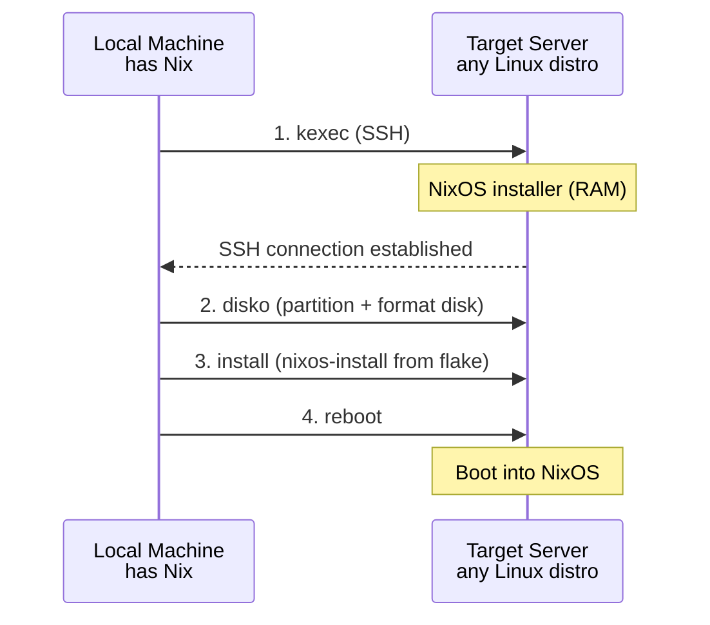

# Bootstrap with nixos-anywhere

`nixos-anywhere` lets you install NixOS on any Linux server with root SSH access — no ISO image, no console access, no provider-specific tooling. It works by kexec-ing into a NixOS installer in RAM, partitioning the disk, and installing your declared configuration.

## How It Works



## Prerequisites

On your local machine:

```bash
# Install Nix if you don't have it
curl --proto '=https' --tlsv1.2 -sSf -L https://install.determinate.systems/nix | sh

# Verify nix is available
nix --version
```

On the target server:
- Root SSH access with your public key
- At least 2 GB RAM (kexec installer runs in memory)
- At least 20 GB disk space

:::warning Destructive Operation
`nixos-anywhere` will **wipe the target disk**. Make sure you have backups and are targeting the correct server. Double-check the IP address.
:::

## Project Structure

Create a local directory for your NixOS configuration:

```bash
mkdir -p nixos-config && cd nixos-config
```

## Flake Configuration

Create `flake.nix` — this is the entry point for your entire system configuration:

```nix title="flake.nix"
{
  description = "Self-healing NixOS server";

  inputs = {
    nixpkgs.url = "github:NixOS/nixpkgs/nixos-24.11";
    disko = {
      url = "github:nix-community/disko";
      inputs.nixpkgs.follows = "nixpkgs";
    };
  };

  outputs = { self, nixpkgs, disko, ... }: {
    nixosConfigurations.server = nixpkgs.lib.nixosSystem {
      system = "x86_64-linux";
      modules = [
        disko.nixosModules.disko
        ./disk-config.nix
        ./configuration.nix
      ];
    };
  };
}
```

## Disko Disk Configuration

This defines the disk layout that `nixos-anywhere` will apply. We use GPT with an EFI System Partition and a Btrfs partition with subvolumes:

```nix title="disk-config.nix"
{ lib, ... }:
{
  disko.devices = {
    disk = {
      main = {
        type = "disk";
        # Change this to match your target server's disk
        # Common: /dev/sda, /dev/vda, /dev/nvme0n1
        device = "/dev/sda";
        content = {
          type = "gpt";
          partitions = {
            ESP = {
              size = "512M";
              type = "EF00";
              content = {
                type = "filesystem";
                format = "vfat";
                mountpoint = "/boot";
                mountOptions = [ "umask=0077" ];
              };
            };
            root = {
              size = "100%";
              content = {
                type = "btrfs";
                extraArgs = [ "-f" ]; # force overwrite
                subvolumes = {
                  "@root" = {
                    mountpoint = "/";
                    mountOptions = [
                      "compress=zstd:1"
                      "noatime"
                      "space_cache=v2"
                    ];
                  };
                  "@home" = {
                    mountpoint = "/home";
                    mountOptions = [
                      "compress=zstd:1"
                      "noatime"
                      "space_cache=v2"
                    ];
                  };
                  "@nix" = {
                    mountpoint = "/nix";
                    mountOptions = [
                      "compress=zstd:1"
                      "noatime"
                      "space_cache=v2"
                    ];
                  };
                  "@log" = {
                    mountpoint = "/var/log";
                    mountOptions = [
                      "compress=zstd:1"
                      "noatime"
                      "space_cache=v2"
                    ];
                  };
                  "@db" = {
                    mountpoint = "/var/lib/db";
                    mountOptions = [
                      "noatime"
                      "space_cache=v2"
                    ];
                  };
                  "@snapshots" = {
                    mountpoint = "/.snapshots";
                    mountOptions = [
                      "noatime"
                      "space_cache=v2"
                    ];
                  };
                };
              };
            };
          };
        };
      };
    };
  };
}
```

:::tip Disk Device Name
The `device` field must match the target server's primary disk. Common names:
- **KVM/QEMU VPS**: `/dev/vda`
- **Hetzner dedicated**: `/dev/nvme0n1`
- **Generic VPS**: `/dev/sda`

You can find it by running `lsblk` on the target server before starting.
:::

## System Configuration

```nix title="configuration.nix"
{ config, pkgs, ... }:
{
  # Boot
  boot.loader.systemd-boot.enable = true;
  boot.loader.efi.canTouchEfiVariables = true;

  # Networking
  networking.hostName = "nixos-server";
  networking.firewall = {
    enable = true;
    allowedTCPPorts = [ 22 ];
  };

  # Enable SSH
  services.openssh = {
    enable = true;
    settings = {
      PermitRootLogin = "prohibit-password";
      PasswordAuthentication = false;
    };
  };

  # Your SSH public key
  users.users.root.openssh.authorizedKeys.keys = [
    "ssh-ed25519 AAAAC3Nz... your-key-here"
  ];

  # Create an admin user
  users.users.admin = {
    isNormalUser = true;
    extraGroups = [ "wheel" ];
    openssh.authorizedKeys.keys = [
      "ssh-ed25519 AAAAC3Nz... your-key-here"
    ];
  };

  # Basic packages
  environment.systemPackages = with pkgs; [
    vim
    git
    htop
    btrfs-progs
    compsize
  ];

  # Enable Btrfs scrub timer
  services.btrfs.autoScrub = {
    enable = true;
    interval = "weekly";
    fileSystems = [ "/" ];
  };

  # Timezone and locale
  time.timeZone = "UTC";
  i18n.defaultLocale = "en_US.UTF-8";

  system.stateVersion = "24.11";
}
```

## Running nixos-anywhere

With your configuration ready, install NixOS on the target:

```bash
# Replace TARGET_IP with your server's IP address
nix run github:nix-community/nixos-anywhere -- \
  --flake .#server \
  --target-host root@TARGET_IP
```

The process takes 5-15 minutes depending on network speed. You'll see:

1. **SSH connection** to the target
2. **kexec** into NixOS installer in RAM
3. **Disk partitioning** via disko
4. **NixOS installation** from your flake
5. **Reboot** into the new system

:::note Connection Drop Is Normal
The SSH connection will drop when the server reboots into the kexec installer and again after final install. This is expected — `nixos-anywhere` reconnects automatically.
:::

## Post-Install Verification

After the install completes, SSH into your new NixOS server:

```bash
ssh admin@TARGET_IP
```

Verify the system:

```bash
# Check NixOS version
nixos-version

# Verify Btrfs subvolumes
sudo btrfs subvolume list /
# Should show: @root, @home, @nix, @log, @db, @snapshots

# Check Btrfs filesystem
sudo btrfs filesystem show /

# Check mount points
findmnt -t btrfs

# Verify compression is active
sudo compsize /
```

Expected `btrfs subvolume list /` output:

```
ID 256 gen 50 top level 5 path @root
ID 257 gen 50 top level 5 path @home
ID 258 gen 48 top level 5 path @nix
ID 259 gen 45 top level 5 path @log
ID 260 gen 42 top level 5 path @db
ID 261 gen 40 top level 5 path @snapshots
```

## Troubleshooting

### "Connection refused" after kexec

The server's host key changes after kexec. Remove the old key:

```bash
ssh-keygen -R TARGET_IP
```

### Disk device not found

If disko can't find the disk, SSH into the installer and check:

```bash
# During the installer phase, SSH in with:
ssh root@TARGET_IP -p 22
lsblk
```

Update `disk-config.nix` with the correct device path.

### Out of memory during install

The kexec installer runs in RAM. If the server has less than 1.5 GB available, the installer may fail. Consider:

- Stopping unnecessary services before running nixos-anywhere
- Using a server with more RAM
- Adding `--build-on-remote` flag to build the system on the target

```bash
nix run github:nix-community/nixos-anywhere -- \
  --flake .#server \
  --target-host root@TARGET_IP \
  --build-on-remote
```

## Production Tips

:::tip Pin Everything
Always use `flake.lock` to pin your nixpkgs version. Run `nix flake update` deliberately, not accidentally. Commit your lock file to version control.
:::

:::tip Test Locally First
Before deploying to a real server, test your configuration in a VM:

```bash
# Build and run in a QEMU VM
nix run .#nixosConfigurations.server.config.system.build.vm
```
:::

:::tip Idempotent Rebuilds
After the initial install, manage the server with `nixos-rebuild`:

```bash
# On the server
sudo nixos-rebuild switch --flake /etc/nixos#server

# Or remotely
nixos-rebuild switch --flake .#server \
  --target-host admin@TARGET_IP \
  --use-remote-sudo
```
:::

## What's Next

The server is running NixOS with Btrfs. Next, let's examine the [Btrfs subvolume layout](./btrfs-layout) in detail and understand why each subvolume exists.
