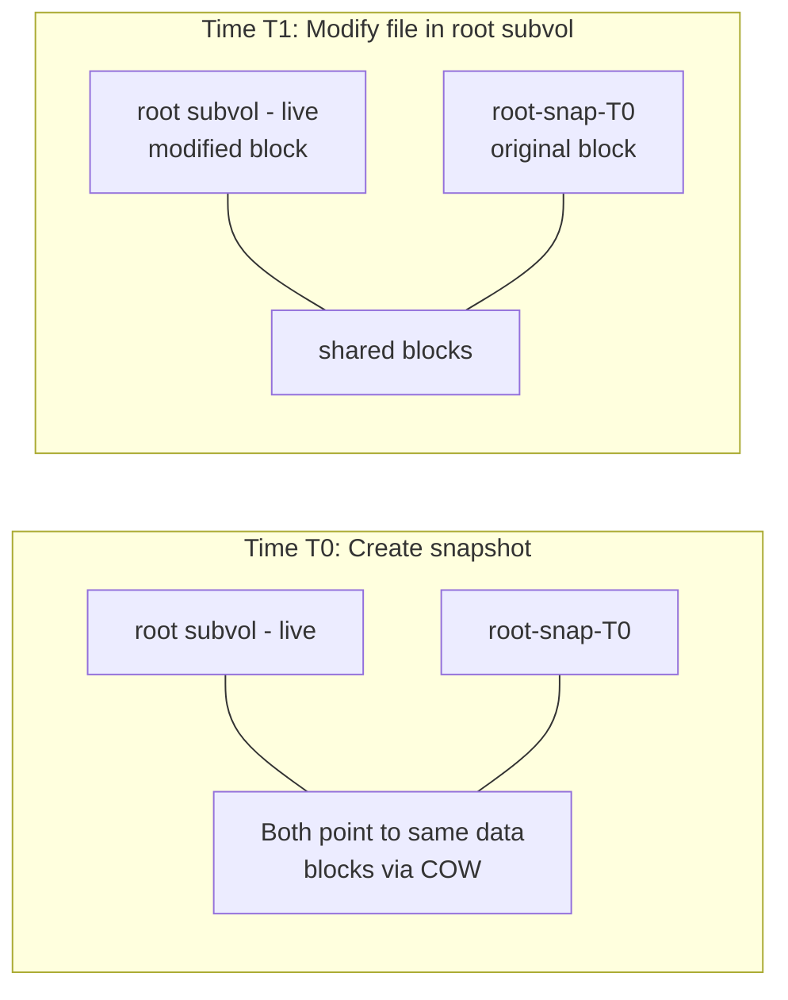

# Btrfs Snapshots & Snapper

Snapshots are the core of the rollback strategy. This chapter covers manual snapshots, automated management with Snapper, and pre-rebuild hooks that ensure every system change has a restore point.

## Snapshot Fundamentals

A Btrfs snapshot is an instant, space-efficient copy of a subvolume. It uses copy-on-write — at creation time, no data is copied. Space is only consumed as files diverge between the original and the snapshot.



> Only the changed blocks consume additional space.

### Read-Only vs Read-Write Snapshots

| Type | Use Case |
|---|---|
| Read-only (`-r`) | Backups, remote send/receive, archive |
| Read-write | Rollback targets (you'll boot into them) |

```bash
# Read-only snapshot (for backups)
sudo btrfs subvolume snapshot -r / /.snapshots/@root-backup

# Read-write snapshot (for rollback)
sudo btrfs subvolume snapshot / /.snapshots/@root-rollback
```

## Manual Snapshots

Before doing anything risky, take a manual snapshot:

```bash
# Snapshot root before a change
sudo btrfs subvolume snapshot / /.snapshots/@root-$(date +%Y%m%d-%H%M%S)

# Snapshot database before migration
sudo btrfs subvolume snapshot /var/lib/db /.snapshots/@db-pre-migration

# List all snapshots
sudo btrfs subvolume list -s /
```

## Snapper on NixOS

Snapper automates snapshot creation, timeline-based cleanup, and pre/post change pairs. NixOS has native Snapper integration.

### NixOS Module Configuration

```nix title="configuration.nix"
{ config, pkgs, ... }:
{
  # Enable Snapper
  services.snapper = {
    snapshotInterval = "hourly";
    cleanupInterval = "1d";

    configs = {
      # Root filesystem snapshots
      root = {
        SUBVOLUME = "/";
        ALLOW_USERS = [ "admin" ];
        TIMELINE_CREATE = true;
        TIMELINE_CLEANUP = true;

        # Retention policy
        TIMELINE_MIN_AGE = "1800";       # 30 minutes
        TIMELINE_LIMIT_HOURLY = "24";    # keep 24 hourly
        TIMELINE_LIMIT_DAILY = "7";      # keep 7 daily
        TIMELINE_LIMIT_WEEKLY = "4";     # keep 4 weekly
        TIMELINE_LIMIT_MONTHLY = "6";    # keep 6 monthly
        TIMELINE_LIMIT_YEARLY = "1";     # keep 1 yearly
      };

      # Home directory snapshots
      home = {
        SUBVOLUME = "/home";
        ALLOW_USERS = [ "admin" ];
        TIMELINE_CREATE = true;
        TIMELINE_CLEANUP = true;

        TIMELINE_LIMIT_HOURLY = "12";
        TIMELINE_LIMIT_DAILY = "7";
        TIMELINE_LIMIT_WEEKLY = "4";
        TIMELINE_LIMIT_MONTHLY = "3";
        TIMELINE_LIMIT_YEARLY = "0";
      };

      # Database snapshots (more frequent)
      db = {
        SUBVOLUME = "/var/lib/db";
        ALLOW_USERS = [ "admin" ];
        TIMELINE_CREATE = true;
        TIMELINE_CLEANUP = true;

        TIMELINE_LIMIT_HOURLY = "48";    # 2 days of hourly
        TIMELINE_LIMIT_DAILY = "14";     # 2 weeks daily
        TIMELINE_LIMIT_WEEKLY = "8";     # 2 months weekly
        TIMELINE_LIMIT_MONTHLY = "6";
        TIMELINE_LIMIT_YEARLY = "0";
      };
    };
  };

  # Ensure snapper directories exist
  systemd.tmpfiles.rules = [
    "d /.snapshots 0750 root root -"
  ];
}
```

### Verify Snapper Is Running

```bash
# Check snapper configs
sudo snapper list-configs

# Output:
# Config | Subvolume
# -------+----------
# root   | /
# home   | /home
# db     | /var/lib/db

# List snapshots for root config
sudo snapper -c root list

# Check the snapper timer
systemctl status snapper-timeline.timer
systemctl status snapper-cleanup.timer
```

## Pre-Rebuild Snapshot Hook

The most critical snapshot happens right before `nixos-rebuild`. Create a wrapper script that ensures a snapshot is taken before every rebuild:

```nix title="modules/safe-rebuild.nix"
{ config, pkgs, lib, ... }:
let
  safeRebuild = pkgs.writeShellScriptBin "safe-rebuild" ''
    set -euo pipefail

    ACTION="''${1:-switch}"
    TIMESTAMP=$(date +%Y%m%d-%H%M%S)
    SNAP_DESC="nixos-rebuild $ACTION"

    echo "=== Safe NixOS Rebuild ==="
    echo "Action: $ACTION"
    echo "Time:   $TIMESTAMP"
    echo ""

    # Step 1: Create pre-rebuild snapshots
    echo "[1/4] Creating pre-rebuild snapshots..."
    sudo snapper -c root create \
      --type pre \
      --description "$SNAP_DESC" \
      --print-number > /tmp/snap-root-num

    ROOT_SNAP=$(cat /tmp/snap-root-num)
    echo "       Root snapshot: #$ROOT_SNAP"

    # Step 2: Run nixos-rebuild
    echo "[2/4] Running nixos-rebuild $ACTION..."
    if sudo nixos-rebuild "$ACTION" "''${@:2}"; then
      REBUILD_STATUS=0
      echo "[3/4] Rebuild succeeded."
    else
      REBUILD_STATUS=$?
      echo "[3/4] Rebuild FAILED with exit code $REBUILD_STATUS"
    fi

    # Step 3: Create post-rebuild snapshot
    echo "[4/4] Creating post-rebuild snapshot..."
    sudo snapper -c root create \
      --type post \
      --pre-number "$ROOT_SNAP" \
      --description "$SNAP_DESC (exit: $REBUILD_STATUS)"

    # Step 4: Report
    if [ $REBUILD_STATUS -ne 0 ]; then
      echo ""
      echo "╔══════════════════════════════════════════╗"
      echo "║  REBUILD FAILED — Rollback available     ║"
      echo "║                                          ║"
      echo "║  To rollback:                            ║"
      echo "║  sudo snapper -c root undochange         ║"
      echo "║         $ROOT_SNAP..0                    ║"
      echo "║                                          ║"
      echo "║  Or reboot into previous generation:     ║"
      echo "║  sudo reboot (select older entry in GRUB)║"
      echo "╚══════════════════════════════════════════╝"
      exit $REBUILD_STATUS
    fi

    echo ""
    echo "Rebuild complete. Snapshot #$ROOT_SNAP saved as restore point."
  '';
in
{
  environment.systemPackages = [ safeRebuild ];
}
```

Usage:

```bash
# Instead of: sudo nixos-rebuild switch
safe-rebuild switch

# With extra flags:
safe-rebuild switch --flake /etc/nixos#server

# Boot (for next reboot):
safe-rebuild boot
```

## Listing and Comparing Snapshots

```bash
# List all root snapshots
sudo snapper -c root list

# Output:
#  # | Type   | Pre # | Date                | User | Cleanup  | Description
# ---+--------+-------+---------------------+------+----------+------------------
#  0 | single |       |                     | root |          | current
#  1 | pre    |       | 2024-01-15 10:30:00 | root |          | nixos-rebuild switch
#  2 | post   |     1 | 2024-01-15 10:32:15 | root |          | nixos-rebuild switch (exit: 0)
#  3 | single |       | 2024-01-15 11:00:00 | root | timeline | timeline

# Show what changed between two snapshots
sudo snapper -c root status 1..2

# Show diff of a specific file between snapshots
sudo snapper -c root diff 1..2 /etc/nixos/configuration.nix
```

## Rollback Procedures

### Method 1: Snapper Undochange (Online)

Revert files changed between two snapshots without rebooting:

```bash
# Undo changes made between snapshot 1 (pre) and current state
sudo snapper -c root undochange 1..0
```

:::warning Undochange Limitations
`snapper undochange` replaces files individually. It works for configuration rollbacks but may not handle running services gracefully. For a clean rollback, use Method 2 or 3.
:::

### Method 2: Subvolume Swap (Full Rollback)

Replace the live root with a snapshot:

```bash
# 1. Boot into a rescue system or use a snapshot as temporary root

# 2. Mount the Btrfs partition directly
sudo mount /dev/sda2 /mnt

# 3. Move the broken root aside
sudo mv /mnt/@root /mnt/@root-broken

# 4. Create a read-write snapshot from the known-good snapshot
sudo btrfs subvolume snapshot /mnt/@snapshots/root/1/snapshot /mnt/@root

# 5. Unmount and reboot
sudo umount /mnt
sudo reboot
```

### Method 3: NixOS Generations (Boot-Level)

NixOS keeps previous system configurations as bootloader entries:

```bash
# List available generations
sudo nix-env --list-generations -p /nix/var/nix/profiles/system

# Switch to a previous generation
sudo nix-env --switch-generation 42 -p /nix/var/nix/profiles/system
sudo /nix/var/nix/profiles/system/bin/switch-to-configuration switch

# Or simply reboot and select a previous generation from the GRUB menu
```

:::tip Belt and Suspenders
NixOS generations and Btrfs snapshots complement each other:
- **NixOS generations** roll back the *system configuration* (packages, services, boot)
- **Btrfs snapshots** roll back the *filesystem state* (data, databases, configs outside Nix management)

Use both for maximum recoverability.
:::

## Remote Backup with Send/Receive

Stream snapshots to a remote backup server:

```bash
# Create a read-only snapshot
sudo btrfs subvolume snapshot -r / /.snapshots/@root-backup-$(date +%Y%m%d)

# Send to remote server (first time — full send)
sudo btrfs send /.snapshots/@root-backup-20240115 | \
  ssh backup-server "sudo btrfs receive /backups/server1/"

# Incremental send (subsequent backups — only send changes)
sudo btrfs send -p /.snapshots/@root-backup-20240115 \
  /.snapshots/@root-backup-20240116 | \
  ssh backup-server "sudo btrfs receive /backups/server1/"
```

### Automated Backup Script

```nix title="modules/btrfs-backup.nix"
{ config, pkgs, ... }:
let
  btrfsBackup = pkgs.writeShellScriptBin "btrfs-backup" ''
    set -euo pipefail

    REMOTE="backup-server"
    REMOTE_PATH="/backups/$(hostname)"
    LOCAL_SNAPS="/.snapshots"
    TODAY=$(date +%Y%m%d)

    # Create read-only snapshot
    sudo btrfs subvolume snapshot -r / "$LOCAL_SNAPS/@root-backup-$TODAY"

    # Find yesterday's snapshot for incremental send
    YESTERDAY=$(date -d yesterday +%Y%m%d)
    if [ -d "$LOCAL_SNAPS/@root-backup-$YESTERDAY" ]; then
      echo "Incremental send (parent: $YESTERDAY)..."
      sudo btrfs send -p "$LOCAL_SNAPS/@root-backup-$YESTERDAY" \
        "$LOCAL_SNAPS/@root-backup-$TODAY" | \
        ssh "$REMOTE" "sudo btrfs receive $REMOTE_PATH/"
    else
      echo "Full send..."
      sudo btrfs send "$LOCAL_SNAPS/@root-backup-$TODAY" | \
        ssh "$REMOTE" "sudo btrfs receive $REMOTE_PATH/"
    fi

    echo "Backup complete: @root-backup-$TODAY -> $REMOTE:$REMOTE_PATH"
  '';
in
{
  environment.systemPackages = [ btrfsBackup ];

  # Daily backup timer
  systemd.services.btrfs-backup = {
    description = "Btrfs snapshot backup to remote";
    serviceConfig = {
      Type = "oneshot";
      ExecStart = "${btrfsBackup}/bin/btrfs-backup";
    };
  };

  systemd.timers.btrfs-backup = {
    wantedBy = [ "timers.target" ];
    timerConfig = {
      OnCalendar = "daily";
      Persistent = true;
      RandomizedDelaySec = "1h";
    };
  };
}
```

## Monitoring Snapshot Space

Snapshots can consume significant space if not cleaned up. Monitor usage:

```bash
# Check overall filesystem usage
sudo btrfs filesystem usage /

# Check how much space snapshots consume
sudo btrfs filesystem du -s /.snapshots/

# Check exclusive space used (space that would be freed on deletion)
sudo btrfs qgroup show -reF /
```

:::danger Don't Let Snapshots Fill the Disk
A full Btrfs filesystem can become unmountable. Set up monitoring:

```bash
# Simple check script — alert if usage exceeds 85%
USAGE=$(sudo btrfs filesystem usage / | grep "Used:" | awk '{print $2}' | tr -d '%')
if [ "$USAGE" -gt 85 ]; then
  echo "WARNING: Btrfs usage at ${USAGE}%"
  # Trigger alert here
fi
```

The snapper cleanup policies from the NixOS config automatically delete old timeline snapshots, but always monitor.
:::

## What's Next

Snapshots are configured and automated. Next, we'll install [OpenClaw](./install-openclaw), the AI operator that will use these snapshots as a safety net while managing infrastructure changes.
