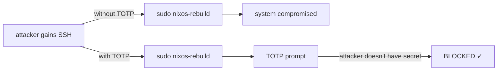
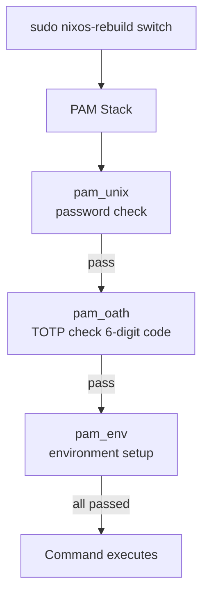

# TOTP Sudo Protection

This chapter configures TOTP (Time-based One-Time Password) authentication for sudo, ensuring that critical operations like `nixos-rebuild switch` require a 6-digit code from an authenticator app — even if an attacker gains shell access.

## Why TOTP for Sudo



The TOTP secret lives on your phone (or hardware token), not on the server. Even if the server is compromised, the attacker cannot generate valid codes.

## Components

| Component | Role |
|---|---|
| `pam_oath` | PAM module that validates TOTP codes |
| `oath-toolkit` | CLI tools for generating secrets and testing codes |
| `oathtool` | Command-line TOTP code generator (for testing) |
| Authenticator app | Google Authenticator, Authy, or any TOTP app |

## PAM Authentication Flow



## NixOS Configuration

### Install and Configure pam_oath

```nix title="modules/totp-sudo.nix"
{ config, pkgs, lib, ... }:
{
  # Install oath-toolkit
  environment.systemPackages = with pkgs; [
    oath-toolkit   # oathtool CLI
    libpam_oath    # PAM module (provided by oath-toolkit)
    qrencode       # Generate QR codes for enrolling devices
  ];

  # Configure PAM for sudo to require TOTP
  security.pam.services.sudo = {
    text = lib.mkForce ''
      # Account management
      account required pam_unix.so

      # Authentication: password + TOTP
      auth required pam_unix.so
      auth required ${pkgs.oath-toolkit}/lib/security/pam_oath.so usersfile=/etc/users.oath window=3 digits=6

      # Session
      session required pam_unix.so
      session required pam_env.so
    '';
  };

  # Ensure the TOTP users file exists with correct permissions
  systemd.tmpfiles.rules = [
    "f /etc/users.oath 0600 root root -"
  ];
}
```

:::warning window=3
The `window=3` parameter allows codes that are up to 3 time steps (90 seconds) old or new. This accounts for clock drift between the server and your authenticator app. Don't set this too high — it weakens security.
:::

### TOTP Secret Enrollment

Generate a TOTP secret for each user that needs sudo access:

```bash
# Generate a random secret (base32 encoded)
head -c 20 /dev/urandom | base32 | tr -d '=' | head -c 32
# Example output: JBSWY3DPEHPK3PXP4ZTLMRQK6BZDG5A

# Store it. Format: HOTP/T TYPE USER - SECRET
# For TOTP with 6 digits and 30-second step:
echo "HOTP/T30/6 admin - JBSWY3DPEHPK3PXP4ZTLMRQK6BZDG5A" | sudo tee -a /etc/users.oath
echo "HOTP/T30/6 openclaw - KFWU4SDPN7PAQ3RPXVTZMRWK8CZDH7B" | sudo tee -a /etc/users.oath

# Set restrictive permissions
sudo chmod 600 /etc/users.oath
sudo chown root:root /etc/users.oath
```

### Generate QR Code for Authenticator App

```bash
# Generate a QR code for the admin user
qrencode -t ansiutf8 \
  "otpauth://totp/nixos-server:admin?secret=JBSWY3DPEHPK3PXP4ZTLMRQK6BZDG5A&issuer=nixos-server&digits=6&period=30"
```

This displays a QR code in your terminal. Scan it with your authenticator app (Google Authenticator, Authy, 1Password, etc.).

:::tip Generate Recovery Codes
After enrolling, generate a set of emergency one-time codes and store them offline (printed or in a password manager):

```bash
# Generate 10 emergency codes from the same secret
for i in $(seq 0 9); do
  oathtool --totp --base32 JBSWY3DPEHPK3PXP4ZTLMRQK6BZDG5A -N "+${i}min"
done > ~/totp-emergency-codes.txt
```

These codes won't work as TOTP (they're time-bound), so a better approach is to keep the **secret key itself** (`JBSWY3DPEHPK3PXP4ZTLMRQK6BZDG5A`) backed up securely. With the secret, you can re-enroll any authenticator app at any time.
:::

### Test TOTP Authentication

```bash
# Generate a test code using oathtool
oathtool --totp --base32 JBSWY3DPEHPK3PXP4ZTLMRQK6BZDG5A
# Output: 123456

# Test sudo — it should ask for password + TOTP
sudo echo "TOTP works!"
# Password: (your password)
# One-time password (OATH): (6-digit code from authenticator)
```

## Users File Format

The `/etc/users.oath` file format:

```
# TYPE         USER    PIN  SECRET
HOTP/T30/6     admin   -    JBSWY3DPEHPK3PXP4ZTLMRQK6BZDG5A
HOTP/T30/6     openclaw -   KFWU4SDPN7PAQ3RPXVTZMRWK8CZDH7B
```

| Field | Meaning |
|---|---|
| `HOTP/T30/6` | TOTP mode, 30-second period, 6 digits |
| `admin` | Unix username |
| `-` | No additional PIN (just the TOTP code) |
| `JBSWY3...` | Base32-encoded secret key |

## OpenClaw TOTP Integration

For OpenClaw to authenticate TOTP for gated operations, it needs a mechanism to request a code from the human operator. This is typically done via a notification channel:

```nix title="modules/openclaw-totp-bridge.nix"
{ config, pkgs, ... }:
let
  totpBridge = pkgs.writeShellScriptBin "openclaw-totp-bridge" ''
    set -euo pipefail

    ACTION="$1"
    PROPOSAL_ID="$2"

    echo "=== TOTP Authorization Required ==="
    echo "Action:   $ACTION"
    echo "Proposal: $PROPOSAL_ID"
    echo ""

    # Send notification to operator (via webhook, email, etc.)
    ${pkgs.curl}/bin/curl -s -X POST \
      "''${OPENCLAW_NOTIFY_URL}" \
      -H "Content-Type: application/json" \
      -d "{
        \"text\": \"🔐 TOTP required for: $ACTION\nProposal: $PROPOSAL_ID\nReply with 6-digit code to approve.\"
      }" || true

    # Wait for operator to provide TOTP code
    # This reads from OpenClaw's approval channel
    echo "Waiting for TOTP code from operator..."
    read -r -t 300 TOTP_CODE < /var/lib/openclaw/totp-response-pipe

    if [ -z "$TOTP_CODE" ]; then
      echo "Timeout: no TOTP code received within 5 minutes"
      exit 1
    fi

    # Validate the TOTP code
    EXPECTED=$(${pkgs.oath-toolkit}/bin/oathtool --totp --base32 \
      "$(grep openclaw /etc/users.oath | awk '{print $4}')")

    if [ "$TOTP_CODE" = "$EXPECTED" ]; then
      echo "TOTP validated successfully"
      exit 0
    else
      echo "Invalid TOTP code"
      exit 1
    fi
  '';
in
{
  environment.systemPackages = [ totpBridge ];

  services.openclaw.settings.authentication = {
    totpBridgeCommand = "${totpBridge}/bin/openclaw-totp-bridge";
    approvalTimeout = "5m";
  };
}
```

## Selective TOTP Enforcement

You may want TOTP only for specific commands, not all sudo operations. Use PAM conditions:

```nix title="Alternative: TOTP only for specific commands"
{ config, pkgs, lib, ... }:
let
  # Wrapper that enforces TOTP before running a command
  totpGuard = pkgs.writeShellScriptBin "totp-guard" ''
    set -euo pipefail

    COMMAND="$*"

    echo "This operation requires TOTP authentication."
    echo "Command: $COMMAND"
    echo ""

    # Read TOTP code
    read -r -s -p "TOTP code: " TOTP_CODE
    echo ""

    # Validate against the current user's secret
    USER=$(whoami)
    SECRET=$(sudo grep "^HOTP.*$USER" /etc/users.oath | awk '{print $4}')

    EXPECTED=$(${pkgs.oath-toolkit}/bin/oathtool --totp --base32 "$SECRET")

    if [ "$TOTP_CODE" != "$EXPECTED" ]; then
      echo "Invalid TOTP code. Operation denied."
      logger -t totp-guard "DENIED: $USER attempted $COMMAND with invalid TOTP"
      exit 1
    fi

    logger -t totp-guard "APPROVED: $USER executed $COMMAND with valid TOTP"
    exec $COMMAND
  '';
in
{
  environment.systemPackages = [ totpGuard ];

  # Create aliases for protected commands
  environment.shellAliases = {
    "nixos-rebuild" = "totp-guard nixos-rebuild";
  };
}
```

## Clock Synchronization

TOTP depends on synchronized clocks between server and authenticator. Ensure NTP is configured:

```nix
# In configuration.nix
services.timesyncd.enable = true;
networking.timeServers = [
  "0.nixos.pool.ntp.org"
  "1.nixos.pool.ntp.org"
  "2.nixos.pool.ntp.org"
  "3.nixos.pool.ntp.org"
];
```

```bash
# Verify time sync
timedatectl status
# Should show: System clock synchronized: yes
```

:::danger Clock Drift Breaks TOTP
If the server clock drifts more than 90 seconds from UTC, TOTP codes will be rejected. Always keep NTP enabled and monitor clock sync. The `window=3` setting in PAM gives a 90-second tolerance.
:::

## Backup and Recovery

### Backup TOTP Secrets

```bash
# Encrypt and backup the users.oath file
sudo gpg --symmetric --cipher-algo AES256 -o /root/users.oath.gpg /etc/users.oath

# Store the GPG-encrypted backup offline (USB, password manager, etc.)
```

### Lost TOTP Device

If you lose your authenticator device:

1. **Boot into rescue mode** (from VPS provider console)
2. **Mount the filesystem**: `mount /dev/sda2 /mnt -o subvol=@root`
3. **Edit or remove the TOTP requirement**: `vim /mnt/etc/users.oath`
4. **Reboot and re-enroll** with a new device

:::tip Always Have a Backup
Keep backup codes or a second enrolled device. Losing your only TOTP device while the server requires it means you'll need console access to recover.
:::

## What's Next

Critical operations are now TOTP-protected. Next, we'll design a [database snapshot strategy](./database-snapshot-strategy) that ensures consistent backups of stateful services.
