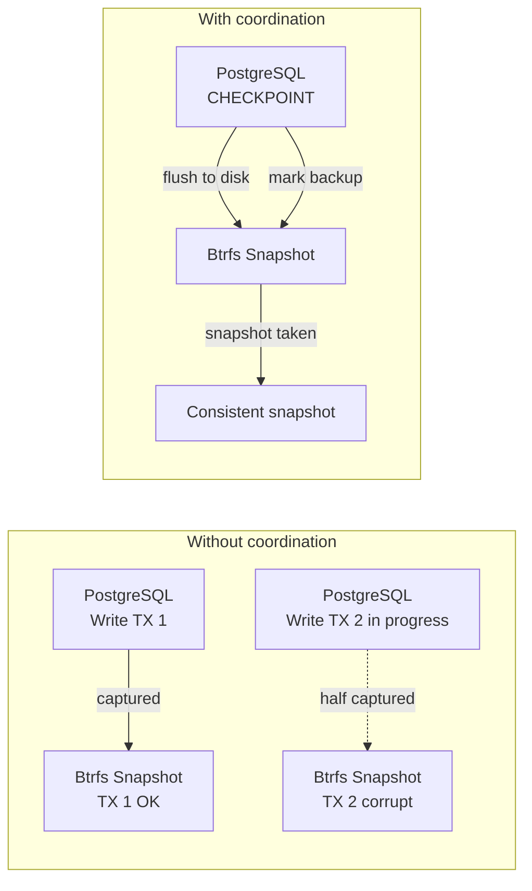

# Database Snapshot Strategy

Databases require special snapshot handling. A naive filesystem snapshot of a running database can capture an inconsistent state — half-written transactions, dirty buffers, incomplete WAL entries. This chapter covers strategies for consistent database snapshots on Btrfs.

## The Consistency Problem



## Strategy Overview

| Database | Snapshot Method |
|---|---|
| PostgreSQL | `CHECKPOINT` + `pg_backup_start()` + Btrfs snapshot + `pg_backup_stop()` |
| SQLite | `PRAGMA wal_checkpoint(TRUNCATE)` + Btrfs snapshot |
| Redis | `BGSAVE` + wait + Btrfs snapshot |
| MySQL/MariaDB | `FLUSH TABLES WITH READ LOCK` + Btrfs snapshot + `UNLOCK TABLES` |

## PostgreSQL Consistent Snapshots

### NixOS PostgreSQL Configuration

```nix title="modules/postgresql.nix"
{ config, pkgs, ... }:
{
  services.postgresql = {
    enable = true;
    package = pkgs.postgresql_16;

    # Store data on the @db subvolume
    dataDir = "/var/lib/db/postgresql";

    settings = {
      # WAL configuration for reliable backup
      wal_level = "replica";
      archive_mode = "on";
      archive_command = "cp %p /var/lib/db/wal-archive/%f";

      # Checkpoint settings
      checkpoint_timeout = "15min";
      max_wal_size = "1GB";
    };
  };

  # Ensure WAL archive directory exists
  systemd.tmpfiles.rules = [
    "d /var/lib/db/wal-archive 0700 postgres postgres -"
  ];
}
```

### Consistent Snapshot Script

```nix title="modules/db-snapshot.nix"
{ config, pkgs, ... }:
let
  dbSnapshot = pkgs.writeShellScriptBin "db-snapshot" ''
    set -euo pipefail

    TIMESTAMP=$(date +%Y%m%d-%H%M%S)
    SNAP_NAME="@db-$TIMESTAMP"
    SNAP_PATH="/.snapshots/$SNAP_NAME"

    echo "=== Database Consistent Snapshot ==="
    echo "Timestamp: $TIMESTAMP"
    echo "Target:    $SNAP_PATH"
    echo ""

    # Step 1: Force a checkpoint (flush dirty buffers to disk)
    echo "[1/5] Forcing PostgreSQL checkpoint..."
    sudo -u postgres psql -c "CHECKPOINT;"

    # Step 2: Start backup mode (PostgreSQL notes the WAL position)
    echo "[2/5] Starting backup mode..."
    BACKUP_LABEL=$(sudo -u postgres psql -t -c \
      "SELECT pg_backup_start('btrfs-snapshot-$TIMESTAMP', false);")
    echo "       Backup LSN: $BACKUP_LABEL"

    # Step 3: Take the Btrfs snapshot
    echo "[3/5] Creating Btrfs snapshot..."
    sudo btrfs subvolume snapshot -r /var/lib/db "$SNAP_PATH"

    # Step 4: Stop backup mode
    echo "[4/5] Stopping backup mode..."
    sudo -u postgres psql -c "SELECT pg_backup_stop(false);" > /dev/null

    # Step 5: Verify
    echo "[5/5] Verifying snapshot..."
    sudo btrfs subvolume show "$SNAP_PATH"

    echo ""
    echo "Snapshot created: $SNAP_PATH"
    echo "To restore: sudo btrfs subvolume snapshot $SNAP_PATH /var/lib/db"
  '';

  dbRestore = pkgs.writeShellScriptBin "db-restore" ''
    set -euo pipefail

    SNAP_PATH="''${1:?Usage: db-restore <snapshot-path>}"

    if [ ! -d "$SNAP_PATH" ]; then
      echo "Error: Snapshot not found: $SNAP_PATH"
      exit 1
    fi

    echo "=== Database Restore ==="
    echo "Source: $SNAP_PATH"
    echo ""
    echo "WARNING: This will stop PostgreSQL and replace the database."
    read -r -p "Continue? [y/N] " confirm
    if [ "$confirm" != "y" ]; then
      echo "Aborted."
      exit 0
    fi

    # Step 1: Stop PostgreSQL
    echo "[1/4] Stopping PostgreSQL..."
    sudo systemctl stop postgresql

    # Step 2: Move current data aside
    echo "[2/4] Moving current data aside..."
    TIMESTAMP=$(date +%Y%m%d-%H%M%S)
    sudo mv /var/lib/db /var/lib/db-old-$TIMESTAMP

    # Step 3: Restore from snapshot (create read-write copy)
    echo "[3/4] Restoring from snapshot..."
    sudo btrfs subvolume snapshot "$SNAP_PATH" /var/lib/db

    # Step 4: Start PostgreSQL
    echo "[4/4] Starting PostgreSQL..."
    sudo systemctl start postgresql

    # Verify
    echo ""
    echo "Restore complete. Verifying..."
    sudo -u postgres psql -c "SELECT version();"
    echo "Old data saved to: /var/lib/db-old-$TIMESTAMP"
  '';
in
{
  environment.systemPackages = [ dbSnapshot dbRestore ];
}
```

## Automated Database Snapshots

Schedule regular consistent snapshots:

```nix title="modules/db-snapshot-timer.nix"
{ config, pkgs, ... }:
{
  # Take a consistent DB snapshot every 6 hours
  systemd.services.db-snapshot = {
    description = "Consistent database Btrfs snapshot";
    serviceConfig = {
      Type = "oneshot";
      ExecStart = "${pkgs.bash}/bin/bash -c '${./scripts/db-snapshot-auto.sh}'";
    };
    path = with pkgs; [ btrfs-progs postgresql_16 coreutils ];
  };

  systemd.timers.db-snapshot = {
    wantedBy = [ "timers.target" ];
    timerConfig = {
      OnCalendar = "*-*-* 00,06,12,18:00:00";  # Every 6 hours
      Persistent = true;
      RandomizedDelaySec = "5m";
    };
  };
}
```

## SQLite Snapshot Strategy

SQLite is simpler — checkpoint the WAL and snapshot:

```bash
#!/usr/bin/env bash
set -euo pipefail

DB_PATH="${1:?Usage: sqlite-snapshot <db-path>}"
TIMESTAMP=$(date +%Y%m%d-%H%M%S)

# Checkpoint the WAL (flush all WAL pages to the main database file)
sqlite3 "$DB_PATH" "PRAGMA wal_checkpoint(TRUNCATE);"

# Now the database file is self-contained — snapshot is safe
sudo btrfs subvolume snapshot -r /var/lib/db "/.snapshots/@db-sqlite-$TIMESTAMP"

echo "SQLite snapshot created: /.snapshots/@db-sqlite-$TIMESTAMP"
```

## Redis Snapshot Strategy

```bash
#!/usr/bin/env bash
set -euo pipefail

TIMESTAMP=$(date +%Y%m%d-%H%M%S)

# Trigger background save
redis-cli BGSAVE

# Wait for save to complete
while [ "$(redis-cli LASTSAVE)" = "$(redis-cli LASTSAVE)" ]; do
  sleep 1
done

# Snapshot the data directory
sudo btrfs subvolume snapshot -r /var/lib/db "/.snapshots/@db-redis-$TIMESTAMP"

echo "Redis snapshot created: /.snapshots/@db-redis-$TIMESTAMP"
```

## Snapshot Retention for Databases

Database snapshots consume more space than system snapshots due to data churn. Configure aggressive cleanup:

```
Timeline:
  ├── Last 48 hours:  hourly snapshots  (48 snapshots)
  ├── Last 2 weeks:   daily snapshots   (14 snapshots)
  ├── Last 2 months:  weekly snapshots  (8 snapshots)
  └── Last 6 months:  monthly snapshots (6 snapshots)

Total retained: ~76 snapshots
Estimated space: 2-5x the database size (depends on churn)
```

## Monitoring

```bash
# Check database snapshot sizes
sudo btrfs filesystem du -s /.snapshots/@db-*

# Check exclusive space (would be freed if deleted)
sudo btrfs qgroup show -reF / | grep "db"

# Alert if database snapshots exceed threshold
DB_SNAP_SIZE=$(sudo du -sb /.snapshots/@db-* 2>/dev/null | awk '{sum+=$1} END {print sum}')
DB_SNAP_GB=$((DB_SNAP_SIZE / 1073741824))
if [ "$DB_SNAP_GB" -gt 50 ]; then
  echo "WARNING: Database snapshots consuming ${DB_SNAP_GB}GB"
fi
```

## OpenClaw Integration

OpenClaw can manage database snapshots as part of its monitoring:

```json
{
  "proposal_id": "prop-20240115-db-001",
  "issue": "Database snapshot age exceeds 12 hours",
  "proposed_actions": [
    {
      "tier": 1,
      "action": "database-snapshot",
      "command": "db-snapshot",
      "impact": "Creates consistent snapshot of PostgreSQL",
      "risk": "low"
    }
  ]
}
```

:::tip Test Your Restores
A backup that hasn't been tested is not a backup. Schedule regular restore tests:

```bash
# Restore to a temporary location and verify
sudo btrfs subvolume snapshot /.snapshots/@db-20240115-120000 /tmp/db-test
sudo -u postgres pg_isready -h /tmp/db-test
sudo btrfs subvolume delete /tmp/db-test
```
:::

## What's Next

Database snapshots are configured for consistency. Next, we'll put it all together in a [disaster recovery plan](./disaster-recovery) that covers every failure scenario.
