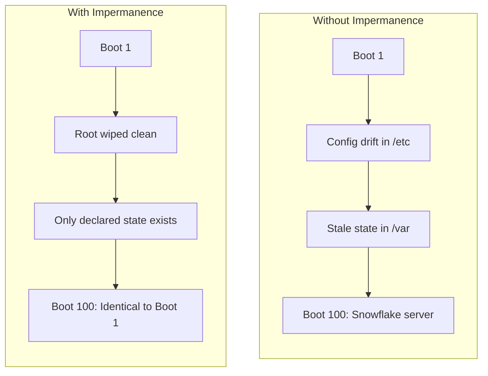

# Impermanence — "Erase Your Darlings"

Impermanence ensures your NixOS root filesystem is **wiped clean on every boot**. Only explicitly persisted state survives. This eliminates configuration drift, ensures reproducibility, and makes the system truly declarative.

## Why Impermanence?

Without Impermanence, state accumulates in `/etc`, `/var`, `/tmp`, and other locations over time. Your running system slowly diverges from what's declared in your NixOS configuration. This is exactly the kind of drift that causes "works on my machine" problems at the infrastructure level.



### Benefits for OpenClaw

- **Predictable baseline**: Every reboot gives OpenClaw a known-good starting state
- **No hidden state**: If it's not in the Nix config, it doesn't exist after reboot
- **Safer rollbacks**: Rolling back a NixOS generation also rolls back filesystem state
- **Drift detection**: Any unexpected file on root is guaranteed to be from the current boot

## How It Works

On each boot:

1. The root subvolume (`@root`) is **deleted and recreated** as an empty Btrfs subvolume
2. NixOS activates the new generation, populating `/` from the Nix store
3. Bind mounts restore **explicitly persisted** directories and files from `/persist`


## Prerequisites

This chapter assumes you already have:
- Btrfs filesystem with subvolume layout from [Chapter 2](./btrfs-layout)
- A `/persist` mount point (we'll use the `@home` subvolume or create a dedicated `@persist`)

## NixOS Configuration

### Step 1: Add Impermanence Flake Input

```nix title="flake.nix"
{
  inputs = {
    nixpkgs.url = "github:NixOS/nixpkgs/nixos-unstable";
    disko.url = "github:nix-community/disko";
    impermanence.url = "github:nix-community/impermanence";
  };

  outputs = { self, nixpkgs, disko, impermanence, ... }: {
    nixosConfigurations.myserver = nixpkgs.lib.nixosSystem {
      system = "x86_64-linux";
      modules = [
        disko.nixosModules.disko
        impermanence.nixosModules.impermanence
        ./configuration.nix
        ./impermanence.nix
      ];
    };
  };
}
```

### Step 2: Boot-time Root Wipe Script

This script runs early in the boot process to wipe and recreate the root subvolume.

```nix title="impermanence.nix"
{ config, lib, pkgs, ... }:

{
  # Wipe root on every boot
  boot.initrd.postDeviceCommands = lib.mkAfter ''
    mkdir -p /mnt
    mount -t btrfs -o subvol=/ /dev/disk/by-partlabel/nixos /mnt

    # Delete old root subvolume
    if [ -d /mnt/@root ]; then
      btrfs subvolume delete /mnt/@root
    fi

    # Create fresh root subvolume
    btrfs subvolume create /mnt/@root

    umount /mnt
  '';

  # Persist directory — all state that must survive reboots
  fileSystems."/persist" = {
    device = "/dev/disk/by-partlabel/nixos";
    fsType = "btrfs";
    options = [ "subvol=@persist" "compress=zstd:1" "noatime" ];
    neededForBoot = true;
  };

  # Impermanence: declare what to persist
  environment.persistence."/persist" = {
    hideMounts = true;

    # System directories that must survive reboots
    directories = [
      "/etc/nixos"                    # NixOS configuration
      "/var/lib/systemd"              # systemd state (timers, journal cursors)
      "/var/lib/nixos"                # NixOS state (uid/gid maps)
      "/var/lib/openclaw"             # OpenClaw state and audit logs
      "/var/lib/prometheus2"          # Prometheus data
      "/var/lib/grafana"              # Grafana dashboards and config
      "/var/lib/loki"                 # Loki log data
      "/var/lib/snapper"              # Snapper metadata
      "/var/lib/private"              # Private state for DynamicUser services
      "/var/log"                      # Logs (also on @log subvolume)
    ];

    # System files that must survive reboots
    files = [
      "/etc/machine-id"              # Unique machine identifier
      "/etc/users.oath"              # TOTP secrets
    ];

    # Per-user persistence
    users.admin = {
      directories = [
        ".ssh"                        # SSH keys and known_hosts
        ".local/share/nix"            # Nix REPL history
      ];
      files = [
        ".bash_history"
      ];
    };
  };

  # Ensure /persist is created in disko config
  # If using the disko layout from Chapter 1, add @persist subvolume:
  # disko.devices.disk.main.content.partitions.root.content.subvolumes."@persist" = {
  #   mountpoint = "/persist";
  #   mountOptions = [ "compress=zstd:1" "noatime" ];
  # };
}
```

### Step 3: Update Disko Configuration

Add the `@persist` subvolume to your disko config from [Chapter 1](./bootstrap-nixos-anywhere).

```nix title="disk-config.nix (additions)"
# Add to the subvolumes section of your existing disko config:
"@persist" = {
  mountpoint = "/persist";
  mountOptions = [ "compress=zstd:1" "noatime" ];
};
```

## What to Persist

### Essential System State

| Path | Why |
|---|---|
| `/etc/nixos` | NixOS configuration files |
| `/etc/machine-id` | Systemd requires stable machine-id |
| `/etc/users.oath` | TOTP secrets for sudo authentication |
| `/var/lib/systemd` | Timer state, journal cursor |
| `/var/lib/nixos` | UID/GID allocation maps |
| `/var/log` | Logs must survive for debugging |

### Service State

| Path | Why |
|---|---|
| `/var/lib/openclaw` | AI operator state, audit trail, proposals |
| `/var/lib/prometheus2` | Metrics time-series data |
| `/var/lib/grafana` | Dashboards and alert configs |
| `/var/lib/loki` | Aggregated log data |
| `/var/lib/snapper` | Snapshot metadata and configs |
| `/var/lib/postgresql` | Database (also on @db subvolume) |

### What NOT to Persist

These are intentionally wiped on reboot:

- `/tmp` — Temporary files
- `/var/cache` — Rebuilt from Nix store
- `/var/tmp` — Temporary storage
- `/root` — Root user's home (use admin user instead)
- Anything in `/etc` not explicitly listed — Regenerated by NixOS activation

## OpenClaw Integration

OpenClaw benefits from Impermanence in several ways:

```nix title="openclaw-impermanence.nix"
{ config, ... }:

{
  # OpenClaw state must persist across reboots
  environment.persistence."/persist".directories = [
    {
      directory = "/var/lib/openclaw";
      user = "openclaw";
      group = "openclaw";
      mode = "0750";
    }
  ];

  # OpenClaw can detect unexpected state on root
  services.openclaw.settings.monitoring.impermanence = {
    enable = true;
    # Alert if unexpected files appear in these paths
    watchPaths = [ "/etc" "/var/lib" "/opt" ];
    # Ignore known transient paths
    ignorePaths = [ "/etc/resolv.conf" "/etc/mtab" ];
  };
}
```

## Verification

After rebuilding and rebooting:

```bash
# Verify root is a fresh subvolume
sudo btrfs subvolume show /
# Should show a recent creation time (this boot)

# Verify persist mount
findmnt /persist
# Should show @persist subvolume

# Verify persisted state exists
ls /persist/etc/nixos/
ls /persist/var/lib/openclaw/

# Verify symlinks are working
ls -la /etc/machine-id
# Should show a bind mount from /persist

# Create a test file on root and reboot
echo "test" > /tmp/impermanence-test
# After reboot:
ls /tmp/impermanence-test  # Should not exist
```

## Troubleshooting

### System won't boot after enabling Impermanence

**Cause**: Missing a critical persist path (e.g., `/var/lib/nixos` or `/etc/machine-id`).

**Fix**: Boot from previous NixOS generation in GRUB, add the missing path to persistence config, rebuild.

### SSH host keys change after reboot

**Cause**: SSH host keys in `/etc/ssh/` are not persisted.

**Fix**:
```nix
environment.persistence."/persist".files = [
  "/etc/ssh/ssh_host_ed25519_key"
  "/etc/ssh/ssh_host_ed25519_key.pub"
  "/etc/ssh/ssh_host_rsa_key"
  "/etc/ssh/ssh_host_rsa_key.pub"
];
```

### Service loses state after reboot

**Cause**: Service state directory not in persistence config.

**Fix**: Add the service's state directory to `environment.persistence."/persist".directories`. Check the service's `StateDirectory` in its systemd unit.

```bash
# Find a service's state directory
systemctl show <service> -p StateDirectory
```

### NetworkManager or WiFi config lost

**Cause**: Network configs in `/etc/NetworkManager/` not persisted.

**Fix**:
```nix
environment.persistence."/persist".directories = [
  "/etc/NetworkManager/system-connections"
];
```

:::warning Start Conservative
When first enabling Impermanence, start with a minimal persistence list and expand as you discover what breaks. Each missing path is a learning opportunity about what state your system actually needs.
:::

:::tip Impermanence + OpenClaw = Drift-Free Operations
With Impermanence, OpenClaw never has to wonder "is this file supposed to be here?" If a file exists on root and isn't in the Nix config or the persist list, it was created during this boot — making anomaly detection trivial.
:::
