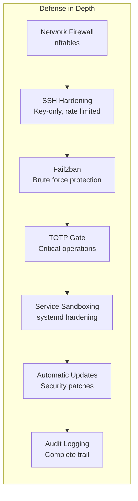

# Security Hardening

TOTP protects sudo, but a production NixOS server needs comprehensive security hardening. This chapter covers firewall rules, SSH hardening, Fail2ban, systemd service sandboxing, and automatic security updates — all configured declaratively in Nix.

## Security Layers



## Firewall Configuration

NixOS uses nftables by default. Define a strict whitelist of allowed ports.

```nix title="firewall.nix"
{ config, ... }:

{
  networking.firewall = {
    enable = true;

    # Only allow essential inbound ports
    allowedTCPPorts = [
      22    # SSH
      80    # HTTP (for ACME challenges)
      443   # HTTPS
      3000  # Grafana (restrict to VPN in production)
    ];

    # No UDP ports by default
    allowedUDPPorts = [ ];

    # Log dropped packets (useful for OpenClaw analysis)
    logRefusedConnections = true;
    logRefusedPackets = false;  # too verbose for production

    # Rate limit ping
    pingLimit = "--limit 1/second --limit-burst 5";

    # Default: drop everything not explicitly allowed
    # This is the default, stated here for clarity
    rejectPackets = false;
  };

  # Disable IPv6 if not needed (reduces attack surface)
  # networking.enableIPv6 = false;
}
```

## SSH Hardening

Disable password auth, restrict key algorithms, limit login attempts.

```nix title="ssh-hardening.nix"
{ config, ... }:

{
  services.openssh = {
    enable = true;
    ports = [ 22 ];  # Consider non-standard port for reduced noise

    settings = {
      # Authentication
      PasswordAuthentication = false;
      KbdInteractiveAuthentication = false;
      PermitRootLogin = "prohibit-password";  # Key-only root (or "no" to disable entirely)
      PubkeyAuthentication = true;

      # Hardening
      X11Forwarding = false;
      PermitEmptyPasswords = false;
      MaxAuthTries = 3;
      LoginGraceTime = 30;          # Seconds to complete authentication
      ClientAliveInterval = 300;     # 5-minute keepalive
      ClientAliveCountMax = 2;       # Disconnect after 10 min idle

      # Restrict crypto
      KexAlgorithms = [
        "curve25519-sha256"
        "curve25519-sha256@libssh.org"
      ];
      Ciphers = [
        "chacha20-poly1305@openssh.com"
        "aes256-gcm@openssh.com"
        "aes128-gcm@openssh.com"
      ];
      Macs = [
        "hmac-sha2-512-etm@openssh.com"
        "hmac-sha2-256-etm@openssh.com"
      ];

      # Logging
      LogLevel = "VERBOSE";  # Logs key fingerprints for audit
    };

    # Only allow specific users
    extraConfig = ''
      AllowUsers admin openclaw
      AllowAgentForwarding no
      AllowTcpForwarding no
      AllowStreamLocalForwarding no
    '';
  };

  # Persist SSH host keys across reboots (required with Impermanence)
  environment.persistence."/persist".files = [
    "/etc/ssh/ssh_host_ed25519_key"
    "/etc/ssh/ssh_host_ed25519_key.pub"
    "/etc/ssh/ssh_host_rsa_key"
    "/etc/ssh/ssh_host_rsa_key.pub"
  ];
}
```

## Fail2ban

Automatically ban IPs that attempt brute-force attacks.

```nix title="fail2ban.nix"
{ config, pkgs, ... }:

{
  services.fail2ban = {
    enable = true;

    maxretry = 3;
    bantime = "1h";
    bantime-increment = {
      enable = true;
      maxtime = "168h";   # Max ban: 1 week
      factor = "4";       # Each repeat offense = 4x longer ban
    };

    jails = {
      # SSH brute force protection
      sshd = {
        settings = {
          enabled = true;
          port = "ssh";
          filter = "sshd[mode=aggressive]";
          maxretry = 3;
          findtime = "10m";
          bantime = "1h";
        };
      };

      # Repeated failed sudo (potential TOTP brute force)
      sudo = {
        settings = {
          enabled = true;
          filter = "sudo";
          maxretry = 3;
          findtime = "10m";
          bantime = "4h";
        };
      };
    };
  };

  # Persist Fail2ban database across reboots
  environment.persistence."/persist".directories = [
    "/var/lib/fail2ban"
  ];
}
```

## Systemd Service Sandboxing

Restrict what services can do at the kernel level. This limits blast radius if a service is compromised.

```nix title="service-hardening.nix"
{ config, ... }:

{
  # Harden OpenClaw service
  systemd.services.openclaw.serviceConfig = {
    # Filesystem restrictions
    ProtectSystem = "strict";         # Read-only everything except allowed paths
    ProtectHome = true;               # No access to /home
    PrivateTmp = true;                # Private /tmp
    ReadWritePaths = [
      "/var/lib/openclaw"             # State directory
      "/var/lib/snapper"              # For snapshot operations
    ];

    # Network restrictions
    RestrictAddressFamilies = [ "AF_INET" "AF_INET6" "AF_UNIX" ];

    # Privilege restrictions
    NoNewPrivileges = true;
    ProtectKernelTunables = true;
    ProtectKernelModules = true;
    ProtectControlGroups = true;
    RestrictNamespaces = true;
    LockPersonality = true;
    RestrictRealtime = true;
    RestrictSUIDSGID = true;
    MemoryDenyWriteExecute = true;

    # System call filtering
    SystemCallFilter = [
      "@system-service"
      "~@privileged"
      "~@resources"
    ];
    SystemCallArchitectures = "native";

    # Capabilities
    CapabilityBoundingSet = "";
    AmbientCapabilities = "";
  };

  # Harden Prometheus
  systemd.services.prometheus.serviceConfig = {
    ProtectSystem = "strict";
    ProtectHome = true;
    PrivateTmp = true;
    NoNewPrivileges = true;
    ProtectKernelTunables = true;
    ProtectKernelModules = true;
    ProtectControlGroups = true;
    ReadWritePaths = [ "/var/lib/prometheus2" ];
  };

  # Harden Grafana
  systemd.services.grafana.serviceConfig = {
    ProtectSystem = "strict";
    ProtectHome = true;
    PrivateTmp = true;
    NoNewPrivileges = true;
    ProtectKernelTunables = true;
    ProtectKernelModules = true;
    ReadWritePaths = [ "/var/lib/grafana" ];
  };
}
```

## Automatic Security Updates

Apply security patches automatically with controlled rollback.

```nix title="auto-update.nix"
{ config, pkgs, ... }:

{
  # Automatic security updates
  system.autoUpgrade = {
    enable = true;
    flake = "/etc/nixos#myserver";
    flags = [ "--update-input" "nixpkgs" ];

    # Only apply updates from the stable channel
    allowReboot = false;  # OpenClaw handles reboots via Tier 3

    # Run at 4 AM daily
    dates = "04:00";
    randomizedDelaySec = "30min";
  };

  # Pre-upgrade snapshot hook
  systemd.services.nixos-upgrade.serviceConfig = {
    ExecStartPre = "${pkgs.writeShellScript "pre-upgrade-snapshot" ''
      ${pkgs.snapper}/bin/snapper -c root create \
        --type pre \
        --description "pre-auto-upgrade" \
        --print-number
    ''}";
    ExecStartPost = "${pkgs.writeShellScript "post-upgrade-snapshot" ''
      ${pkgs.snapper}/bin/snapper -c root create \
        --type post \
        --description "post-auto-upgrade" \
        --print-number
    ''}";
  };
}
```

## Kernel Hardening

Tighten kernel security parameters.

```nix title="kernel-hardening.nix"
{ config, ... }:

{
  boot.kernel.sysctl = {
    # Network hardening
    "net.ipv4.conf.all.rp_filter" = 1;              # Strict reverse path filtering
    "net.ipv4.conf.default.rp_filter" = 1;
    "net.ipv4.conf.all.accept_redirects" = 0;        # Don't accept ICMP redirects
    "net.ipv4.conf.default.accept_redirects" = 0;
    "net.ipv6.conf.all.accept_redirects" = 0;
    "net.ipv4.conf.all.send_redirects" = 0;           # Don't send ICMP redirects
    "net.ipv4.conf.default.send_redirects" = 0;
    "net.ipv4.conf.all.accept_source_route" = 0;      # Disable source routing
    "net.ipv4.conf.default.accept_source_route" = 0;
    "net.ipv4.icmp_echo_ignore_broadcasts" = 1;        # Ignore broadcast pings
    "net.ipv4.tcp_syncookies" = 1;                     # SYN flood protection
    "net.ipv4.tcp_timestamps" = 0;                     # Hide uptime from TCP timestamps

    # Kernel hardening
    "kernel.sysrq" = 0;                               # Disable SysRq key
    "kernel.core_uses_pid" = 1;                        # PID in core dump filenames
    "kernel.kptr_restrict" = 2;                        # Hide kernel pointers
    "kernel.dmesg_restrict" = 1;                       # Restrict dmesg access
    "kernel.yama.ptrace_scope" = 2;                    # Restrict ptrace to root
    "kernel.unprivileged_bpf_disabled" = 1;            # Disable unprivileged BPF
    "net.core.bpf_jit_harden" = 2;                     # Harden BPF JIT

    # Memory protection
    "vm.mmap_min_addr" = 65536;                        # Prevent NULL pointer exploits
    "vm.swappiness" = 10;                              # Prefer keeping processes in RAM
  };

  # Use hardened kernel (optional, may break some software)
  # boot.kernelPackages = pkgs.linuxPackages_hardened;
}
```

## ACME/Let's Encrypt Certificates

Automatic TLS certificate management for any web services.

```nix title="acme.nix"
{ config, ... }:

{
  # ACME (Let's Encrypt) certificate management
  security.acme = {
    acceptTerms = true;
    defaults.email = "admin@example.com";
  };

  # Example: Grafana behind Nginx with auto-TLS
  services.nginx = {
    enable = true;
    recommendedTlsSettings = true;
    recommendedOptimisation = true;
    recommendedGzipSettings = true;
    recommendedProxySettings = true;

    virtualHosts."grafana.example.com" = {
      enableACME = true;
      forceSSL = true;
      locations."/" = {
        proxyPass = "http://localhost:3000";
        proxyWebsockets = true;
      };
    };
  };

  # Persist ACME certificates across reboots
  environment.persistence."/persist".directories = [
    "/var/lib/acme"
  ];

  # Open HTTP for ACME challenges
  networking.firewall.allowedTCPPorts = [ 80 443 ];
}
```

## OpenClaw Security Integration

Configure OpenClaw to monitor and respond to security events.

```nix title="openclaw-security.nix"
{ config, ... }:

{
  services.openclaw.settings.security = {
    # Monitor Fail2ban events
    fail2ban = {
      enable = true;
      alertOnBan = true;         # Notify when IP is banned
      alertThreshold = 10;        # Alert if >10 bans/hour
      tier = 1;                   # Autonomous monitoring
    };

    # Monitor SSH events
    ssh = {
      enable = true;
      alertOnRootLogin = true;    # Alert on any root login
      alertOnNewKey = true;        # Alert when new SSH key is used
      tier = 1;
    };

    # Monitor certificate expiry
    certificates = {
      enable = true;
      renewBeforeDays = 14;       # Tier 2 renewal 14 days before expiry
      alertBeforeDays = 7;         # Tier 3 alert 7 days before expiry
    };

    # Security scanning
    scanning = {
      # Check for world-readable sensitive files
      filePermissions = {
        enable = true;
        paths = [ "/etc/users.oath" "/run/secrets" ];
        expectedMode = "0600";
        tier = 1;                  # Auto-fix permissions
      };

      # Check for unexpected listening ports
      openPorts = {
        enable = true;
        allowedPorts = [ 22 80 443 3000 9090 3100 ];
        tier = 2;                  # Supervised: notify and propose fix
      };
    };
  };
}
```

## Verification

After applying security hardening:

```bash
# Check firewall rules
sudo nft list ruleset

# Verify SSH config
sudo sshd -T | grep -E "passwordauth|permitroot|maxauthtries"
# Expected: passwordauthentication no, permitrootlogin prohibit-password, maxauthtries 3

# Check Fail2ban status
sudo fail2ban-client status sshd

# Verify kernel parameters
sysctl net.ipv4.conf.all.rp_filter          # Should be 1
sysctl kernel.dmesg_restrict                  # Should be 1
sysctl net.ipv4.tcp_syncookies               # Should be 1

# Audit systemd service sandboxing
systemd-analyze security openclaw.service
# Look for overall exposure rating (lower = better, target < 5.0)

systemd-analyze security prometheus.service

# Check for open ports
ss -tlnp
# Should only show ports from allowedTCPPorts

# Verify certificate
curl -vI https://grafana.example.com 2>&1 | grep "expire"
```

## Security Checklist

| Item | Status | Config File |
|---|---|---|
| Firewall enabled, whitelist-only | Required | `firewall.nix` |
| SSH key-only, no password auth | Required | `ssh-hardening.nix` |
| SSH crypto restricted to modern algos | Recommended | `ssh-hardening.nix` |
| Fail2ban for SSH and sudo | Required | `fail2ban.nix` |
| TOTP on sudo | Required | [Chapter 7](./totp-sudo-protection) |
| Service sandboxing (OpenClaw, Prometheus) | Recommended | `service-hardening.nix` |
| Kernel hardening (sysctl) | Recommended | `kernel-hardening.nix` |
| Auto security updates with snapshots | Recommended | `auto-update.nix` |
| TLS certificates (ACME) | If web services | `acme.nix` |
| OpenClaw security monitoring | Recommended | `openclaw-security.nix` |

:::warning Never Skip Firewall
Even on a private network, always enable the firewall. Defense in depth means assuming every other layer might fail.
:::

:::tip Gradual Hardening
Apply hardening incrementally. Start with firewall + SSH + Fail2ban (the essentials), then add kernel and service hardening after verifying nothing breaks. Use `systemd-analyze security <service>` to measure your progress.
:::
