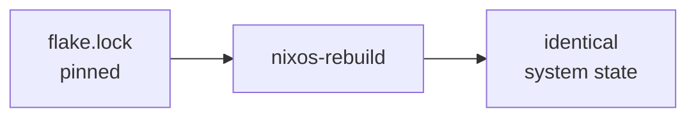
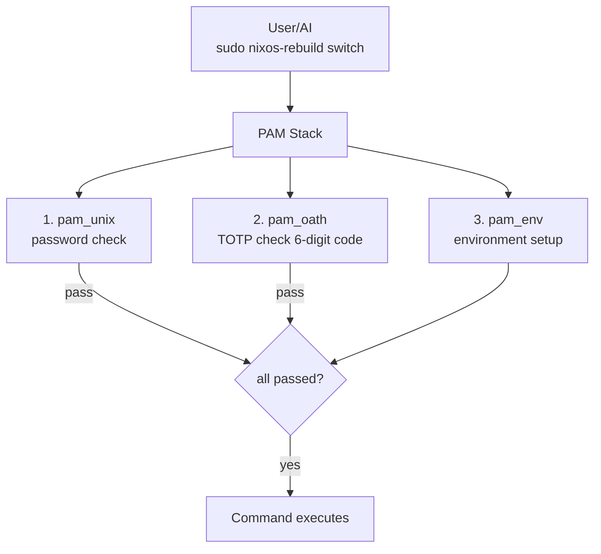

# Architecture Overview

This page describes the full system architecture, component interactions, data flows, and failure handling strategies.

## System Layers

The architecture is built in layers, each providing guarantees to the layer above:

```mermaid
flowchart TB
    subgraph Hardware["Hardware / VPS / VPC"]
        H[provisioned via nixos-anywhere]
    end
    
    subgraph Btrfs["Btrfs Filesystem (subvolumes)"]
        B[@root, @home, @nix, @log, @db, @snapshots]
    end
    
    subgraph Snap["Snapshot Layer (Snapper)"]
        S1[Pre Snapshots] --> S2[Timeline Cleanup]
        S2 --> S3[Remote Backup]
    end
    
    subgraph Nix["NixOS Configuration"]
        N1[Flake<br/>pinned] --> N2[Modules]
        N2 --> N3[nixos-rebuild]
    end
    
    subgraph TOTP["TOTP Gate (pam_oath)"]
        T[Guards: nixos-rebuild, systemctl, user management, firewall changes]
    end
    
    subgraph OpenClaw["OpenClaw (AI infrastructure operator)"]
        O1[Monitor & Detect] --> O2[Propose Changes]
        O2 --> O3[Execute<br/>via sudo]
    end
    
    subgraph Human["Human Operator"]
        HO[TOTP authentication]
    end
    
    H --> B
    B --> Snap
    Snap --> Nix
    Nix --> TOTP
    TOTP --> OpenClaw
    OpenClaw --> Human
```

## Design Principles

### 1. Rollback-First

Every state-changing operation is preceded by a Btrfs snapshot. If the change fails, rollback is instant:

```bash
# Before any nixos-rebuild, a snapshot is taken automatically
# Rollback is a single command:
sudo btrfs subvolume snapshot /snapshots/@root/pre-rebuild /
sudo reboot
```

### 2. Reproducibility

The entire system is defined in Nix flakes. Two identical flake inputs produce identical systems:



### 3. Defense-in-Depth

Multiple safety layers protect against bad changes:

| Layer | Protection |
|---|---|
| TOTP gate | Prevents unauthorized `nixos-rebuild` |
| Pre-rebuild snapshots | Instant rollback after bad apply |
| NixOS generations | Boot into previous generation from GRUB |
| Btrfs send/receive | Off-site backup of known-good state |
| OpenClaw policy engine | AI can only act within defined boundaries |

### 4. Least Privilege

OpenClaw runs as a dedicated system user. It cannot directly execute privileged commands — it must go through the TOTP-gated sudo path for anything destructive.

## Component Interactions

```mermaid
flowchart TB
    A[OpenClaw<br/>detect] -->|propose change| B[TOTP Sudo Gate<br/>pam_oath validates 6-digit code]
    C[Human<br/>approve] -->|TOTP code| B
    B -->|authorized| D[Pre-Change Snapshot<br/>btrfs snapshot @root -> @root-pre]
    D -->|apply| E[nixos-rebuild switch<br/>applies new NixOS configuration]
    E --> F{success?}
    F -->|yes| G[Done<br/>keep snapshot]
    F -->|no| H[Rollback<br/>restore snapshot]
## Data Flow: Configuration Change

A typical configuration change flows through the system like this:

1. **Trigger** — OpenClaw detects an issue or operator initiates a change
2. **Propose** — A Nix configuration diff is generated
3. **Authenticate** — TOTP code is required for critical operations
4. **Snapshot** — Btrfs snapshots all relevant subvolumes
5. **Apply** — `nixos-rebuild switch` applies the new configuration
6. **Verify** — Health checks confirm the system is functional
7. **Commit or Rollback** — On success, the snapshot is retained as a restore point. On failure, the snapshot is restored.

## Failure Modes

| Failure | Detection | Recovery |
|---|---|---|
| Bad NixOS config (won't build) | `nixos-rebuild` fails at build stage | No system change occurred — fix config and retry |
| Bad NixOS config (builds but breaks services) | Health check fails after switch | Rollback to pre-change Btrfs snapshot |
| Bad NixOS config (breaks boot) | System doesn't come up after reboot | Select previous NixOS generation in GRUB |
| Database corruption after change | Application health check / data validation | Restore `@db` subvolume from snapshot |
| OpenClaw proposes bad change | Human reviews and rejects at TOTP gate | Change never applied |
| OpenClaw acts outside policy | Policy engine blocks the action | Action logged and alert sent |
| Disk failure | Btrfs device stats / SMART monitoring | Restore from remote backup (btrfs receive) |

## Subvolume Map

```mermaid
flowchart TB
    subgraph Btrfs["Btrfs pool (/)"]
        A["@root -> /<br/>system root, snapshotted"]
        B["@home -> /home<br/>user data, snapshotted"]
        C["@nix -> /nix<br/>Nix store, NOT snapshotted"]
        D["@log -> /var/log<br/>logs, persisted across rollbacks"]
        E["@db -> /var/lib/db<br/>databases, separate snapshot schedule"]
        F["@snapshots -> /.snapshots<br/>snapshot storage"]
    end
```

:::note Why /nix Is Not Snapshotted
The Nix store (`/nix`) is content-addressed. Every path is identified by its hash. Snapshotting it would waste space — you can always rebuild any Nix store path from the flake. Instead, snapshot the configuration that *references* the store paths.
:::

## Security Model

```mermaid
flowchart TB
    subgraph Threats["Threat Model"]
        A[Threat: AI makes a bad change] --> A1[Mitigation: TOTP gate + pre-change snapshot]
        B[Threat: Attacker gains shell access] --> B1[Mitigation: TOTP required for sudo escalation]
        C[Threat: Configuration drift] --> C1[Mitigation: Declarative NixOS (no drift)]
        D[Threat: Data loss from bad migration] --> D1[Mitigation: Btrfs snapshot of @db before change]
        E[Threat: Complete disk failure] --> E1[Mitigation: Remote btrfs send/receive backup]
    end
```

### Authentication Flow



## What's Next

With the architecture understood, let's start building. The next chapter walks through [bootstrapping NixOS on a remote server](./bootstrap-nixos-anywhere) using `nixos-anywhere`.
