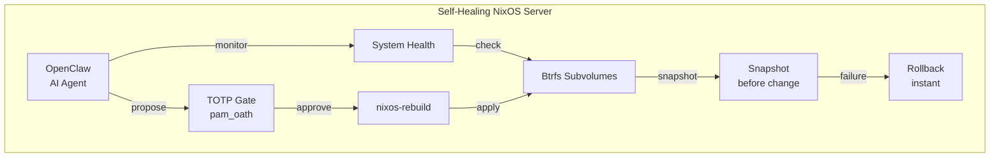

# Bootstrapping Self-Healing Infrastructure with NixOS

This tutorial walks you through building a **production-grade, self-healing server** that combines declarative system management, copy-on-write snapshots, AI-assisted operations, and TOTP-protected critical commands.

## What You'll Build

By the end of this guide, you'll have a server that:

- Runs **NixOS** installed remotely via `nixos-anywhere` — no ISO, no console access needed
- Uses a **Btrfs** filesystem with a carefully designed subvolume layout
- Takes **automatic snapshots** before every system change
- Runs **OpenClaw**, an AI infrastructure operator that monitors and proposes fixes
- Gates **critical operations** (`nixos-rebuild switch`, config changes) behind **TOTP authentication**
- Can **roll back instantly** when something goes wrong — whether caused by a human or an AI

## Who This Is For

- **DevOps engineers** managing production Linux servers
- **SREs** designing resilient infrastructure
- **Platform engineers** exploring AI-assisted operations
- **NixOS enthusiasts** looking for production patterns

## Prerequisites

| Requirement | Details |
|---|---|
| Target server | VPS or VPC with root SSH access, 2+ GB RAM, 20+ GB disk |
| Local machine | Linux or macOS with [Nix installed](https://nixos.org/download/) |
| SSH key pair | `ssh-keygen -t ed25519` if you don't have one |
| Knowledge | Basic Linux administration, SSH, command-line comfort |

:::tip No NixOS Experience Required
This tutorial assumes no prior NixOS experience. Each step is explained from first principles. However, basic Linux sysadmin skills (SSH, filesystems, services) are expected.
:::

## The Stack

| Component | Role |
|---|---|
| [nixos-anywhere](https://github.com/nix-community/nixos-anywhere) | Remote NixOS installation over SSH |
| [NixOS](https://nixos.org) | Declarative, reproducible operating system |
| [Btrfs](https://btrfs.readthedocs.io/) | Copy-on-write filesystem with snapshots |
| [Snapper](http://snapper.io/) | Automated snapshot management |
| [OpenClaw](https://github.com/openclaw) | AI infrastructure operator |
| [pam_oath](https://www.nongnu.org/oath-toolkit/) | TOTP-based sudo authentication |

## Tutorial Roadmap

1. **[Architecture Overview](./architecture)** — System design and component interactions
2. **[Bootstrap with nixos-anywhere](./bootstrap-nixos-anywhere)** — Install NixOS on any server remotely
3. **[Btrfs Subvolume Layout](./btrfs-layout)** — Design the filesystem for snapshots and rollback
4. **[Btrfs Snapshots & Snapper](./btrfs-snapshots)** — Automate snapshot creation and cleanup
5. **[Install OpenClaw](./install-openclaw)** — Set up the AI infrastructure operator
6. **[AI-Managed Infrastructure](./ai-managed-infra)** — Configure AI-assisted operations
7. **[TOTP Sudo Protection](./totp-sudo-protection)** — Gate critical commands behind TOTP
8. **[Database Snapshot Strategy](./database-snapshot-strategy)** — Consistent database backups with Btrfs
9. **[Disaster Recovery](./disaster-recovery)** — Full recovery procedures
10. **[AI Safety & Rollback](./ai-safety-and-rollback)** — Guardrails and rollback workflows
11. **[FAQ](./faq)** — Common questions and troubleshooting

:::warning Production Readiness
This tutorial uses realistic, production-grade configurations. However, always test in a staging environment before applying to production servers. Every environment has unique requirements.
:::

## Design Philosophy

This architecture follows three core principles:

1. **Rollback-first** — Every change is preceded by a snapshot. Recovery is always one command away.
2. **Defense-in-depth** — AI can propose changes, but humans approve critical ones via TOTP. Snapshots catch what TOTP doesn't.
3. **Declarative everything** — The entire system state lives in version-controlled Nix configurations. No snowflake servers.

Let's start with the [architecture overview](./architecture).
