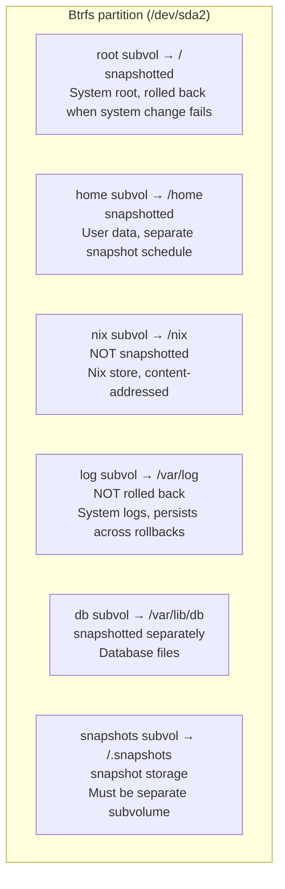

# Btrfs 子卷布局

精心设计的子卷布局是可回滚系统的基础。每个子卷都可以独立创建快照、使用不同的挂载选项，并在需要数据持久化时排除在回滚范围之外。

## 为什么选择 Btrfs

| 特性 | 对 NixOS 的价值 |
|---|---|
| 写时复制（COW） | 快照即时生成且节省空间 |
| 子卷 | 每个目录树可独立设置快照和挂载策略 |
| 压缩（zstd） | 系统文件节省 30-50% 的空间 |
| Send/receive | 将快照流式传输到远程备份服务器 |
| Scrub | 检测并修复静默数据损坏 |
| 在线扩容 | 无需停机即可扩展文件系统 |

:::note ext4 与 Btrfs 对比
ext4 久经考验，但缺少原生快照支持。LVM 快照虽然存在，但在高负载下速度慢且不稳定。Btrfs 快照是即时的、空间高效的（COW），并且可以发送到远程主机。对于「回滚优先」的架构，Btrfs 是最佳选择。
:::

## 子卷设计



## 为什么采用这种布局

### @root（系统根目录）

包含 `/` 下所有未单独挂载的内容：
- `/etc` — 系统配置（由 NixOS 管理）
- `/var/lib` — 服务状态（数据库除外）
- `/usr` — 内容很少，大部分二进制文件在 `/nix` 中

回滚 `@root` 可以将系统恢复到已知正常的状态，同时不影响用户数据、日志和数据库。

### @home（用户数据）

独立出来的好处：
- 回滚系统时不会丢失用户文件
- 可以按不同的时间表为用户数据创建快照
- 可以应用不同的压缩和配额策略

### @nix（Nix store）

```
/nix/store/xxxxxxxx-package-name/
```

Nix store 中的每个路径都通过内容哈希寻址。对 `/nix` 创建快照是浪费的，因为：
1. Store 路径是不可变的，创建后永远不会改变
2. 任何 store 路径都可以从 flake 配置重新构建
3. Store 可能很大（10-50 GB），快照会消耗大量空间
4. 垃圾回收（`nix-collect-garbage`）负责清理

### @log（持久化日志）

日志**必须在回滚后保留**。当错误的配置被回滚时，你需要失败状态下的日志来排查问题。如果不做分离，回滚会把证据一起删掉。

### @db（数据库）

数据库需要特殊处理：
- 快照必须在数据库处于一致状态时创建
- 可能需要在快照前执行 `CHECKPOINT` 或写冻结
- 快照时间表独立于系统（活跃数据库需要更频繁的快照）
- 独立回滚 — 你可能需要回滚系统但保留当前数据

### @snapshots（快照存储）

Snapper 在此存储快照。它必须是独立的子卷，以避免递归问题：对 `@root` 创建快照时会包含 `/.snapshots`，导致快照中包含所有快照的副本。

## Disko 实现

以下是实现该布局的完整 disko 模块：

```nix title="disk-config.nix"
{ lib, ... }:
{
  disko.devices = {
    disk = {
      main = {
        type = "disk";
        device = "/dev/sda";
        content = {
          type = "gpt";
          partitions = {
            ESP = {
              size = "512M";
              type = "EF00";
              content = {
                type = "filesystem";
                format = "vfat";
                mountpoint = "/boot";
                mountOptions = [ "umask=0077" ];
              };
            };
            root = {
              size = "100%";
              content = {
                type = "btrfs";
                extraArgs = [ "-f" ];
                subvolumes = {
                  "@root" = {
                    mountpoint = "/";
                    mountOptions = [
                      "compress=zstd:1"
                      "noatime"
                      "space_cache=v2"
                    ];
                  };
                  "@home" = {
                    mountpoint = "/home";
                    mountOptions = [
                      "compress=zstd:1"
                      "noatime"
                      "space_cache=v2"
                    ];
                  };
                  "@nix" = {
                    mountpoint = "/nix";
                    mountOptions = [
                      "compress=zstd:1"
                      "noatime"
                      "space_cache=v2"
                    ];
                  };
                  "@log" = {
                    mountpoint = "/var/log";
                    mountOptions = [
                      "compress=zstd:1"
                      "noatime"
                      "space_cache=v2"
                    ];
                  };
                  "@db" = {
                    mountpoint = "/var/lib/db";
                    mountOptions = [
                      "noatime"
                      "space_cache=v2"
                      "nodatacow"
                    ];
                  };
                  "@snapshots" = {
                    mountpoint = "/.snapshots";
                    mountOptions = [
                      "noatime"
                      "space_cache=v2"
                    ];
                  };
                };
              };
            };
          };
        };
      };
    };
  };
}
```

:::warning @db 上的 nodatacow
`@db` 子卷使用 `nodatacow` 来禁用数据库文件的写时复制。像 PostgreSQL 这样的数据库有自己的日志机制，在此基础上再叠加 COW 会导致写放大和碎片化。注意：`nodatacow` 隐含 `nodatasum`，因此该子卷上的 Btrfs 校验和功能会失效，但数据库自身的完整性检查可以弥补这一点。
:::

## 挂载选项说明

| 选项 | 用途 |
|---|---|
| `compress=zstd:1` | Zstandard 压缩级别 1 — 速度快且压缩率不错（约 30% 空间节省） |
| `noatime` | 读取时不更新访问时间戳 — 显著减少写 I/O |
| `space_cache=v2` | 更快的空闲空间追踪 — 大文件系统必需 |
| `nodatacow` | 禁用数据库子卷的 COW — 防止写放大 |

### SSD 检测

如果使用 SSD 或 NVMe 驱动器，可以添加 `ssd` 挂载选项：

```nix
mountOptions = [
  "compress=zstd:1"
  "noatime"
  "space_cache=v2"
  "ssd"
];
```

Btrfs 在大多数系统上会自动检测 SSD，但显式指定也无妨。

## 验证布局

安装完成后，验证所有挂载是否正确：

```bash
# List all subvolumes
sudo btrfs subvolume list /

# Check mount points and options
findmnt -t btrfs
```

`findmnt` 的预期输出：

```
TARGET       SOURCE           FSTYPE OPTIONS
/            /dev/sda2[@root] btrfs  rw,noatime,compress=zstd:1,space_cache=v2,subvol=/@root
├─/home      /dev/sda2[@home] btrfs  rw,noatime,compress=zstd:1,space_cache=v2,subvol=/@home
├─/nix       /dev/sda2[@nix]  btrfs  rw,noatime,compress=zstd:1,space_cache=v2,subvol=/@nix
├─/var/log   /dev/sda2[@log]  btrfs  rw,noatime,compress=zstd:1,space_cache=v2,subvol=/@log
├─/var/lib/db /dev/sda2[@db]  btrfs  rw,noatime,space_cache=v2,nodatacow,subvol=/@db
└─/.snapshots /dev/sda2[@snapshots] btrfs rw,noatime,space_cache=v2,subvol=/@snapshots
```

## 查看压缩率

安装 `compsize` 并查看压缩节省了多少空间：

```bash
sudo compsize /
```

示例输出：

```
Processed 45231 files, 12847 regular extents (13102 refs), 8423 inline.
Type       Perc     Disk Usage   Uncompressed Referenced
TOTAL       68%      2.1G         3.1G         3.2G
none       100%      1.4G         1.4G         1.4G
zstd        48%      723M         1.7G         1.8G
```

可以看到 zstd 压缩在可压缩文件上节省了约 52% 的空间。

## 容量规划

按子卷监控磁盘使用情况：

```bash
# Overall filesystem usage
sudo btrfs filesystem usage /

# Per-subvolume space (requires quota)
sudo btrfs quota enable /
sudo btrfs qgroup show /
```

:::tip 为 @snapshots 设置配额
防止快照占满磁盘：

```bash
# Limit snapshots to 20GB
sudo btrfs qgroup limit 20G /.snapshots
```

或在 NixOS 中配置：

```nix
# In configuration.nix — run this as an activation script
system.activationScripts.btrfsQuota = ''
  ${pkgs.btrfs-progs}/bin/btrfs quota enable / 2>/dev/null || true
'';
```
:::

## 下一步

子卷布局已就绪。接下来，让我们配置 [Snapper 自动快照](./btrfs-snapshots)，确保每次系统变更都有可恢复的还原点。
