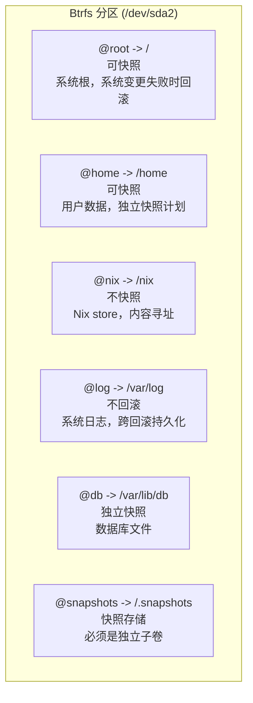

# Btrfs 子卷布局

精心设计的子卷布局是具备回滚能力系统的基础。每个子卷都可以独立快照、挂载不同选项，并在需要持久化时排除回滚。

## 为什么 NixOS 使用 Btrfs

| 特性 | 对 NixOS 的好处 |
|---|---|
| 写时复制 (COW) | 快照即时且节省空间 |
| 子卷 | 每个目录树独立快照和挂载策略 |
| 压缩 (zstd) | 系统文件节省 30-50% 空间 |
| Send/receive | 将快照流式传输到远程备份服务器 |
| Scrub | 检测和修复静默数据损坏 |
| 在线调整大小 | 无需停机即可增长文件系统 |

:::note ext4 vs Btrfs
ext4 经过实战测试但缺乏原生快照。LVM 快照存在但在负载下缓慢且脆弱。Btrfs 快照即时、节省空间（COW），并且可以发送到远程主机。对于回滚优先架构，Btrfs 是明确的选择。
:::

## 子卷设计



## 为什么是这个布局

### @root（系统根）

`/` 下不是单独挂载的所有内容。包括：
- `/etc` — 系统配置（由 NixOS 管理）
- `/var/lib` — 服务状态（数据库除外）
- `/usr` — 最小化，大多数二进制文件在 `/nix` 中

回滚 `@root` 将系统恢复到已知良好状态，同时不触及用户数据、日志或数据库。

### @home（用户数据）

分离以便您可以：
- 回滚系统而不丢失用户文件
- 按不同计划快照用户数据
- 应用不同的压缩/配额策略

### @nix（Nix store）

```
/nix/store/xxxxxxxx-package-name/
```

每个 Nix store 路径由其内容哈希寻址。快照 `/nix` 是浪费的，因为：
1. Store 路径是不可变的 — 创建后从不更改
2. 任何 store 路径都可以从 flake 配置重建
3. Store 可能很大（10-50 GB），快照会消耗大量空间
4. 垃圾回收（`nix-collect-garbage`）处理清理

### @log（持久日志）

日志**必须跨回滚存活**。当不良配置被回滚时，您需要失败状态的日志来调试出了什么问题。没有这个分离，回滚会删除证据。

### @db（数据库）

数据库需要特殊处理：
- 快照必须在数据库处于一致状态时拍摄
- 可能需要在快照前执行 `CHECKPOINT` 或写冻结
- 与系统独立的快照计划（对于活动数据库更频繁）
- 独立回滚 — 您可能希望回滚系统但保留当前数据

### @snapshots（快照存储）

Snapper 在这里存储快照。它必须是自己的子卷以避免递归问题：快照 `@root` 会包含 `/.snapshots`，创建所有快照的快照。

## Disko 实现

这是实现该布局的完整 disko 模块：

```nix title="disk-config.nix"
{ lib, ... }:
{
  disko.devices = {
    disk = {
      main = {
        type = "disk";
        device = "/dev/sda";
        content = {
          type = "gpt";
          partitions = {
            ESP = {
              size = "512M";
              type = "EF00";
              content = {
                type = "filesystem";
                format = "vfat";
                mountpoint = "/boot";
                mountOptions = [ "umask=0077" ];
              };
            };
            root = {
              size = "100%";
              content = {
                type = "btrfs";
                extraArgs = [ "-f" ];
                subvolumes = {
                  "@root" = {
                    mountpoint = "/";
                    mountOptions = [
                      "compress=zstd:1"
                      "noatime"
                      "space_cache=v2"
                    ];
                  };
                  "@home" = {
                    mountpoint = "/home";
                    mountOptions = [
                      "compress=zstd:1"
                      "noatime"
                      "space_cache=v2"
                    ];
                  };
                  "@nix" = {
                    mountpoint = "/nix";
                    mountOptions = [
                      "compress=zstd:1"
                      "noatime"
                      "space_cache=v2"
                    ];
                  };
                  "@log" = {
                    mountpoint = "/var/log";
                    mountOptions = [
                      "compress=zstd:1"
                      "noatime"
                      "space_cache=v2"
                    ];
                  };
                  "@db" = {
                    mountpoint = "/var/lib/db";
                    mountOptions = [
                      "noatime"
                      "space_cache=v2"
                      "nodatacow"
                    ];
                  };
                  "@snapshots" = {
                    mountpoint = "/.snapshots";
                    mountOptions = [
                      "noatime"
                      "space_cache=v2"
                    ];
                  };
                };
              };
            };
          };
        };
      };
    };
  };
}
```

:::warning @db 使用 nodatacow
`@db` 子卷使用 `nodatacow` 来禁用数据库文件的写时复制。数据库如 PostgreSQL 有自己的日志 — 在其上叠加 COW 会导致写放大和碎片化。注意：`nodatacow` 意味着 `nodatasum`，因此您在此子卷上会失去 Btrfs 校验和。数据库自己的完整性检查补偿了这一点。
:::

## 挂载选项解释

| 选项 | 目的 |
|---|---|
| `compress=zstd:1` | Zstandard 压缩级别 1 — 快速且比率良好（~30% 节省）|
| `noatime` | 读取时不更新访问时间戳 — 显著减少写 I/O |
| `space_cache=v2` | 更快的空闲空间跟踪 — 大型文件系统必需 |
| `nodatacow` | 禁用数据库子卷的 COW — 防止写放大 |

### SSD 检测

如果您在 SSD 或 NVMe 驱动器上，添加 `ssd` 挂载选项：

```nix
mountOptions = [
  "compress=zstd:1"
  "noatime"
  "space_cache=v2"
  "ssd"
];
```

Btrfs 在大多数系统上自动检测 SSD，但明确指定没有坏处。

## 验证布局

安装后，验证所有内容正确挂载：

```bash
# 列出所有子卷
sudo btrfs subvolume list /

# 检查挂载点和选项
findmnt -t btrfs
```

预期的 `findmnt` 输出：

```
TARGET       SOURCE           FSTYPE OPTIONS
/            /dev/sda2[@root] btrfs  rw,noatime,compress=zstd:1,space_cache=v2,subvol=/@root
├─/home      /dev/sda2[@home] btrfs  rw,noatime,compress=zstd:1,space_cache=v2,subvol=/@home
├─/nix       /dev/sda2[@nix]  btrfs  rw,noatime,compress=zstd:1,space_cache=v2,subvol=/@nix
├─/var/log   /dev/sda2[@log]  btrfs  rw,noatime,compress=zstd:1,space_cache=v2,subvol=/@log
├─/var/lib/db /dev/sda2[@db]  btrfs  rw,noatime,space_cache=v2,nodatacow,subvol=/@db
└─/.snapshots /dev/sda2[@snapshots] btrfs rw,noatime,space_cache=v2,subvol=/@snapshots
```

## 检查压缩比率

安装 `compsize` 并检查压缩节省了多少空间：

```bash
sudo compsize /
```

示例输出：

```
Processed 45231 files, 12847 regular extents (13102 refs), 8423 inline.
Type       Perc     Disk Usage   Uncompressed Referenced
TOTAL       68%      2.1G         3.1G         3.2G
none       100%      1.4G         1.4G         1.4G
zstd        48%      723M         1.7G         1.8G
```

这显示 zstd 压缩在可压缩文件上节省了约 52%。

## 容量规划

监控每个子卷的磁盘使用：

```bash
# 整体文件系统使用
sudo btrfs filesystem usage /

# 每个子卷空间（需要配额）
sudo btrfs quota enable /
sudo btrfs qgroup show /
```

:::tip 为 @snapshots 设置配额
防止快照填满磁盘：

```bash
# 将快照限制为 20GB
sudo btrfs qgroup limit 20G /.snapshots
```

或在 NixOS 中配置：

```nix
# 在 configuration.nix 中 — 作为激活脚本运行
system.activationScripts.btrfsQuota = ''
  ${pkgs.btrfs-progs}/bin/btrfs quota enable / 2>/dev/null || true
'';
```
:::

## 下一步

子卷布局已准备就绪。接下来，让我们配置 [使用 Snapper 的自动快照](./btrfs-snapshots)，以便每个系统变更都受恢复点保护。
