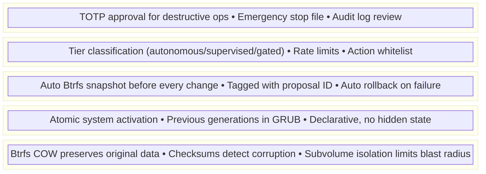
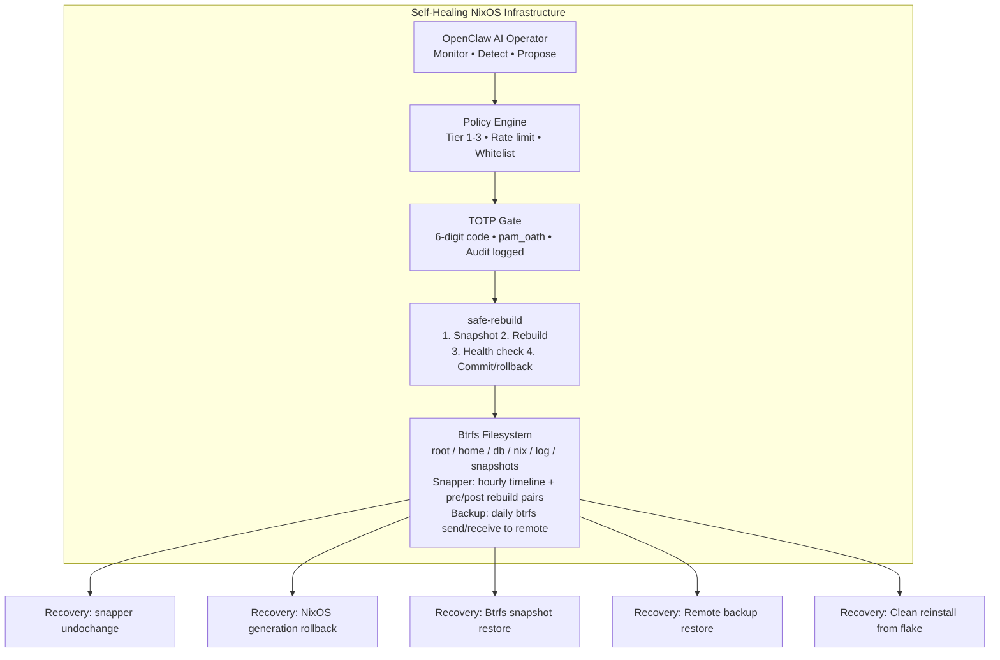

# AI Safety & Rollback

This final chapter defines the operating procedures for running AI-managed infrastructure safely. It covers guardrails, rollback workflows, failure budgets, and the principles that keep humans in control while benefiting from AI automation.

## The Safety Model



## AI Guardrails

### 1. Action Whitelist

OpenClaw can only perform actions explicitly listed in the policy. Anything not whitelisted is denied by default:

```nix
# Only these actions are allowed — everything else is blocked
services.openclaw.settings.policy.autonomous.allowedActions = [
  "restart-failed-service"
  "rotate-logs"
  "clean-temp-files"
  "collect-metrics"
  "check-certificates"
];
```

:::tip Default Deny
The policy engine operates on a default-deny model. If an action isn't in the whitelist, OpenClaw cannot execute it — even if the LLM recommends it. This is a fundamental safety property.
:::

### 2. Rate Limiting

Prevent runaway automation:

```nix
services.openclaw.settings.policy.safety = {
  maxActionsPerHour = 5;          # Total actions across all tiers
  maxChangesPerDay = 20;          # Total state-changing operations
  maxRestartsPerServicePerHour = 3; # Per-service restart limit
  cooldownAfterFailure = "15m";   # Pause after any failed action
};
```

### 3. Blast Radius Containment

Each action has a defined scope. OpenClaw cannot combine multiple actions into a single operation:

```
ALLOWED:
  - Restart nginx (single service, defined scope)
  - Update one package (targeted change)
  - Add a firewall rule (specific modification)

NOT ALLOWED:
  - Restart all services at once
  - Run arbitrary shell commands
  - Modify multiple config files in one action
  - Chain actions without individual approval
```

### 4. Rollback Budget

Define how many rollbacks are acceptable before OpenClaw is automatically suspended:

```nix
services.openclaw.settings.policy.safety = {
  # If OpenClaw triggers 3 rollbacks in 24 hours, suspend autonomous actions
  maxRollbacksPerDay = 3;
  suspendOnRollbackBudgetExceeded = true;

  # Require human review to resume
  resumeRequiresTotp = true;
};
```

## The Rollback Workflow

Every AI-initiated change follows this sequence:

```
Step 1: PROPOSE
  OpenClaw generates a change proposal
  ├── Nix configuration diff
  ├── Impact assessment
  ├── Risk classification
  └── Rollback plan

Step 2: APPROVE (if Tier 2 or 3)
  ├── Tier 2: Notification + countdown timer
  └── Tier 3: TOTP code required

Step 3: SNAPSHOT
  Btrfs snapshots taken:
  ├── snapper -c root create --type pre
  ├── snapper -c db create --type pre  (if DB affected)
  └── Snapshot IDs recorded in proposal

Step 4: APPLY
  safe-rebuild switch (or targeted action)
  ├── NixOS builds new configuration
  ├── Activates new system profile
  └── Records exit code

Step 5: VERIFY
  Health checks run:
  ├── All systemd services healthy?
  ├── Network connectivity OK?
  ├── Application endpoints responding?
  ├── Database accepting connections?
  └── Custom health checks passing?

Step 6a: COMMIT (if healthy)
  ├── Post-snapshot created (snapper --type post)
  ├── Audit log updated (status: success)
  └── Proposal marked complete

Step 6b: ROLLBACK (if unhealthy)
  ├── snapper -c root undochange $PRE_SNAP..0
  ├── snapper -c db undochange $DB_SNAP..0  (if DB affected)
  ├── Services restarted
  ├── Health check re-run to confirm recovery
  ├── Audit log updated (status: rolled-back)
  └── Alert sent to operator
```

### Rollback Implementation

```nix title="modules/auto-rollback.nix"
{ config, pkgs, ... }:
let
  autoRollback = pkgs.writeShellScriptBin "auto-rollback" ''
    set -euo pipefail

    PRE_SNAP_NUM="''${1:?Usage: auto-rollback <pre-snapshot-number>}"
    HEALTH_TIMEOUT="''${2:-120}"

    echo "=== Post-Change Health Check ==="
    echo "Pre-snapshot: #$PRE_SNAP_NUM"
    echo "Timeout: ''${HEALTH_TIMEOUT}s"
    echo ""

    HEALTHY=true

    # Check 1: Failed systemd services
    FAILED=$(systemctl --failed --no-legend | wc -l)
    if [ "$FAILED" -gt 0 ]; then
      echo "FAIL: $FAILED failed systemd units"
      systemctl --failed --no-legend
      HEALTHY=false
    else
      echo "PASS: No failed systemd units"
    fi

    # Check 2: SSH is still accessible
    if systemctl is-active --quiet sshd; then
      echo "PASS: SSH daemon running"
    else
      echo "FAIL: SSH daemon not running"
      HEALTHY=false
    fi

    # Check 3: Network connectivity
    if ping -c 1 -W 5 1.1.1.1 > /dev/null 2>&1; then
      echo "PASS: Network connectivity OK"
    else
      echo "FAIL: No network connectivity"
      HEALTHY=false
    fi

    # Check 4: Disk space
    DISK_USAGE=$(df / | awk 'NR==2 {print $5}' | tr -d '%')
    if [ "$DISK_USAGE" -lt 95 ]; then
      echo "PASS: Disk usage at ''${DISK_USAGE}%"
    else
      echo "FAIL: Disk usage critical at ''${DISK_USAGE}%"
      HEALTHY=false
    fi

    # Check 5: PostgreSQL (if enabled)
    if systemctl is-enabled --quiet postgresql 2>/dev/null; then
      if sudo -u postgres psql -c "SELECT 1;" > /dev/null 2>&1; then
        echo "PASS: PostgreSQL responding"
      else
        echo "FAIL: PostgreSQL not responding"
        HEALTHY=false
      fi
    fi

    echo ""

    if [ "$HEALTHY" = true ]; then
      echo "All health checks passed. Change committed."
      exit 0
    else
      echo "╔══════════════════════════════════════════╗"
      echo "║  HEALTH CHECK FAILED — ROLLING BACK     ║"
      echo "╚══════════════════════════════════════════╝"
      echo ""
      echo "Rolling back to snapshot #$PRE_SNAP_NUM..."

      sudo snapper -c root undochange "''${PRE_SNAP_NUM}..0"

      echo "Rollback complete. Restarting services..."
      sudo systemctl daemon-reload

      echo "Verifying rollback..."
      sleep 5
      NEW_FAILED=$(systemctl --failed --no-legend | wc -l)
      if [ "$NEW_FAILED" -gt 0 ]; then
        echo "WARNING: Still have $NEW_FAILED failed units after rollback"
        echo "Manual intervention required"
        exit 2
      fi

      echo "Rollback verified. System is healthy."
      exit 1
    fi
  '';
in
{
  environment.systemPackages = [ autoRollback ];
}
```

## Operating Procedures

### Daily Operations

```
Morning Review (5 minutes):
  1. Check OpenClaw audit log for overnight actions
     $ sudo tail -50 /var/log/openclaw/audit.jsonl | jq -r '.timestamp + " " + .action + " " + .status'

  2. Review any pending Tier 2 proposals
     $ sudo openclaw pending-proposals

  3. Verify snapshot health
     $ sudo snapper -c root list | tail -10
     $ sudo snapper -c db list | tail -10

  4. Check disk usage
     $ sudo btrfs filesystem usage /
```

### Weekly Operations

```
Weekly Review (30 minutes):
  1. Review full audit log for patterns
     - Are certain actions failing repeatedly?
     - Is OpenClaw making too many/too few changes?
     - Any suspicious proposals from the LLM?

  2. Test a snapshot restore (non-destructive)
     $ sudo btrfs subvolume snapshot /.snapshots/root/latest /tmp/restore-test
     $ ls /tmp/restore-test/etc/nixos/
     $ sudo btrfs subvolume delete /tmp/restore-test

  3. Verify remote backups are current
     $ ssh backup-server "ls -la /backups/$(hostname)/ | tail -5"

  4. Update the NixOS flake (in a test environment first)
     $ nix flake update
     $ nixos-rebuild dry-build
```

### Monthly Operations

```
Monthly Review (2 hours):
  1. Full disaster recovery drill
     - Restore from backup to a test server
     - Verify all services come up
     - Test TOTP authentication
     - Document any issues

  2. Review and update OpenClaw policies
     - Are the tier classifications still correct?
     - Any new actions that should be whitelisted?
     - Rate limits appropriate?

  3. Rotate secrets
     - OpenClaw API key
     - Backup SSH keys
     - Review TOTP enrollment

  4. Review and archive old snapshots
     $ sudo snapper -c root cleanup number
     $ sudo snapper -c db cleanup number
```

## Anti-Patterns

Things that will get you into trouble:

### 1. Giving OpenClaw Root Access

```
DON'T:
  users.users.openclaw.extraGroups = [ "wheel" ];
  # or
  security.sudo.extraRules = [{
    users = [ "openclaw" ];
    commands = [{ command = "ALL"; options = [ "NOPASSWD" ]; }];
  }];
```

This bypasses every safety layer. OpenClaw must go through TOTP-gated sudo for destructive operations.

### 2. Disabling Snapshots to Save Space

```
DON'T:
  services.snapper.configs.root.TIMELINE_CREATE = false;
```

Without snapshots, rollback is impossible. If disk space is an issue, reduce retention — don't disable snapshots.

### 3. Trusting AI Output Without Verification

```
DON'T:
  Accept every proposal OpenClaw makes without reviewing the Nix diff.

DO:
  Review every Tier 3 proposal before providing your TOTP code.
  The TOTP gate is your opportunity to review, not just a speed bump.
```

### 4. Skipping Health Checks

```
DON'T:
  Apply changes without post-change health verification.
  The auto-rollback system only works if health checks are comprehensive.

DO:
  Add application-specific health checks beyond the defaults.
  If your app has a /health endpoint, include it.
```

## Operational Metrics

Track these metrics to assess the health of your AI-managed infrastructure:

| Metric | Target | Alert Threshold |
|---|---|---|
| Successful changes / total changes | > 95% | < 90% |
| Rollbacks per week | < 2 | > 3 |
| Mean time to detect issue | < 5 min | > 15 min |
| Mean time to recover | < 10 min | > 30 min |
| Snapshot space usage | < 30% of disk | > 50% |
| OpenClaw action rate | 5-15/day | > 30/day or 0/day |
| TOTP approval response time | < 15 min | > 1 hour |

## Complete System Summary



## Final Thoughts

This architecture provides a practical framework for AI-assisted infrastructure management. The key insight is that **AI doesn't need to be perfect to be useful** — it just needs to operate within a system where mistakes are cheap to undo.

The combination of:
- **NixOS** (declarative, reproducible system state)
- **Btrfs snapshots** (instant, space-efficient rollback)
- **TOTP gates** (human-in-the-loop for critical operations)
- **Policy engine** (bounded AI autonomy)

creates an environment where AI can experiment and learn while humans maintain ultimate control. When the AI makes a mistake, recovery is one command away. When it makes a good decision, the system improves without human intervention.

Start conservative — restrict OpenClaw to Tier 1 actions only. As you build confidence, gradually expand its autonomy. The safety layers are there so you can move fast without fear.

Have questions? Check the [FAQ](./faq) for answers to common questions about this architecture.
