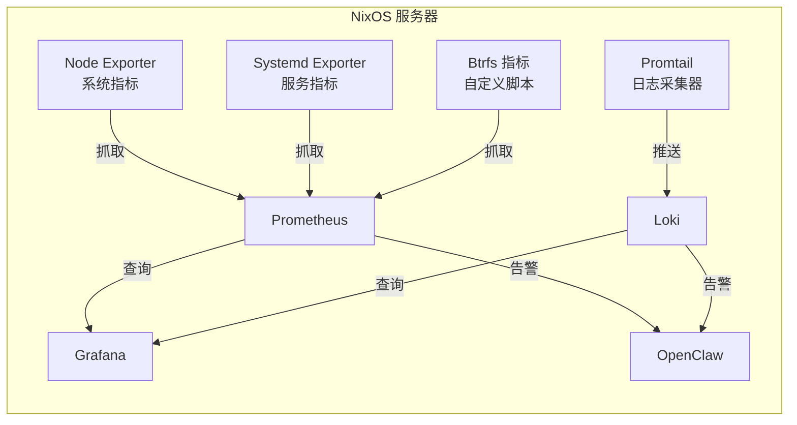

# 监控与告警

OpenClaw 需要**可观测性数据**来检测问题并提出修复方案。如果没有适当的监控，AI 操作代理就如同盲人摸象。本章将在 NixOS 上搭建一套完整的监控栈：Prometheus 用于指标采集，Grafana 用于仪表板展示，Loki 用于日志聚合。

## 架构概览



## Prometheus 与 Node Exporter

Node Exporter 提供硬件和操作系统指标（CPU、内存、磁盘、网络）。Prometheus 负责抓取并存储这些指标。

```nix title="monitoring.nix"
{ config, pkgs, ... }:

{
  # Prometheus 服务器
  services.prometheus = {
    enable = true;
    port = 9090;
    retentionTime = "30d";

    # 抓取目标
    scrapeConfigs = [
      {
        job_name = "node";
        static_configs = [{
          targets = [ "localhost:9100" ];
        }];
        scrape_interval = "15s";
      }
      {
        job_name = "systemd";
        static_configs = [{
          targets = [ "localhost:9558" ];
        }];
        scrape_interval = "30s";
      }
    ];

    # 告警规则
    rules = [
      (builtins.toJSON {
        groups = [{
          name = "system";
          rules = [
            {
              alert = "HighCPU";
              expr = ''100 - (avg by(instance) (rate(node_cpu_seconds_total{mode="idle"}[5m])) * 100) > 85'';
              for = "5m";
              labels.severity = "warning";
              annotations.summary = "CPU usage above 85% for 5 minutes";
            }
            {
              alert = "HighMemory";
              expr = ''(1 - node_memory_MemAvailable_bytes / node_memory_MemTotal_bytes) * 100 > 90'';
              for = "5m";
              labels.severity = "warning";
              annotations.summary = "Memory usage above 90%";
            }
            {
              alert = "DiskSpaceLow";
              expr = ''(1 - node_filesystem_avail_bytes{mountpoint="/"} / node_filesystem_size_bytes{mountpoint="/"}) * 100 > 85'';
              for = "2m";
              labels.severity = "critical";
              annotations.summary = "Disk usage above 85%";
            }
            {
              alert = "SystemdUnitFailed";
              expr = ''node_systemd_unit_state{state="failed"} == 1'';
              for = "1m";
              labels.severity = "critical";
              annotations.summary = "Systemd unit {{ $labels.name }} has failed";
            }
            {
              alert = "HighLoad";
              expr = ''node_load15 > on() count(node_cpu_seconds_total{mode="idle"}) by (instance) * 0.8'';
              for = "10m";
              labels.severity = "warning";
              annotations.summary = "15-minute load average exceeds 80% of CPU count";
            }
            {
              alert = "NetworkErrors";
              expr = ''rate(node_network_receive_errs_total[5m]) + rate(node_network_transmit_errs_total[5m]) > 10'';
              for = "5m";
              labels.severity = "warning";
              annotations.summary = "Network interface errors detected";
            }
          ];
        }];
      })
    ];
  };

  # Node Exporter — 系统指标
  services.prometheus.exporters.node = {
    enable = true;
    port = 9100;
    enabledCollectors = [
      "cpu"
      "diskstats"
      "filesystem"
      "loadavg"
      "meminfo"
      "netdev"
      "netstat"
      "stat"
      "time"
      "vmstat"
      "systemd"
      "processes"
      "tcpstat"
    ];
  };

  # Systemd Exporter — 服务级别指标
  services.prometheus.exporters.systemd = {
    enable = true;
    port = 9558;
  };

  # 防火墙：仅暴露 Grafana，保持 Prometheus/Loki 仅内部访问
  networking.firewall.allowedTCPPorts = [ 3000 ];
}
```

## Grafana 仪表板

Grafana 提供可视化展示，是操作人员（以及 OpenClaw）查看系统健康状况的地方。

```nix title="grafana.nix"
{ config, pkgs, ... }:

{
  services.grafana = {
    enable = true;
    settings = {
      server = {
        http_addr = "0.0.0.0";
        http_port = 3000;
        domain = "grafana.example.com";
      };
      security = {
        admin_user = "admin";
        # 请更改此密码！生产环境中使用 agenix/sops-nix
        admin_password = "$__file{/run/secrets/grafana-admin-password}";
      };
      # 禁用公开注册
      "auth.anonymous".enabled = false;
    };

    # 自动配置数据源
    provision = {
      enable = true;
      datasources.settings.datasources = [
        {
          name = "Prometheus";
          type = "prometheus";
          url = "http://localhost:9090";
          isDefault = true;
        }
        {
          name = "Loki";
          type = "loki";
          url = "http://localhost:3100";
        }
      ];
    };
  };
}
```

## Loki 与 Promtail（日志聚合）

Loki 存储日志。Promtail 将系统和服务日志发送到 Loki。这使 OpenClaw 能够搜索和分析日志以进行异常检测。

```nix title="loki.nix"
{ config, pkgs, ... }:

{
  # Loki 日志存储
  services.loki = {
    enable = true;
    configuration = {
      auth_enabled = false;
      server.http_listen_port = 3100;

      common = {
        path_prefix = "/var/lib/loki";
        storage.filesystem.chunks_directory = "/var/lib/loki/chunks";
        storage.filesystem.rules_directory = "/var/lib/loki/rules";
        replication_factor = 1;
        ring.kvstore.store = "inmemory";
        ring.instance_addr = "127.0.0.1";
      };

      schema_config.configs = [{
        from = "2024-01-01";
        store = "tsdb";
        object_store = "filesystem";
        schema = "v13";
        index = {
          prefix = "index_";
          period = "24h";
        };
      }];

      limits_config = {
        retention_period = "30d";
        max_query_length = "721h";
      };

      compactor = {
        working_directory = "/var/lib/loki/compactor";
        compaction_interval = "10m";
        retention_enabled = true;
        retention_delete_delay = "2h";
      };
    };
  };

  # Promtail 日志采集器
  services.promtail = {
    enable = true;
    configuration = {
      server = {
        http_listen_port = 9080;
        grpc_listen_port = 0;
      };

      positions.filename = "/var/lib/promtail/positions.yaml";

      clients = [{
        url = "http://localhost:3100/loki/api/v1/push";
      }];

      scrape_configs = [
        {
          job_name = "journal";
          journal = {
            max_age = "12h";
            labels.job = "systemd-journal";
          };
          relabel_configs = [{
            source_labels = [ "__journal__systemd_unit" ];
            target_label = "unit";
          }];
        }
        {
          job_name = "syslog";
          static_configs = [{
            targets = [ "localhost" ];
            labels = {
              job = "syslog";
              __path__ = "/var/log/*.log";
            };
          }];
        }
        {
          job_name = "openclaw";
          static_configs = [{
            targets = [ "localhost" ];
            labels = {
              job = "openclaw";
              __path__ = "/var/lib/openclaw/audit/*.log";
            };
          }];
        }
      ];
    };
  };
}
```

## Btrfs 快照监控

标准的 Exporter 不覆盖 Btrfs 快照健康状态。可以使用自定义脚本通过 textfile collector 将快照指标暴露给 Prometheus。

```bash title="/usr/local/bin/btrfs-metrics.sh"
#!/usr/bin/env bash
# 为 Btrfs 健康状态生成 Prometheus 兼容的指标
# 通过 systemd timer 每 5 分钟运行一次

TEXTFILE_DIR="/var/lib/prometheus-node-exporter"
METRIC_FILE="${TEXTFILE_DIR}/btrfs.prom"
TMP_FILE="${METRIC_FILE}.tmp"

mkdir -p "$TEXTFILE_DIR"

{
  # 每个配置的快照数量
  for config in $(snapper list-configs --columns config | tail -n +3); do
    count=$(snapper -c "$config" list --columns number | tail -n +3 | wc -l)
    echo "btrfs_snapshot_count{config=\"$config\"} $count"

    # 最新快照的存活时间（秒）
    latest=$(snapper -c "$config" list --columns date | tail -1 | xargs -I{} date -d {} +%s 2>/dev/null || echo 0)
    now=$(date +%s)
    if [ "$latest" -gt 0 ]; then
      age=$((now - latest))
      echo "btrfs_snapshot_latest_age_seconds{config=\"$config\"} $age"
    fi
  done

  # 文件系统使用情况
  usage_json=$(btrfs filesystem usage -b / 2>/dev/null)
  if [ $? -eq 0 ]; then
    total=$(echo "$usage_json" | grep "Device size:" | awk '{print $3}')
    used=$(echo "$usage_json" | grep "Used:" | head -1 | awk '{print $2}')
    echo "btrfs_device_size_bytes $total"
    echo "btrfs_used_bytes $used"
  fi

  # 数据校验状态
  last_scrub=$(btrfs scrub status / 2>/dev/null | grep "finished" | head -1)
  if echo "$last_scrub" | grep -q "finished"; then
    echo "btrfs_scrub_healthy 1"
  else
    echo "btrfs_scrub_healthy 0"
  fi

  # Btrfs 设备错误
  errors=$(btrfs device stats / 2>/dev/null | awk '{sum += $NF} END {print sum}')
  echo "btrfs_device_errors_total ${errors:-0}"

} > "$TMP_FILE"

mv "$TMP_FILE" "$METRIC_FILE"
```

### Btrfs 指标的 NixOS 配置

```nix title="btrfs-metrics.nix"
{ config, pkgs, ... }:

{
  # 安装脚本
  environment.etc."btrfs-metrics.sh" = {
    source = ./scripts/btrfs-metrics.sh;
    mode = "0755";
  };

  # 生成指标的 systemd 服务
  systemd.services.btrfs-metrics = {
    description = "Generate Btrfs metrics for Prometheus";
    serviceConfig = {
      Type = "oneshot";
      ExecStart = "/etc/btrfs-metrics.sh";
    };
    path = with pkgs; [ btrfs-progs snapper coreutils gawk gnugrep ];
  };

  systemd.timers.btrfs-metrics = {
    description = "Run Btrfs metrics collection every 5 minutes";
    wantedBy = [ "timers.target" ];
    timerConfig = {
      OnBootSec = "2min";
      OnUnitActiveSec = "5min";
      RandomizedDelaySec = "30s";
    };
  };

  # 告知 Node Exporter 读取 textfile 指标
  services.prometheus.exporters.node.extraFlags = [
    "--collector.textfile.directory=/var/lib/prometheus-node-exporter"
  ];
}
```

## OpenClaw 的告警规则

这些 Prometheus 告警规则专为 OpenClaw 消费和执行操作而设计。

```nix title="alert-rules.nix"
{ config, ... }:

{
  services.prometheus.rules = [
    (builtins.toJSON {
      groups = [
        {
          name = "btrfs";
          rules = [
            {
              alert = "SnapshotTooOld";
              expr = ''btrfs_snapshot_latest_age_seconds{config="root"} > 86400'';
              for = "10m";
              labels.severity = "warning";
              annotations.summary = "Root snapshot is older than 24 hours";
            }
            {
              alert = "SnapshotSpaceHigh";
              expr = ''btrfs_snapshot_count{config="root"} > 100'';
              for = "5m";
              labels.severity = "warning";
              annotations.summary = "Too many root snapshots, cleanup needed";
            }
            {
              alert = "BtrfsDeviceErrors";
              expr = "btrfs_device_errors_total > 0";
              for = "1m";
              labels.severity = "critical";
              annotations.summary = "Btrfs device errors detected — run btrfs scrub";
            }
          ];
        }
        {
          name = "openclaw";
          rules = [
            {
              alert = "OpenClawDown";
              expr = ''up{job="openclaw"} == 0'';
              for = "2m";
              labels.severity = "critical";
              annotations.summary = "OpenClaw service is down";
            }
            {
              alert = "HighRollbackRate";
              expr = ''rate(openclaw_rollbacks_total[1h]) > 3'';
              for = "5m";
              labels.severity = "warning";
              annotations.summary = "OpenClaw has triggered more than 3 rollbacks in the last hour";
            }
            {
              alert = "TierThreePending";
              expr = ''openclaw_proposals_pending{tier="3"} > 0'';
              for = "30m";
              labels.severity = "warning";
              annotations.summary = "Tier 3 proposal waiting for TOTP approval for >30 minutes";
            }
          ];
        }
        {
          name = "services";
          rules = [
            {
              alert = "SSHDown";
              expr = ''node_systemd_unit_state{name="sshd.service",state="active"} != 1'';
              for = "1m";
              labels.severity = "critical";
              annotations.summary = "SSH service is not running";
            }
            {
              alert = "NTPOutOfSync";
              expr = "abs(node_timex_offset_seconds) > 0.5";
              for = "5m";
              labels.severity = "warning";
              annotations.summary = "System clock drift detected — TOTP may break";
            }
            {
              alert = "HighSwapUsage";
              expr = ''(node_memory_SwapTotal_bytes - node_memory_SwapFree_bytes) / node_memory_SwapTotal_bytes * 100 > 50'';
              for = "10m";
              labels.severity = "warning";
              annotations.summary = "Swap usage above 50%";
            }
          ];
        }
        {
          name = "certificates";
          rules = [
            {
              alert = "CertificateExpiringSoon";
              expr = ''(probe_ssl_earliest_cert_expiry - time()) / 86400 < 14'';
              for = "1h";
              labels.severity = "warning";
              annotations.summary = "TLS certificate expires in less than 14 days";
            }
          ];
        }
      ];
    })
  ];
}
```

## OpenClaw 监控集成

配置 OpenClaw 查询 Prometheus 和 Loki，以实现智能问题检测。

```nix title="openclaw-monitoring.nix"
{ config, pkgs, ... }:

{
  services.openclaw.settings.monitoring = {
    prometheus = {
      endpoint = "http://localhost:9090";
      # OpenClaw 定期执行的查询
      queries = {
        diskUsage = ''100 - (node_filesystem_avail_bytes{mountpoint="/"} / node_filesystem_size_bytes{mountpoint="/"} * 100)'';
        memoryUsage = ''(1 - node_memory_MemAvailable_bytes / node_memory_MemTotal_bytes) * 100'';
        cpuUsage = ''100 - (avg(rate(node_cpu_seconds_total{mode="idle"}[5m])) * 100)'';
        failedUnits = ''node_systemd_unit_state{state="failed"}'';
        loadAverage = "node_load15";
        networkErrors = ''rate(node_network_receive_errs_total[5m]) + rate(node_network_transmit_errs_total[5m])'';
        snapshotAge = ''btrfs_snapshot_latest_age_seconds'';
        btrfsErrors = "btrfs_device_errors_total";
      };
      pollingInterval = "60s";
    };

    loki = {
      endpoint = "http://localhost:3100";
      queries = {
        errors = ''{job="systemd-journal"} |= "error" | rate[5m] > 10'';
        oomKills = ''{job="systemd-journal"} |= "Out of memory"'';
        sshBruteForce = ''{unit="sshd.service"} |= "Failed password" | rate[5m] > 5'';
        openclaw = ''{job="openclaw"}'';
      };
    };
  };
}
```

## 验证

应用配置后，验证所有组件是否正常运行：

```bash
# 检查所有监控服务
systemctl status prometheus grafana loki promtail

# 验证 Prometheus 目标
curl -s http://localhost:9090/api/v1/targets | jq '.data.activeTargets[] | {job: .labels.job, health: .health}'

# 检查 Prometheus 告警
curl -s http://localhost:9090/api/v1/alerts | jq '.data.alerts[] | {name: .labels.alertname, state: .state}'

# 验证 Grafana 是否可访问
curl -s -o /dev/null -w "%{http_code}" http://localhost:3000/api/health

# 检查 Loki 是否正在接收日志
curl -s "http://localhost:3100/loki/api/v1/query?query={job=%22systemd-journal%22}&limit=5" | jq '.data.result | length'

# 验证 Btrfs 指标是否正在生成
cat /var/lib/prometheus-node-exporter/btrfs.prom
```

预期输出：

```
btrfs_snapshot_count{config="root"} 12
btrfs_snapshot_count{config="home"} 8
btrfs_snapshot_count{config="db"} 24
btrfs_snapshot_latest_age_seconds{config="root"} 3420
btrfs_scrub_healthy 1
btrfs_device_errors_total 0
```

## 关键告警汇总

| 告警 | 严重级别 | 阈值 | OpenClaw 操作 |
|---|---|---|---|
| DiskSpaceLow | Critical | 磁盘使用 >85% | Tier 1：清理快照/日志 |
| SystemdUnitFailed | Critical | 任何失败的单元 | Tier 1：重启服务 |
| HighMemory | Warning | 内存使用 >90% | Tier 1：识别并重启 |
| SSHDown | Critical | SSH 未运行 | Tier 3：需要 TOTP |
| SnapshotTooOld | Warning | 距上次快照 >24 小时 | Tier 1：触发快照 |
| BtrfsDeviceErrors | Critical | 存在任何错误 | Tier 3：运行 scrub 并告警 |
| NTPOutOfSync | Warning | 时钟偏移 >0.5 秒 | Tier 1：重启 NTP |
| OpenClawDown | Critical | 服务停止 | 需人工介入 |
| CertificateExpiringSoon | Warning | 有效期不足 14 天 | Tier 2：续签证书 |

:::tip OpenClaw 需要指标才能工作
没有监控，OpenClaw 只能对其直接观察到的服务故障做出反应。有了 Prometheus 指标和 Loki 日志，OpenClaw 可以**主动**检测到性能退化，将问题消灭在故障发生之前——例如内存使用趋势上升、磁盘逐渐填满、快照年龄不断增长、证书即将过期等。
:::
