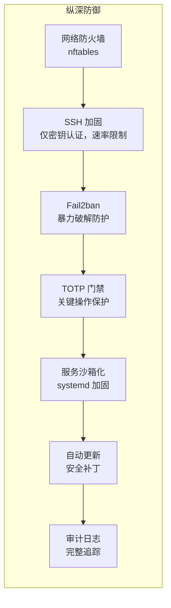

# 安全加固

TOTP 保护了 sudo，但生产环境的 NixOS 服务器需要全面的安全加固。本章涵盖防火墙规则、SSH 加固、Fail2ban、systemd 服务沙箱化以及自动安全更新——所有配置都以声明式方式在 Nix 中完成。

## 安全层次



## 防火墙配置

NixOS 默认使用 nftables。定义一个严格的白名单，只允许特定端口。

```nix title="firewall.nix"
{ config, ... }:

{
  networking.firewall = {
    enable = true;

    # 仅允许必要的入站端口
    allowedTCPPorts = [
      22    # SSH
      80    # HTTP (for ACME challenges)
      443   # HTTPS
      3000  # Grafana (restrict to VPN in production)
    ];

    # 默认不开放 UDP 端口
    allowedUDPPorts = [ ];

    # 记录被拒绝的连接（对 OpenClaw 分析有用）
    logRefusedConnections = true;
    logRefusedPackets = false;  # too verbose for production

    # 限制 ping 速率
    pingLimit = "--limit 1/second --limit-burst 5";

    # 默认：丢弃所有未明确允许的流量
    # 这是默认行为，此处明确声明以便清晰
    rejectPackets = false;
  };

  # 如不需要 IPv6，可禁用以减少攻击面
  # networking.enableIPv6 = false;
}
```

## SSH 加固

禁用密码认证，限制密钥算法，限制登录尝试次数。

```nix title="ssh-hardening.nix"
{ config, ... }:

{
  services.openssh = {
    enable = true;
    ports = [ 22 ];  # Consider non-standard port for reduced noise

    settings = {
      # 认证
      PasswordAuthentication = false;
      KbdInteractiveAuthentication = false;
      PermitRootLogin = "prohibit-password";  # Key-only root (or "no" to disable entirely)
      PubkeyAuthentication = true;

      # 加固
      X11Forwarding = false;
      PermitEmptyPasswords = false;
      MaxAuthTries = 3;
      LoginGraceTime = 30;          # Seconds to complete authentication
      ClientAliveInterval = 300;     # 5-minute keepalive
      ClientAliveCountMax = 2;       # Disconnect after 10 min idle

      # 限制加密算法
      KexAlgorithms = [
        "curve25519-sha256"
        "curve25519-sha256@libssh.org"
      ];
      Ciphers = [
        "chacha20-poly1305@openssh.com"
        "aes256-gcm@openssh.com"
        "aes128-gcm@openssh.com"
      ];
      Macs = [
        "hmac-sha2-512-etm@openssh.com"
        "hmac-sha2-256-etm@openssh.com"
      ];

      # 日志
      LogLevel = "VERBOSE";  # Logs key fingerprints for audit
    };

    # 仅允许特定用户
    extraConfig = ''
      AllowUsers admin openclaw
      AllowAgentForwarding no
      AllowTcpForwarding no
      AllowStreamLocalForwarding no
    '';
  };

  # 跨重启持久化 SSH 主机密钥（使用 Impermanence 时必需）
  environment.persistence."/persist".files = [
    "/etc/ssh/ssh_host_ed25519_key"
    "/etc/ssh/ssh_host_ed25519_key.pub"
    "/etc/ssh/ssh_host_rsa_key"
    "/etc/ssh/ssh_host_rsa_key.pub"
  ];
}
```

## Fail2ban

自动封禁尝试暴力破解的 IP 地址。

```nix title="fail2ban.nix"
{ config, pkgs, ... }:

{
  services.fail2ban = {
    enable = true;

    maxretry = 3;
    bantime = "1h";
    bantime-increment = {
      enable = true;
      maxtime = "168h";   # Max ban: 1 week
      factor = "4";       # Each repeat offense = 4x longer ban
    };

    jails = {
      # SSH 暴力破解防护
      sshd = {
        settings = {
          enabled = true;
          port = "ssh";
          filter = "sshd[mode=aggressive]";
          maxretry = 3;
          findtime = "10m";
          bantime = "1h";
        };
      };

      # 反复 sudo 失败（潜在的 TOTP 暴力破解）
      sudo = {
        settings = {
          enabled = true;
          filter = "sudo";
          maxretry = 3;
          findtime = "10m";
          bantime = "4h";
        };
      };
    };
  };

  # 跨重启持久化 Fail2ban 数据库
  environment.persistence."/persist".directories = [
    "/var/lib/fail2ban"
  ];
}
```

## systemd 服务沙箱化

在内核级别限制服务的行为。这可以在服务被攻破时限制影响范围。

```nix title="service-hardening.nix"
{ config, ... }:

{
  # 加固 OpenClaw 服务
  systemd.services.openclaw.serviceConfig = {
    # 文件系统限制
    ProtectSystem = "strict";         # Read-only everything except allowed paths
    ProtectHome = true;               # No access to /home
    PrivateTmp = true;                # Private /tmp
    ReadWritePaths = [
      "/var/lib/openclaw"             # State directory
      "/var/lib/snapper"              # For snapshot operations
    ];

    # 网络限制
    RestrictAddressFamilies = [ "AF_INET" "AF_INET6" "AF_UNIX" ];

    # 权限限制
    NoNewPrivileges = true;
    ProtectKernelTunables = true;
    ProtectKernelModules = true;
    ProtectControlGroups = true;
    RestrictNamespaces = true;
    LockPersonality = true;
    RestrictRealtime = true;
    RestrictSUIDSGID = true;
    MemoryDenyWriteExecute = true;

    # 系统调用过滤
    SystemCallFilter = [
      "@system-service"
      "~@privileged"
      "~@resources"
    ];
    SystemCallArchitectures = "native";

    # 能力限制
    CapabilityBoundingSet = "";
    AmbientCapabilities = "";
  };

  # 加固 Prometheus
  systemd.services.prometheus.serviceConfig = {
    ProtectSystem = "strict";
    ProtectHome = true;
    PrivateTmp = true;
    NoNewPrivileges = true;
    ProtectKernelTunables = true;
    ProtectKernelModules = true;
    ProtectControlGroups = true;
    ReadWritePaths = [ "/var/lib/prometheus2" ];
  };

  # 加固 Grafana
  systemd.services.grafana.serviceConfig = {
    ProtectSystem = "strict";
    ProtectHome = true;
    PrivateTmp = true;
    NoNewPrivileges = true;
    ProtectKernelTunables = true;
    ProtectKernelModules = true;
    ReadWritePaths = [ "/var/lib/grafana" ];
  };
}
```

## 自动安全更新

自动应用安全补丁，并支持可控回滚。

```nix title="auto-update.nix"
{ config, pkgs, ... }:

{
  # 自动安全更新
  system.autoUpgrade = {
    enable = true;
    flake = "/etc/nixos#myserver";
    flags = [ "--update-input" "nixpkgs" ];

    # 仅应用稳定通道的更新
    allowReboot = false;  # OpenClaw handles reboots via Tier 3

    # 每天凌晨 4 点运行
    dates = "04:00";
    randomizedDelaySec = "30min";
  };

  # 升级前快照钩子
  systemd.services.nixos-upgrade.serviceConfig = {
    ExecStartPre = "${pkgs.writeShellScript "pre-upgrade-snapshot" ''
      ${pkgs.snapper}/bin/snapper -c root create \
        --type pre \
        --description "pre-auto-upgrade" \
        --print-number
    ''}";
    ExecStartPost = "${pkgs.writeShellScript "post-upgrade-snapshot" ''
      ${pkgs.snapper}/bin/snapper -c root create \
        --type post \
        --description "post-auto-upgrade" \
        --print-number
    ''}";
  };
}
```

## 内核加固

收紧内核安全参数。

```nix title="kernel-hardening.nix"
{ config, ... }:

{
  boot.kernel.sysctl = {
    # 网络加固
    "net.ipv4.conf.all.rp_filter" = 1;              # Strict reverse path filtering
    "net.ipv4.conf.default.rp_filter" = 1;
    "net.ipv4.conf.all.accept_redirects" = 0;        # Don't accept ICMP redirects
    "net.ipv4.conf.default.accept_redirects" = 0;
    "net.ipv6.conf.all.accept_redirects" = 0;
    "net.ipv4.conf.all.send_redirects" = 0;           # Don't send ICMP redirects
    "net.ipv4.conf.default.send_redirects" = 0;
    "net.ipv4.conf.all.accept_source_route" = 0;      # Disable source routing
    "net.ipv4.conf.default.accept_source_route" = 0;
    "net.ipv4.icmp_echo_ignore_broadcasts" = 1;        # Ignore broadcast pings
    "net.ipv4.tcp_syncookies" = 1;                     # SYN flood protection
    "net.ipv4.tcp_timestamps" = 0;                     # Hide uptime from TCP timestamps

    # 内核加固
    "kernel.sysrq" = 0;                               # Disable SysRq key
    "kernel.core_uses_pid" = 1;                        # PID in core dump filenames
    "kernel.kptr_restrict" = 2;                        # Hide kernel pointers
    "kernel.dmesg_restrict" = 1;                       # Restrict dmesg access
    "kernel.yama.ptrace_scope" = 2;                    # Restrict ptrace to root
    "kernel.unprivileged_bpf_disabled" = 1;            # Disable unprivileged BPF
    "net.core.bpf_jit_harden" = 2;                     # Harden BPF JIT

    # 内存保护
    "vm.mmap_min_addr" = 65536;                        # Prevent NULL pointer exploits
    "vm.swappiness" = 10;                              # Prefer keeping processes in RAM
  };

  # 使用加固内核（可选，可能导致部分软件不兼容）
  # boot.kernelPackages = pkgs.linuxPackages_hardened;
}
```

## ACME/Let's Encrypt 证书

为 Web 服务自动管理 TLS 证书。

```nix title="acme.nix"
{ config, ... }:

{
  # ACME (Let's Encrypt) 证书管理
  security.acme = {
    acceptTerms = true;
    defaults.email = "admin@example.com";
  };

  # 示例：Grafana 通过 Nginx 反向代理并自动获取 TLS 证书
  services.nginx = {
    enable = true;
    recommendedTlsSettings = true;
    recommendedOptimisation = true;
    recommendedGzipSettings = true;
    recommendedProxySettings = true;

    virtualHosts."grafana.example.com" = {
      enableACME = true;
      forceSSL = true;
      locations."/" = {
        proxyPass = "http://localhost:3000";
        proxyWebsockets = true;
      };
    };
  };

  # 跨重启持久化 ACME 证书
  environment.persistence."/persist".directories = [
    "/var/lib/acme"
  ];

  # 为 ACME 验证开放 HTTP 端口
  networking.firewall.allowedTCPPorts = [ 80 443 ];
}
```

## OpenClaw 安全集成

配置 OpenClaw 来监控和响应安全事件。

```nix title="openclaw-security.nix"
{ config, ... }:

{
  services.openclaw.settings.security = {
    # 监控 Fail2ban 事件
    fail2ban = {
      enable = true;
      alertOnBan = true;         # Notify when IP is banned
      alertThreshold = 10;        # Alert if >10 bans/hour
      tier = 1;                   # Autonomous monitoring
    };

    # 监控 SSH 事件
    ssh = {
      enable = true;
      alertOnRootLogin = true;    # Alert on any root login
      alertOnNewKey = true;        # Alert when new SSH key is used
      tier = 1;
    };

    # 监控证书过期
    certificates = {
      enable = true;
      renewBeforeDays = 14;       # Tier 2 renewal 14 days before expiry
      alertBeforeDays = 7;         # Tier 3 alert 7 days before expiry
    };

    # 安全扫描
    scanning = {
      # 检查全局可读的敏感文件
      filePermissions = {
        enable = true;
        paths = [ "/etc/users.oath" "/run/secrets" ];
        expectedMode = "0600";
        tier = 1;                  # Auto-fix permissions
      };

      # 检查意外的监听端口
      openPorts = {
        enable = true;
        allowedPorts = [ 22 80 443 3000 9090 3100 ];
        tier = 2;                  # Supervised: notify and propose fix
      };
    };
  };
}
```

## 验证

应用安全加固后：

```bash
# 检查防火墙规则
sudo nft list ruleset

# 验证 SSH 配置
sudo sshd -T | grep -E "passwordauth|permitroot|maxauthtries"
# 预期输出: passwordauthentication no, permitrootlogin prohibit-password, maxauthtries 3

# 检查 Fail2ban 状态
sudo fail2ban-client status sshd

# 验证内核参数
sysctl net.ipv4.conf.all.rp_filter          # 应为 1
sysctl kernel.dmesg_restrict                  # 应为 1
sysctl net.ipv4.tcp_syncookies               # 应为 1

# 审计 systemd 服务沙箱化
systemd-analyze security openclaw.service
# 查看整体暴露评分（越低越好，目标 < 5.0）

systemd-analyze security prometheus.service

# 检查开放端口
ss -tlnp
# 应仅显示 allowedTCPPorts 中的端口

# 验证证书
curl -vI https://grafana.example.com 2>&1 | grep "expire"
```

## 安全检查清单

| 项目 | 状态 | 配置文件 |
|---|---|---|
| 防火墙已启用，仅白名单模式 | 必需 | `firewall.nix` |
| SSH 仅密钥认证，禁用密码 | 必需 | `ssh-hardening.nix` |
| SSH 加密算法限制为现代算法 | 推荐 | `ssh-hardening.nix` |
| Fail2ban 保护 SSH 和 sudo | 必需 | `fail2ban.nix` |
| TOTP 保护 sudo | 必需 | [第 7 章](./totp-sudo-protection) |
| 服务沙箱化（OpenClaw、Prometheus） | 推荐 | `service-hardening.nix` |
| 内核加固（sysctl） | 推荐 | `kernel-hardening.nix` |
| 自动安全更新与快照 | 推荐 | `auto-update.nix` |
| TLS 证书（ACME） | 如有 Web 服务 | `acme.nix` |
| OpenClaw 安全监控 | 推荐 | `openclaw-security.nix` |

:::warning 切勿跳过防火墙
即使在私有网络中，也应始终启用防火墙。纵深防御意味着假设其他每一层都可能失效。
:::

:::tip 渐进式加固
逐步应用安全加固。首先从防火墙 + SSH + Fail2ban（基本要素）开始，然后在验证不影响正常功能后，再添加内核和服务加固。使用 `systemd-analyze security <service>` 来衡量您的加固进度。
:::
