# 架构概览

本页描述了完整的系统架构、组件交互、数据流以及故障处理策略。

:::info AI 优先设计
此架构专为 **AI 运维基础设施** 而设计。每一项设计决策都考虑到：AI 可能犯错、AI 可能产生幻觉、AI 可能误判系统状态。即使 AI 出错，架构也必须保持安全。
:::

## 为什么 AI 安全很重要

驱动 OpenClaw 的大语言模型（LLM）可能会：

- **幻觉出问题** — 检测到实际不存在的故障
- **提出错误修复** — 建议会损坏系统的命令
- **误读状态** — 认为系统处于与实际不同的状态
- **错误连锁** — 在修复第一个错误时犯下第二个错误

此架构假设 AI **一定会** 犯错。安全层的存在正是因为有 AI 参与，而非尽管有 AI 参与。

## 系统层次

架构采用分层构建，每一层为其上层提供保障：

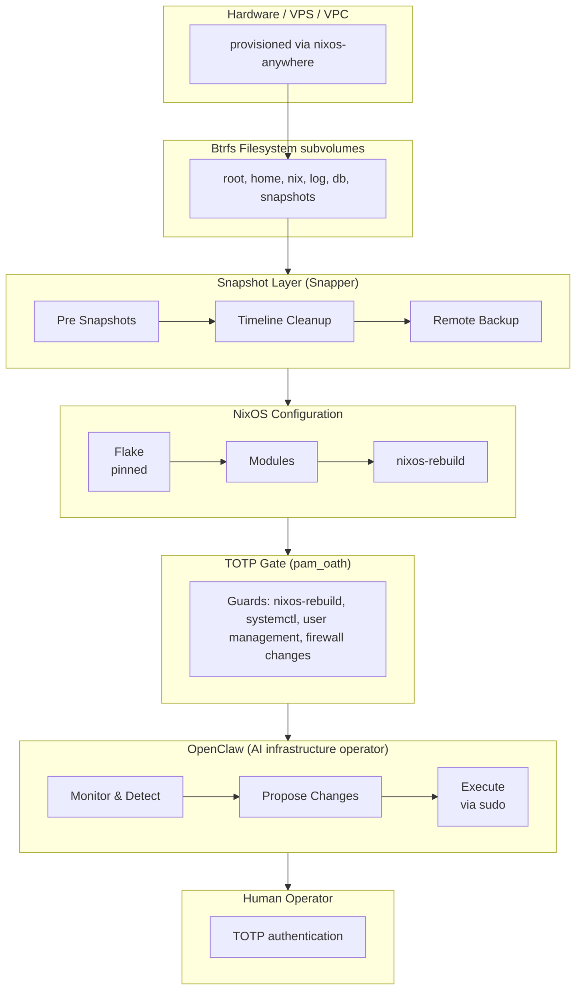

## 设计原则

### 1. 回滚优先

每一个状态变更操作之前都会创建 Btrfs 快照。**这就是原子性保障** — 如果出现任何问题，你可以始终回到之前的精确状态。

```mermaid
sequenceDiagram
    participant AI as OpenClaw (AI)
    participant Snap as Snapshot Layer
    participant Nix as NixOS
    participant Health as Health Check

    AI->>Snap: Propose change
    Note over Snap: Before ANY change:<br/>btrfs snapshot root -&gt; root-pre
    Snap-->>Nix: Snapshot confirmed
    Nix->>Health: Apply config
    alt Health check passes
        Health-->>AI: Success - keep snapshot
    else Health check fails
        Nix->>Snap: Rollback request
        Snap->>Snap: btrfs subvolume snapshot<br/>snapshots/root-pre to /
        Snap-->>AI: Rolled back - human notified
    end
```

**原子回滚保障：**

| 保障 | 执行方式 |
|---|---|
| **变更前快照** | Snapper 在每次 `nixos-rebuild` 前自动创建快照 |
| **不可变快照** | Btrfs 快照默认为只读 |
| **单命令回滚** | `sudo btrfs subvolume snapshot /snapshots/@root/pre-rebuild /` |
| **状态验证** | 健康检查在"提交"前确认系统正常运行 |
| **多层回滚** | Btrfs 快照 → NixOS 代 → 远程备份 |

:::danger AI 无法绕过回滚机制
即使 OpenClaw 尝试执行变更，快照也会在任何变更应用**之前**创建。AI 无法跳过此安全层 — 它由系统级别的 Snapper 钩子强制执行。
:::

### 2. 可复现性

整个系统由 Nix flakes 定义。相同的 flake 输入产生相同的系统：

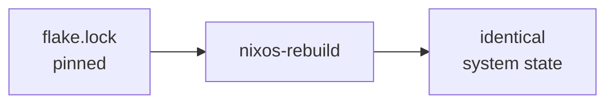

### 3. 纵深防御

多个安全层保护系统免受错误变更的影响：

| 层级 | 保护机制 |
|---|---|
| TOTP 门控 | 阻止未授权的 `nixos-rebuild` |
| 重建前快照 | 错误应用后即时回滚 |
| NixOS 代 | 从 GRUB 引导进入前一代 |
| Btrfs send/receive | 已知良好状态的异地备份 |
| OpenClaw 策略引擎 | AI 只能在定义的边界内操作 |

### 4. 最小权限

OpenClaw 作为专用系统用户运行。它不能直接执行特权命令 — 任何破坏性操作都必须通过 TOTP 门控的 sudo 路径。

### 5. AI 幻觉缓解

此架构假设 AI **一定会** 出错。多层保护机制防范 AI 幻觉：

| AI 风险 | 此架构中的缓解措施 |
|---|---|
| **幻觉出问题** | 策略引擎仅基于已验证的指标行动，而非 AI 的解读 |
| **提出错误修复** | TOTP 门控要求所有系统变更都需人工审批 |
| **误读系统状态** | 健康检查在任何变更后验证实际状态 |
| **在错误时间应用变更** | 操作间的冷却期防止连续快速出错 |
| **级联故障** | 变更前快照可即时回滚到已知良好状态 |

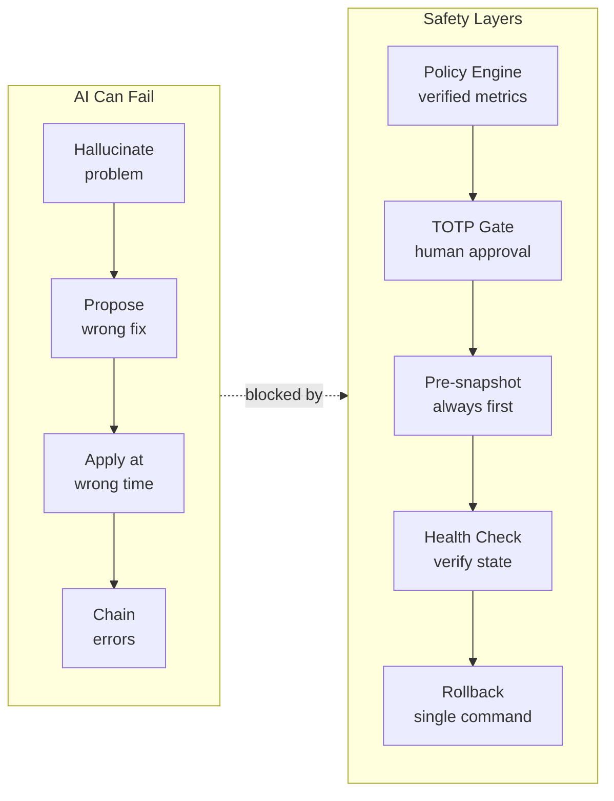

**核心观点**：AI 提出建议，但**架构做出决策**。人工审批和自动快照不是可选项 — 它们由系统强制执行，而非由 AI 执行。

## 组件交互

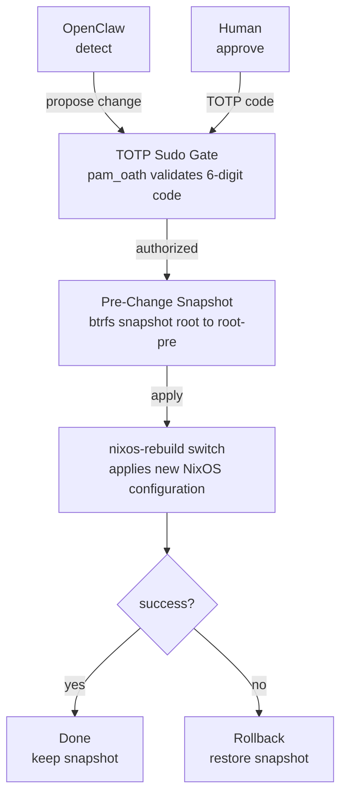

## OpenClaw：AI 基础设施运维员

### 什么是 OpenClaw？

OpenClaw 是一个 AI 驱动的代理，充当你的**数字待命 SRE**。它不会取代人类运维人员 — 而是通过处理日常监控、分析来增强他们的能力，并可以自主执行低风险操作，同时将高风险变更升级给人类处理。

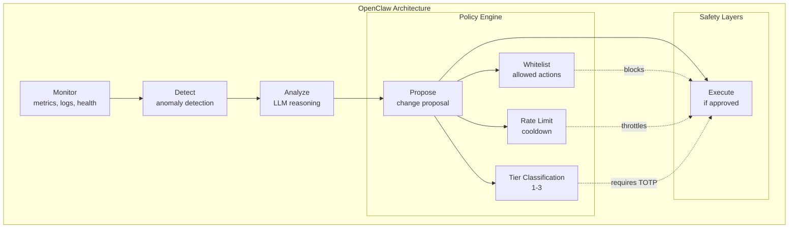

### 核心职责

| 职责 | 描述 |
|---|---|
| **监控** | 持续收集系统指标（CPU、内存、磁盘、服务） |
| **检测** | 识别异常、降级服务、安全问题 |
| **分析** | 使用 LLM 分析根因并提出解决方案 |
| **执行** | 执行已审批的变更并保留完整审计记录 |

### 为什么选择 OpenClaw？（不仅仅是另一个自动化工具）

与传统自动化工具（Ansible、Terraform）不同，OpenClaw：

| 传统自动化 | OpenClaw（AI 运维员） |
|---|---|
| 声明式期望状态 | 学习并适应系统行为 |
| 固定的剧本 | 为新问题生成新解决方案 |
| 无上下文理解 | 使用 LLM 理解上下文 |
| 人工编写所有逻辑 | AI 建议，人工审批 |
| 静态 | 从反馈中改进 |

### 三级操作模型

OpenClaw 将每个操作分为三个级别：

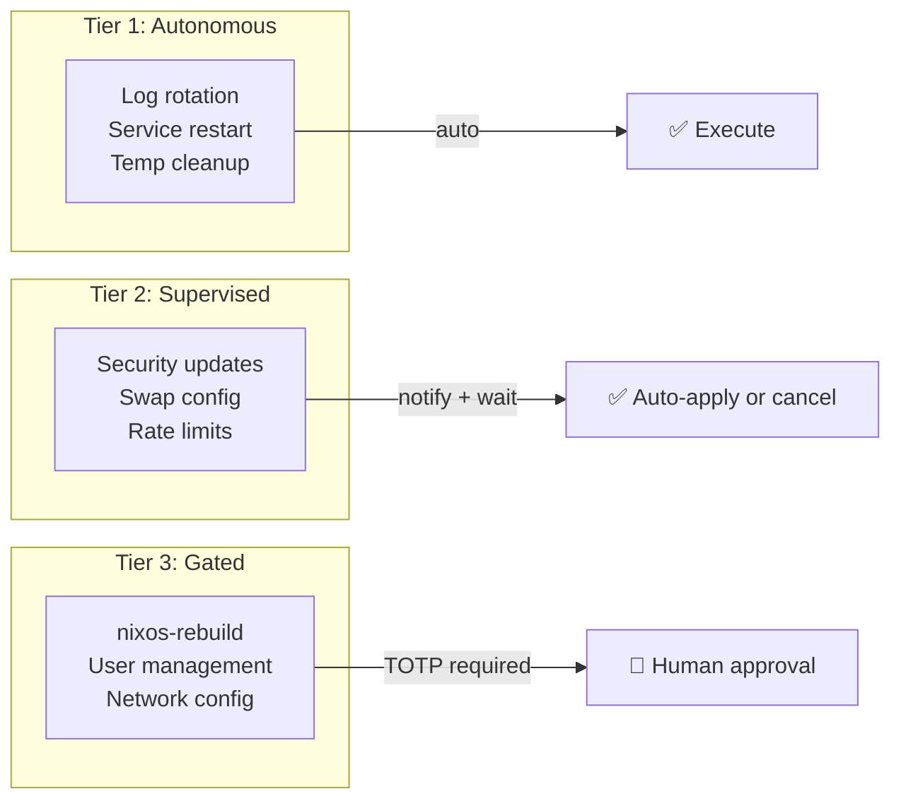

**第一级 — 自主操作（无需审批）**
- 低风险、可逆操作
- 立即自动执行
- 示例：日志轮转、故障后服务重启、临时文件清理

**第二级 — 监督操作（通知 + 自动应用）**
- 中等风险操作
- 通知人类，在窗口期后自动应用（默认：30 分钟）
- 示例：安全补丁、swap 配置

**第三级 — 门控操作（需要 TOTP）**
- 高风险操作
- 需要人类通过 TOTP 显式审批
- 示例：`nixos-rebuild switch`、用户管理、防火墙变更

### OpenClaw 策略引擎

策略引擎是防止 OpenClaw 越权的**安全边界**。它在 Nix 中定义：

```nix
services.openclaw.settings.policy = {
  # Tier 1: What AI can do autonomously
  autonomous = {
    allowedActions = [
      "restart-failed-service"
      "rotate-logs"
      "clean-temp-files"
    ];
    constraints = {
      maxActionsPerHour = 5;
      maxRestartsPerServicePerHour = 3;
    };
  };

  # Tier 2: What AI proposes but waits for
  supervised = {
    allowedActions = [
      "security-package-update"
      "add-swap"
    ];
    defaultWindow = "30m";
  };

  # Tier 3: What AI cannot do without human
  gated = {
    actions = [
      "nixos-rebuild-switch"
      "user-management"
    ];
    requireTOTP = true;
  };

  # Global safety limits
  safety = {
    emergencyStopFile = "/var/lib/openclaw/STOP";
    maxChangesPerDay = 20;
    requirePreSnapshot = true;
    autoRollbackOnFailure = true;
  };
};
```

### OpenClaw 在架构中的位置

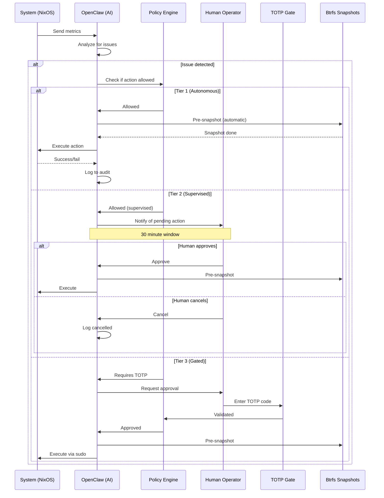

### AI 幻觉防护

OpenClaw 的设计明确应对 AI 幻觉问题：

| 幻觉类型 | 防护措施 |
|---|---|
| **幻觉出问题** | 仅基于已验证的指标行动，而非 LLM 的解读 |
| **错误修复建议** | 策略白名单阻止未授权操作 |
| **错误目标** | 人工在 TOTP 审批前审查差异 |
| **反馈循环** | 速率限制 + 冷却期 |
| **过度自信** | 始终记录不确定性，第三级操作需人工介入 |

:::danger OpenClaw 没有 Root 权限
OpenClaw 作为专用用户（`openclaw`）运行，而非 root。即使 LLM 建议执行 root 级别的命令，OpenClaw 也无法在不通过 TOTP 门控的 sudo 路径的情况下执行。**永远不要给 OpenClaw root 权限** — 这将绕过所有安全层。
:::

### OpenClaw 的回滚技能

OpenClaw 不会猜测如何恢复 — 它有**结构化的回滚技能**，以 Nix 模块定义。这些技能是原子的、经过测试的、并且保证可用。

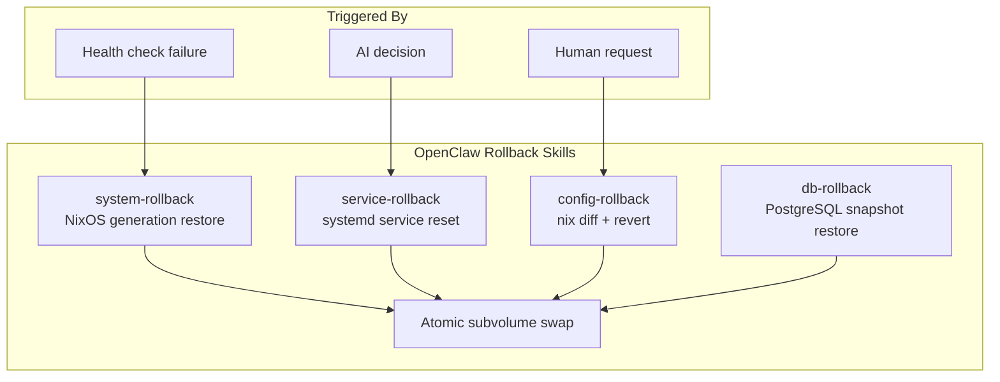

#### 技能 1：系统回滚（NixOS 代）

将系统恢复到之前的 NixOS 代：

```nix
# Implemented as a Nix module
systemRollback = {
  description = "Rollback to previous NixOS generation";

  # Only executes pre-verified commands
  command = ''
    # Get previous generation
    PREV_GEN=$(nix-env --list-generations | grep -B1 current | head -1 | awk '{print $1}')

    # Activate previous generation
    sudo /nix/var/nix/profiles/system/bin/switch-to-configuration switch --specialisations "$PREV_GEN"
  '';

  # Prerequisites
  requiresSnapshot = true;
  verifyBefore = ["health-check", "ssh-accessible"];
  verifyAfter = ["health-check", "disk-space"];
};
```

**使用场景：**
- `nixos-rebuild` 应用后健康检查失败
- 重启后系统不可达
- OpenClaw 检测到引导故障

#### 技能 2：服务回滚（systemd）

将服务重启到已知良好状态：

```nix
serviceRollback = {
  description = "Rollback a systemd service";

  command = ''
    SERVICE=$1  # Passed by OpenClaw

    # Stop the service
    sudo systemctl stop "$SERVICE"

    # Restore config from last known good
    sudo cp /var/lib/openclaw/service-backups/"$SERVICE"/* /etc/systemd/system/

    # Reload and restart
    sudo systemctl daemon-reload
    sudo systemctl restart "$SERVICE"

    # Verify
    sudo systemctl status "$SERVICE"
  '';

  # Only for allowed services (policy whitelist)
  allowedServices = ["nginx", "postgresql", "docker"];
  maxRollbacksPerHour = 3;
};
```

**使用场景：**
- 服务处于崩溃循环中
- 服务返回错误响应
- 检测到配置漂移

#### 技能 3：配置回滚（Nix Diff 还原）

还原特定的 Nix 配置变更：

```nix
configRollback = {
  description = "Revert specific Nix config changes";

  command = ''
    # Get the diff between current and previous
    nix diff /etc/nixos/configuration.nix > /tmp/config-diff

    # Show what changed
    cat /tmp/config-diff

    # Revert to previous commit in git
    cd /etc/nixos
    sudo git revert HEAD --no-commit

    # Rebuild
    sudo nixos-rebuild switch
  '';

  requiresSnapshot = true;
  alwaysGated = true;  # Always requires TOTP
};
```

**使用场景：**
- 部分配置变更导致问题
- 需要保留大部分变更，仅还原其中一个
- 人工识别出特定的问题变更

#### 技能 4：数据库回滚（Btrfs 快照）

从 Btrfs 快照恢复数据库子卷：

```nix
dbRollback = {
  description = "Restore database from Btrfs snapshot";

  command = ''
    DB_PATH=$1  # e.g., /var/lib/postgresql
    SNAPSHOT=$2  # e.g., pre-change-20240115

    # Stop database
    sudo systemctl stop postgresql

    # Create backup of current state (in case rollback fails)
    sudo btrfs subvolume snapshot "$DB_PATH" "$DB_PATH-broken-$(date +%s)"

    # Restore from snapshot
    sudo btrfs subvolume snapshot "$SNAPSHOT" "$DB_PATH"

    # Fix permissions
    sudo chown -R postgres:postgres "$DB_PATH"

    # Start database
    sudo systemctl start postgresql

    # Verify
    sudo -u postgres pg_isready
  '';

  requiresSnapshot = true;
  requiresTOTP = true;
  createsSnapshot = true;  # Creates backup before rollback
};
```

**使用场景：**
- 模式迁移后数据库损坏
- 数据完整性检查失败
- 意外数据删除

#### 回滚技能配置

所有回滚技能在策略中配置：

```nix
services.openclaw.settings.policy.rollback = {
  # Enable rollback skills
  enableSystemRollback = true;
  enableServiceRollback = true;
  enableConfigRollback = true;
  enableDbRollback = true;

  # Constraints
  maxRollbacksPerHour = 5;
  maxRollbacksPerDay = 20;
  requireSnapshotBeforeRollback = true;

  # Auto-rollback triggers (AI can trigger without human approval)
  autoRollbackOnHealthCheckFail = true;
  autoRollbackOnServiceCrash = false;  # Always requires approval

  # Cooldown between rollbacks
  rollbackCooldownMinutes = 5;

  # Rollback chain limit (prevent rollback loops)
  maxConsecutiveRollbacks = 2;

  # Always notify human after rollback
  notifyAfterRollback = true;
};
```

#### 为什么回滚技能化很重要

| 临时回滚的问题 | 技能化如何解决 |
|---|---|
| AI 不知道正确的命令 | 预定义、经过测试的命令 |
| 回滚可能破坏更多东西 | 回滚前创建快照 |
| 没有验证 | 回滚前后进行健康检查 |
| 回滚循环 | 冷却期 + 链式限制 |
| 根因未诊断 | 记录完整的回滚上下文 |

:::info 回滚不是失败
回滚**不是**失败 — 而是安全机制按预期工作。如果 OpenClaw 触发了回滚，说明安全架构正在正确运行。请查看审计日志以了解发生了什么问题，并相应调整策略或健康检查。
:::

## 数据流：配置变更

典型的配置变更在系统中的流转过程如下：

1. **触发** — OpenClaw 检测到问题或运维人员发起变更
2. **提议** — 生成 Nix 配置差异
3. **认证** — 关键操作需要 TOTP 验证码
4. **快照** — Btrfs 对所有相关子卷创建快照
5. **应用** — `nixos-rebuild switch` 应用新配置
6. **验证** — 健康检查确认系统正常运行
7. **提交或回滚** — 成功时，快照作为还原点保留；失败时，恢复快照

## 故障模式

### AI 特定故障（为什么我们需要这些安全措施）

| AI 故障 | 检测方式 | 恢复方式 |
|---|---|---|
| AI 幻觉出不存在的问题 | 人工在 TOTP 门控处审查提议 | 变更不会被应用 |
| AI 提出有害命令 | 策略引擎阻止未允许的操作 | 向运维人员发送告警 |
| AI 提出正确修复但目标错误 | 人工在审批前审查差异 | 变更需要 TOTP |
| AI 错误地应用变更 | 切换后健康检查失败 | 回滚到变更前快照 |
| AI 处于反馈循环中（持续尝试相同修复） | 策略引擎中的速率限制 | 强制冷却期 |

### 系统故障

| 故障 | 检测方式 | 恢复方式 |
|---|---|---|
| 错误的 NixOS 配置（无法构建） | `nixos-rebuild` 在构建阶段失败 | 系统未发生变更 — 修复配置后重试 |
| 错误的 NixOS 配置（可构建但服务中断） | 切换后健康检查失败 | 回滚到变更前的 Btrfs 快照 |
| 错误的 NixOS 配置（引导中断） | 重启后系统无法启动 | 在 GRUB 中选择之前的 NixOS 代 |
| 变更后数据库损坏 | 应用健康检查/数据验证 | 从快照恢复 `@db` 子卷 |
| OpenClaw 提出错误变更 | 人工在 TOTP 门控处审查并拒绝 | 变更不会被应用 |
| OpenClaw 超出策略范围 | 策略引擎阻止该操作 | 记录操作并发送告警 |
| 磁盘故障 | Btrfs 设备统计/SMART 监控 | 从远程备份恢复（btrfs receive） |

## 子卷映射

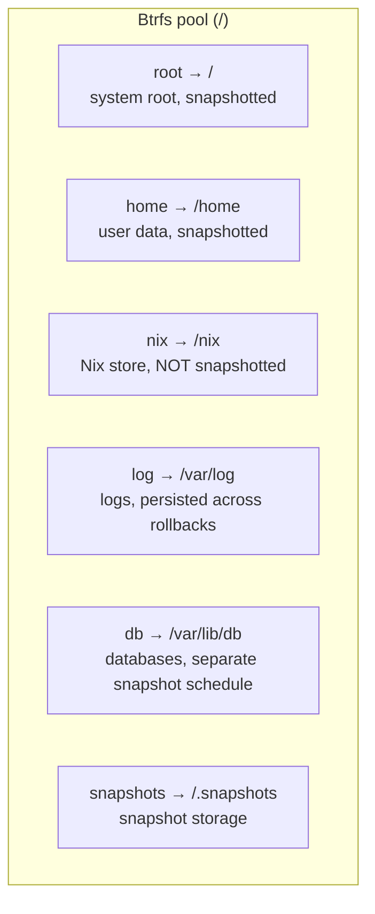

:::note 为什么 /nix 不需要快照
Nix 存储（`/nix`）是内容寻址的。每个路径都由其哈希值标识。对其创建快照会浪费空间 — 你可以始终从 flake 重建任何 Nix 存储路径。应该对*引用*存储路径的配置创建快照。
:::

## 安全模型

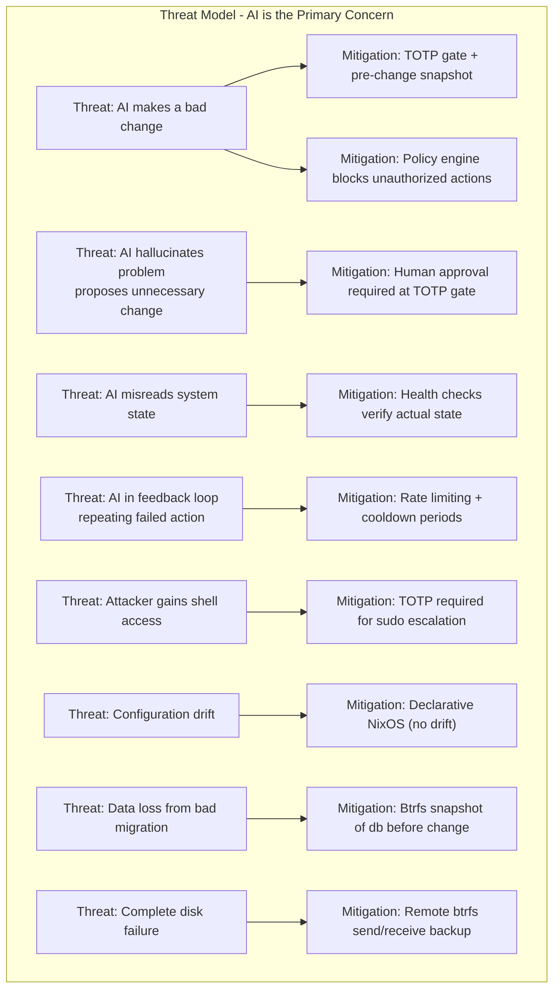

### 认证流程

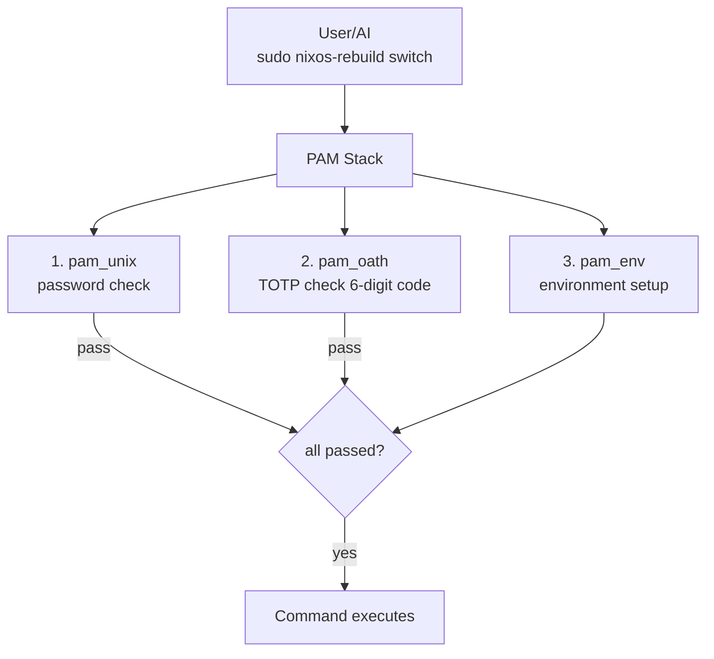

## 下一步

在理解了架构之后，让我们开始构建。下一章将介绍如何使用 `nixos-anywhere` [在远程服务器上引导 NixOS](./bootstrap-nixos-anywhere)。
