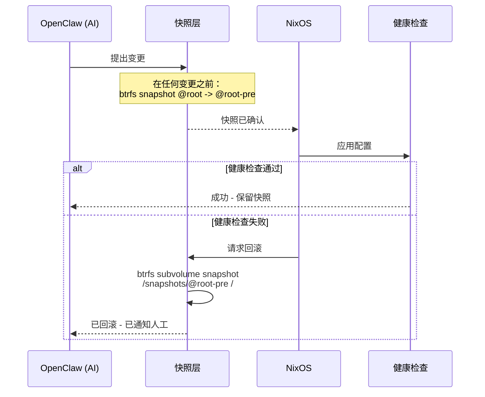
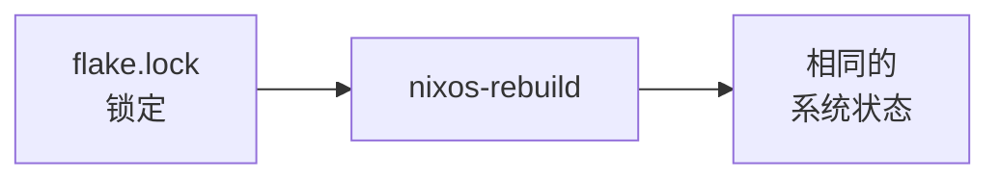
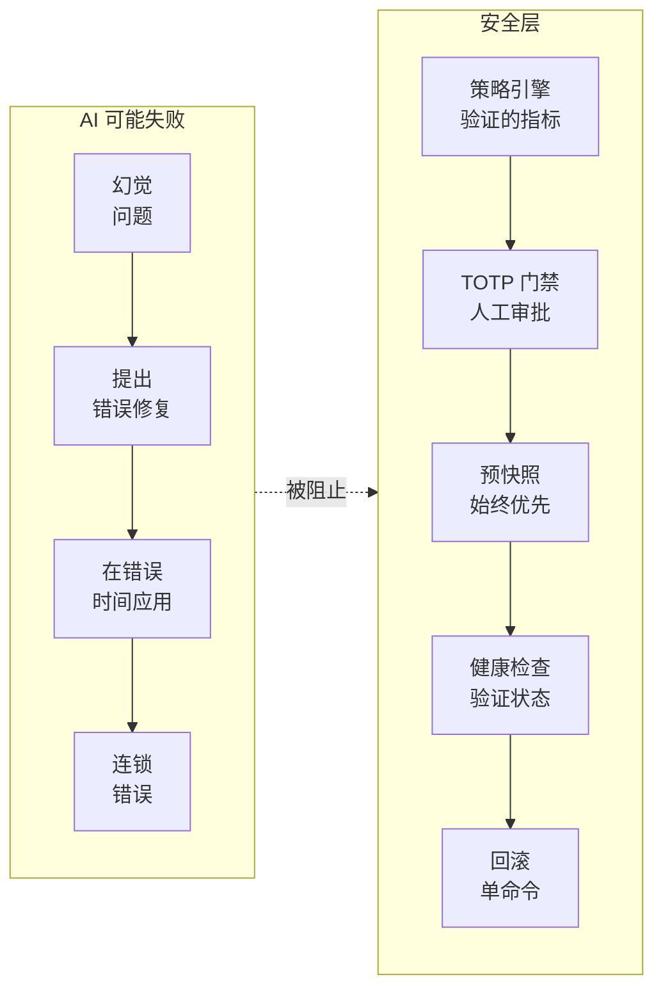
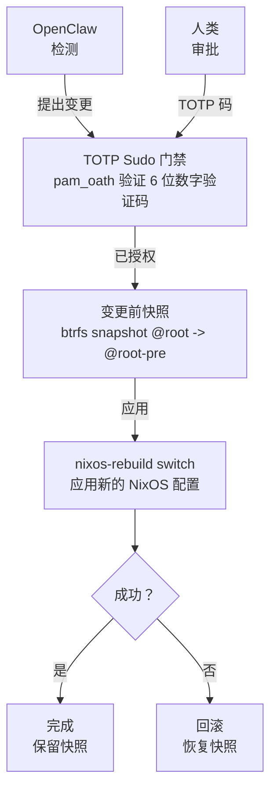
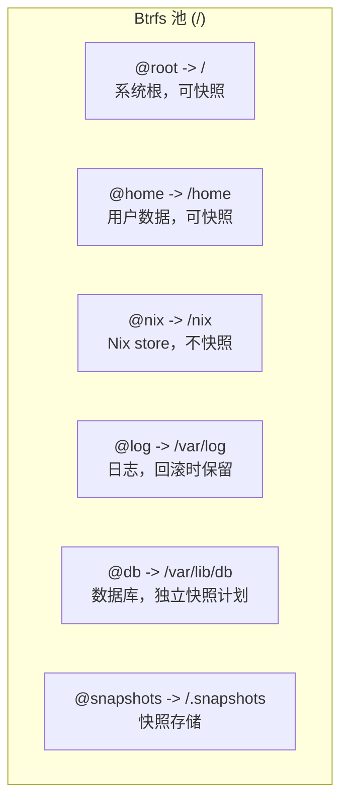
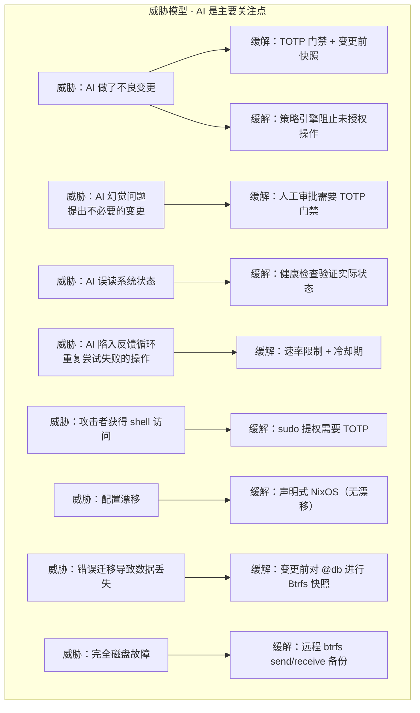
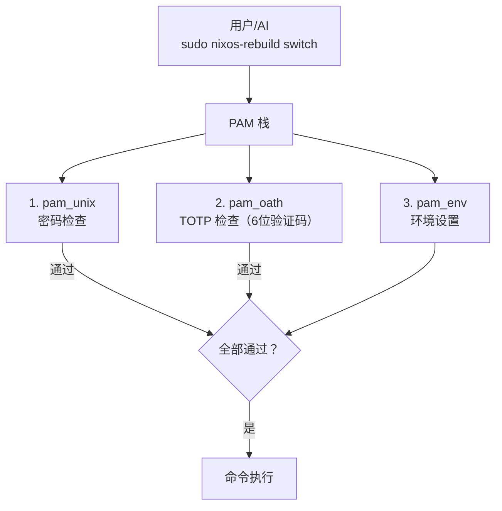

# 架构概览

本文档描述完整的系统架构、组件交互、数据流和故障处理策略。

:::info AI 优先设计
此架构专门为 **AI 运维的基础设施** 设计。每一个设计决策都考虑到：AI 会犯错、AI 会产生幻觉、AI 会误解系统状态。 即使 AI 错误的情况下，架构也必须是安全的。
:::

## 为什么 AI 安全至关重要

像为 OpenClaw 提供动力的大型语言模型 (LLM) 可能：

- **产生幻觉** — 检测不存在的问题
- **提出错误的修复方案** — 建议会破坏系统的命令
- **误读状态** — 相信系统处于与实际不同的状态
- **连锁错误** — 尝试修复第一个错误时犯下第二个错误

此架构假设 AI **将会** 犯错。安全层存在正是因为有 AI 参与，而不是尽管有 AI。

## 系统层次

架构分层次构建，每一层为其上一层提供保障：

```mermaid
flowchart TB
    subgraph Hardware["硬件 / VPS / VPC"]
        H[通过 nixos-anywhere 配置]
    end

    subgraph BtrfsLayer["Btrfs 文件系统 (子卷)"]
        BL[@root, @home, @nix, @log, @db, @snapshots]
    end

    subgraph Snap["快照层 (Snapper)"]
        S1[变更前快照] --> S2[定时清理]
        S2 --> S3[远程备份]
    end

    subgraph Nix["NixOS 配置"]
        N1[Flake<br/>锁定] --> N2[Modules]
        N2 --> N3[nixos-rebuild]
    end

    subgraph TOTPBox["TOTP 门禁 (pam_oath)"]
        T[保护：nixos-rebuild、systemctl、用户管理、防火墙变更]
    end

    subgraph OpenClawBox["OpenClaw (AI 基础设施运维代理)"]
        O1[监控与检测] --> O2[提出变更]
        O2 --> O3[执行<br/>通过 sudo]
    end

    subgraph HumanBox["人工运维"]
        HO[TOTP 身份验证]
    end

    H --> BtrfsLayer
    BtrfsLayer --> Snap
    Snap --> Nix
    Nix --> TOTPBox
    TOTPBox --> OpenClawBox
    OpenClawBox --> HumanBox
```

## 设计原则

### 1. 回滚优先

每个状态变更操作之前都会创建 Btrfs 快照。**这是原子性保证** — 如果任何事情出错，您始终可以返回完全相同之前的状态。



**原子回滚保证：**

| 保证 | 如何执行 |
|---|---|
| **变更前快照** | Snapper 在每次 `nixos-rebuild` 前自动创建快照 |
| **快照不可变** | Btrfs 快照默认是只读的 |
| **单命令回滚** | `sudo btrfs subvolume snapshot /snapshots/@root/pre-rebuild /` |
| **验证状态** | 健康检查确认系统在"提交"前是可操作的 |
| **多层回滚** | Btrfs 快照 → NixOS 代数 → 远程备份 |

:::danger AI 无法绕过回滚
即使 OpenClaw 尝试执行变更，快照也会在**任何变更应用之前**创建。AI 无法跳过这一安全层 — 它由 Snapper 钩子在系统级别强制执行。
:::

### 2. 可复现性

整个系统在 Nix flakes 中定义。相同的 flake 输入产生相同的系统：



### 3. 纵深防御

多层安全保护防止不良变更：

| 层级 | 保护机制 |
|---|---|
| TOTP 门禁 | 防止未授权的 `nixos-rebuild` |
| 变更前快照 | 错误应用后即时回滚 |
| NixOS 代数 | 从 GRUB 进入上一代数启动 |
| Btrfs send/receive | 已知良好状态的异地备份 |
| OpenClaw 策略引擎 | AI 只能在定义的边界内行动 |

### 4. 最小权限

OpenClaw 以专用系统用户运行。它不能直接执行特权命令 — 对于任何破坏性操作，它必须经过 TOTP 门禁的 sudo 路径。

### 5. AI 幻觉缓解

此架构假设 AI **将会** 犯错。多层保护防止 AI 幻觉：

| AI 风险 | 本架构中的缓解措施 |
|---|---|
| **幻觉问题** | 策略引擎只根据验证的指标行动，而非 AI 解释 |
| **提出错误修复** | TOTP 门禁要求人工审批所有系统变更 |
| **误读系统状态** | 健康检查在任何变更后验证实际状态 |
| **在错误时间应用变更** | 操作之间的冷却期防止快速连续的错误 |
| **连锁失败** | 变更前快照支持恢复到已知良好状态 |



**关键洞察**：AI 提议，但**架构决定**。人工审批和自动快照不是可选的 — 它们由系统强制执行，而非由 AI。

## 组件交互



## 数据流：配置变更

典型的配置变更按如下流程流经系统：

1. **触发** — OpenClaw 检测到问题或运维人员发起变更
2. **提议** — 生成 Nix 配置差异
3. **认证** — 临界操作需要 TOTP 验证码
4. **快照** — Btrfs 快照所有相关子卷
5. **应用** — `nixos-rebuild switch` 应用新配置
6. **验证** — 健康检查确认系统功能正常
7. **提交或回滚** — 成功时，快照保留为恢复点；失败时，恢复快照。

## 故障模式

### AI 特定故障（为什么我们需要这些保护措施）

| AI 故障 | 检测 | 恢复 |
|---|---|---|
| AI 幻觉不存在的问题 | 人工在 TOTP 门禁处审查提案 | 变更从未应用 |
| AI 提出有害命令 | 策略引擎阻止不允许的操作 | 向运维人员发送警报 |
| AI 提出正确修复但目标错误 | 人工在审批前审查差异 | 变更需要 TOTP |
| AI 错误应用变更 | 变更后健康检查失败 | 回滚到变更前快照 |
| AI 陷入反馈循环（持续尝试相同修复） | 策略引擎中的速率限制 | 强制冷却期 |

### 系统故障

| 故障 | 检测 | 恢复 |
|---|---|---|
| 错误的 NixOS 配置（无法构建）| `nixos-rebuild` 在构建阶段失败 | 未发生系统变更 — 修复配置后重试 |
| 错误的 NixOS 配置（构建但服务异常）| 切换后健康检查失败 | 回滚到变更前 Btrfs 快照 |
| 错误的 NixOS 配置（无法启动）| 重启后系统无法启动 | 在 GRUB 中选择上一 NixOS 代数 |
| 变更后数据库损坏 | 应用健康检查 / 数据验证 | 从快照恢复 `@db` 子卷 |
| OpenClaw 提出不良变更 | 人类在 TOTP 门禁处审查并拒绝 | 变更从未应用 |
| OpenClaw 超出策略行动 | 策略引擎阻止操作 | 操作被记录并发送警报 |
| 磁盘故障 | Btrfs 设备统计 / SMART 监控 | 从远程备份恢复 (btrfs receive) |

## 子卷映射



:::note 为什么 /nix 不快照
Nix store (`/nix`) 是内容寻址的。每个路径由其哈希标识。对其快照会浪费空间 — 您始终可以从 flake 重建任何 Nix store 路径。相反，快照那些*引用* store 路径的配置。
:::

## 安全模型


        D[威胁：不良迁移导致数据丢失] --> D1[缓解：变更前对 @db 进行 Btrfs 快照]
        E[威胁：完全磁盘故障] --> E1[缓解：远程 btrfs send/receive 备份]
    end
```

### 认证流程



## 下一步

理解了架构之后，让我们开始构建。下一章将介绍如何使用 `nixos-anywhere` 在远程服务器上[引导 NixOS](./bootstrap-nixos-anywhere)。
