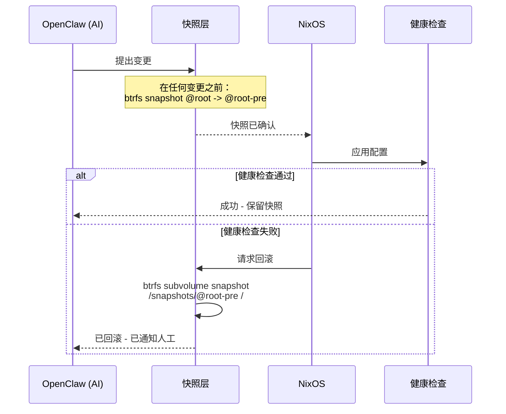
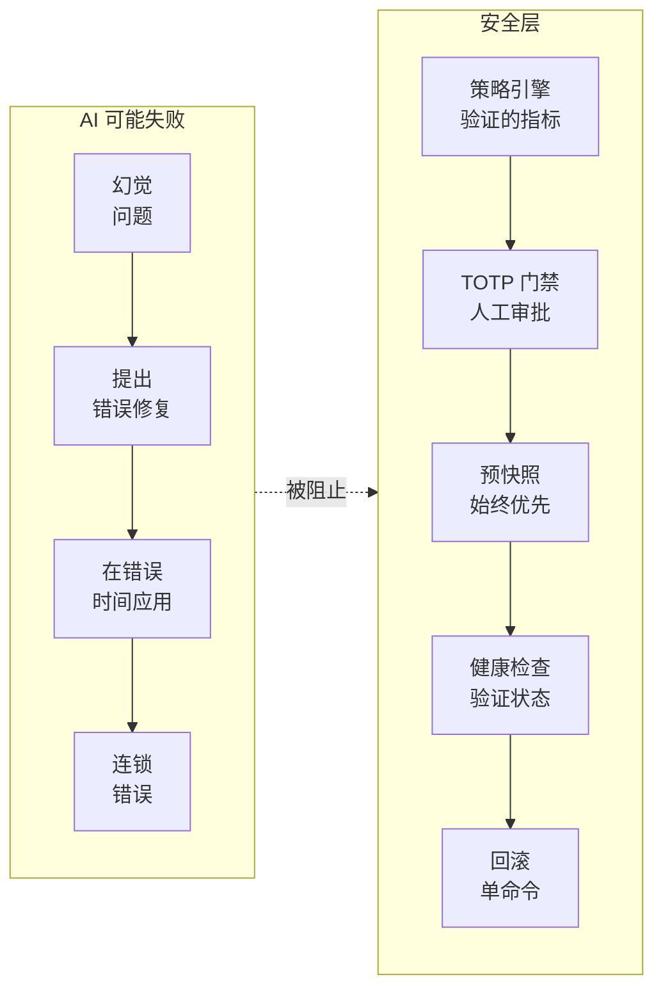
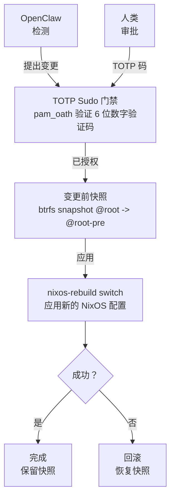
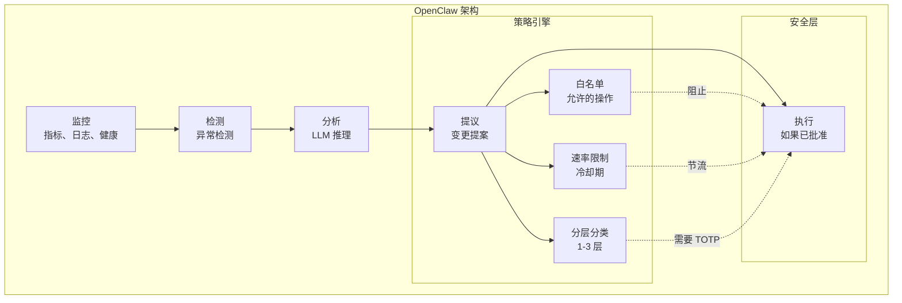
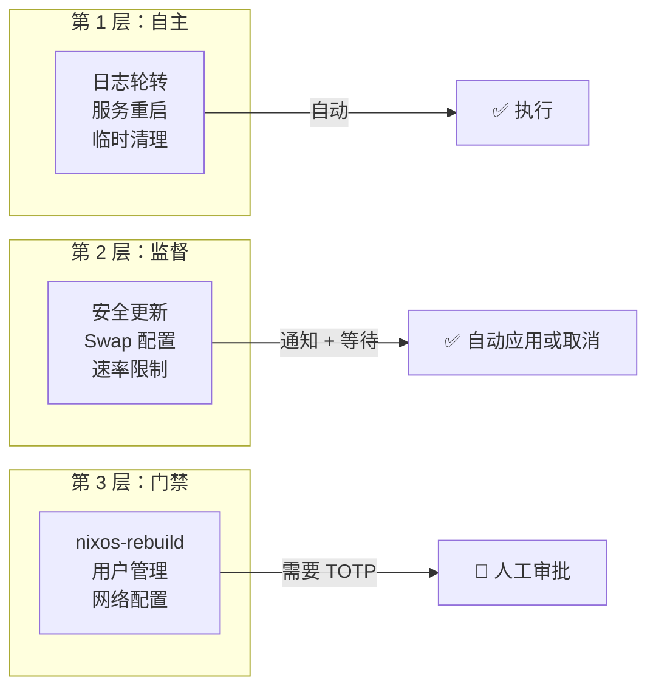
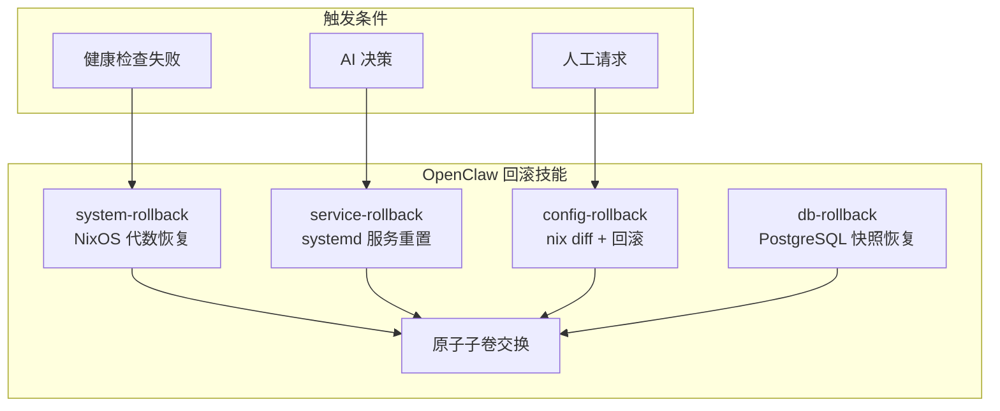
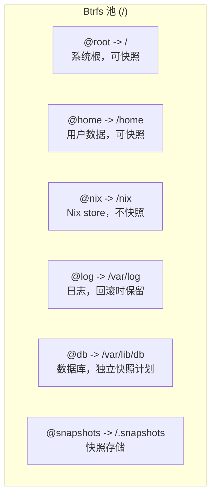
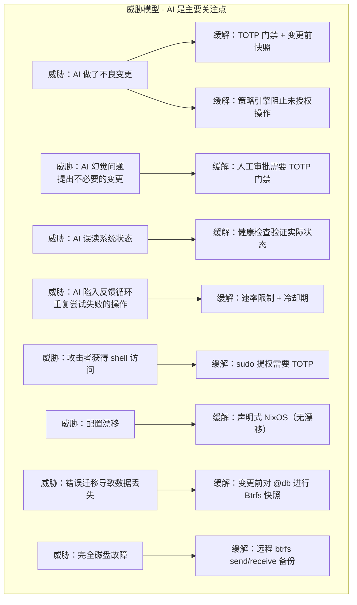
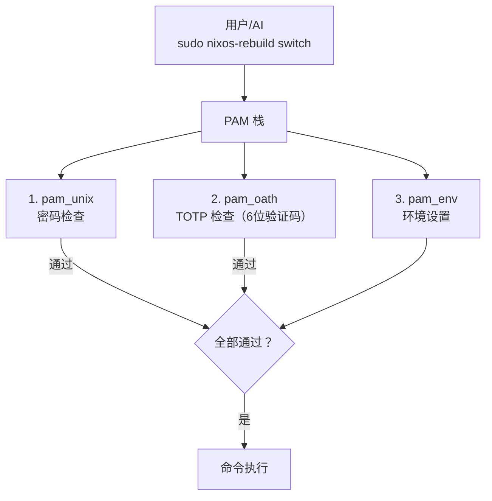

# 架构概览

本文档描述完整的系统架构、组件交互、数据流和故障处理策略。

:::info AI 优先设计
此架构专门为 **AI 运维的基础设施** 设计。每一个设计决策都考虑到：AI 会犯错、AI 会产生幻觉、AI 会误解系统状态。 即使 AI 错误的情况下，架构也必须是安全的。
:::

## 为什么 AI 安全至关重要

像为 OpenClaw 提供动力的大型语言模型 (LLM) 可能：

- **产生幻觉** — 检测不存在的问题
- **提出错误的修复方案** — 建议会破坏系统的命令
- **误读状态** — 相信系统处于与实际不同的状态
- **连锁错误** — 尝试修复第一个错误时犯下第二个错误

此架构假设 AI **将会** 犯错。安全层存在正是因为有 AI 参与，而不是尽管有 AI。

## 系统层次

架构分层次构建，每一层为其上一层提供保障：

```mermaid
flowchart TB
    subgraph Hardware["硬件 / VPS / VPC"]
        H[通过 nixos-anywhere 配置]
    end

    subgraph BtrfsLayer["Btrfs 文件系统 (子卷)"]
        BL[@root, @home, @nix, @log, @db, @snapshots]
    end

    subgraph Snap["快照层 (Snapper)"]
        S1[变更前快照] --> S2[定时清理]
        S2 --> S3[远程备份]
    end

    subgraph Nix["NixOS 配置"]
        N1[Flake<br/>锁定] --> N2[Modules]
        N2 --> N3[nixos-rebuild]
    end

    subgraph TOTPBox["TOTP 门禁 (pam_oath)"]
        T[保护：nixos-rebuild、systemctl、用户管理、防火墙变更]
    end

    subgraph OpenClawBox["OpenClaw (AI 基础设施运维代理)"]
        O1[监控与检测] --> O2[提出变更]
        O2 --> O3[执行<br/>通过 sudo]
    end

    subgraph HumanBox["人工运维"]
        HO[TOTP 身份验证]
    end

    H --> BtrfsLayer
    BtrfsLayer --> Snap
    Snap --> Nix
    Nix --> TOTPBox
    TOTPBox --> OpenClawBox
    OpenClawBox --> HumanBox
```

## 设计原则

### 1. 回滚优先

每个状态变更操作之前都会创建 Btrfs 快照。**这是原子性保证** — 如果任何事情出错，您始终可以返回完全相同之前的状态。



**原子回滚保证：**

| 保证 | 如何执行 |
|---|---|
| **变更前快照** | Snapper 在每次 `nixos-rebuild` 前自动创建快照 |
| **快照不可变** | Btrfs 快照默认是只读的 |
| **单命令回滚** | `sudo btrfs subvolume snapshot /snapshots/@root/pre-rebuild /` |
| **验证状态** | 健康检查确认系统在"提交"前是可操作的 |
| **多层回滚** | Btrfs 快照 → NixOS 代数 → 远程备份 |

:::danger AI 无法绕过回滚
即使 OpenClaw 尝试执行变更，快照也会在**任何变更应用之前**创建。AI 无法跳过这一安全层 — 它由 Snapper 钩子在系统级别强制执行。
:::

### 2. 可复现性

整个系统在 Nix flakes 中定义。相同的 flake 输入产生相同的系统：


### 3. 纵深防御

多层安全保护防止不良变更：

| 层级 | 保护机制 |
|---|---|
| TOTP 门禁 | 防止未授权的 `nixos-rebuild` |
| 变更前快照 | 错误应用后即时回滚 |
| NixOS 代数 | 从 GRUB 进入上一代数启动 |
| Btrfs send/receive | 已知良好状态的异地备份 |
| OpenClaw 策略引擎 | AI 只能在定义的边界内行动 |

### 4. 最小权限

OpenClaw 以专用系统用户运行。它不能直接执行特权命令 — 对于任何破坏性操作，它必须经过 TOTP 门禁的 sudo 路径。

### 5. AI 幻觉缓解

此架构假设 AI **将会** 犯错。多层保护防止 AI 幻觉：

| AI 风险 | 本架构中的缓解措施 |
|---|---|
| **幻觉问题** | 策略引擎只根据验证的指标行动，而非 AI 解释 |
| **提出错误修复** | TOTP 门禁要求人工审批所有系统变更 |
| **误读系统状态** | 健康检查在任何变更后验证实际状态 |
| **在错误时间应用变更** | 操作之间的冷却期防止快速连续的错误 |
| **连锁失败** | 变更前快照支持恢复到已知良好状态 |



**关键洞察**：AI 提议，但**架构决定**。人工审批和自动快照不是可选的 — 它们由系统强制执行，而非由 AI。

## 组件交互



## OpenClaw：AI 基础设施运维代理

### 什么是 OpenClaw？

OpenClaw 是一个 AI 驱动的代理，作为您的**数字值班 SRE**。它不取代人工运维人员 — 而是通过处理常规监控、分析，并能够自主执行低风险操作，同时将高风险变更上报给人工来增强人工运维人员的能力。



### 核心职责

| 职责 | 描述 |
|---|---|
| **监控** | 持续收集系统指标（CPU、内存、磁盘、服务） |
| **检测** | 识别异常、服务降级、安全问题 |
| **分析** | 使用 LLM 分析根本原因并提出解决方案 |
| **执行** | 执行已批准的变更并提供完整审计跟踪 |

### 为什么是 OpenClaw？（不仅仅是另一种自动化工具）

与传统自动化（Ansible、Terraform）不同，OpenClaw：

| 传统自动化 | OpenClaw（AI 运维代理）|
|---|---|
| 声明式期望状态 | 学习并适应系统行为 |
| 固定 playbook | 为新问题生成新解决方案 |
| 无上下文理解 | 使用 LLM 理解上下文 |
| 人工编写所有逻辑 | AI 提议，人工审批 |
| 静态 | 从反馈中改进 |

### 三层运维模型

OpenClaw 将每个操作分类为三个层级之一：



**第 1 层 — 自主（无需批准）**
- 低风险、可逆操作
- 立即自动执行
- 示例：日志轮转、服务故障后重启、临时文件清理

**第 2 层 — 监督（通知 + 自动应用）**
- 中等风险操作
- 通知人工，窗口期后自动应用（默认：30 分钟）
- 示例：安全补丁、Swap 配置

**第 3 层 — 门禁（需要 TOTP）**
- 高风险操作
- 需要人工通过 TOTP 明确批准
- 示例：`nixos-rebuild switch`、用户管理、防火墙变更

### OpenClaw 策略引擎

策略引擎是防止 OpenClaw 越界的**安全边界**。它在 Nix 中定义：

```nix
services.openclaw.settings.policy = {
  # 第 1 层：AI 可以自主执行的操作
  autonomous = {
    allowedActions = [
      "restart-failed-service"
      "rotate-logs"
      "clean-temp-files"
    ];
    constraints = {
      maxActionsPerHour = 5;
      maxRestartsPerServicePerHour = 3;
    };
  };
  
  # 第 2 层：AI 提议但等待的操作
  supervised = {
    allowedActions = [
      "security-package-update"
      "add-swap"
    ];
    defaultWindow = "30m";
  };
  
  # 第 3 层：AI 无法在没有人工的情况下执行的操作
  gated = {
    actions = [
      "nixos-rebuild-switch"
      "user-management"
    ];
    requireTOTP = true;
  };
  
  # 全局安全限制
  safety = {
    emergencyStopFile = "/var/lib/openclaw/STOP";
    maxChangesPerDay = 20;
    requirePreSnapshot = true;
    autoRollbackOnFailure = true;
  };
};
```

### OpenClaw 在架构中的位置

```mermaid
sequenceDiagram
    participant System as 系统 (NixOS)
    participant OpenClaw as OpenClaw (AI)
    participant Policy as 策略引擎
    participant Human as 人工运维
    participant TOTP as TOTP 门禁
    participant Snap as Btrfs 快照
    
    System->>OpenClaw: 发送指标
    OpenClaw->>OpenClaw: 分析问题
    
    alt 检测到问题
        OpenClaw->>Policy: 检查操作是否允许
        
        alt 第 1 层（自主）
            Policy->>OpenClaw: 允许
            OpenClaw->>Snap: 预快照（自动）
            Snap-->>OpenClaw: 快照完成
            OpenClaw->>System: 执行操作
            System-->>OpenClaw: 成功/失败
            OpenClaw->>OpenClaw: 记录到审计
            
        alt 第 2 层（监督）
            Policy->>OpenClaw: 允许（监督）
            OpenClaw->>Human: 通知待处理操作
            Note over Human,OpenClaw: 30 分钟窗口期
            alt 人工批准
                Human->>OpenClaw: 批准
                OpenClaw->>Snap: 预快照
                OpenClaw->>System: 执行
            else 人工取消
                Human->>OpenClaw: 取消
                OpenClaw->>OpenClaw: 记录已取消
            end
            
        alt 第 3 层（门禁）
            Policy->>OpenClaw: 需要 TOTP
            OpenClaw->>Human: 请求审批
            Human->>TOTP: 输入 TOTP 码
            TOTP->>Policy: 已验证
            Policy->>OpenClaw: 已批准
            OpenClaw->>Snap: 预快照
            OpenClaw->>System: 通过 sudo 执行
        end
    end
```

### AI 幻觉保护

OpenClaw 的设计明确解决 AI 幻觉问题：

| 幻觉类型 | 保护措施 |
|---|---|
| **幻觉问题** | 只根据验证的指标行动，而非 LLM 解释 |
| **提出错误修复** | 策略白名单阻止未授权操作 |
| **目标错误** | 人工在 TOTP 审批前审查差异 |
| **反馈循环** | 速率限制 + 冷却期 |
| **过度自信** | 始终记录不确定性，第 3 层需要人工 |

:::danger OpenClaw 不是 root
OpenClaw 以专用用户（`openclaw`）运行，而非 root。即使 LLM 建议 root 级别命令，OpenClaw 也无法在不经过 TOTP 门禁 sudo 路径的情况下执行。**永远不要给 OpenClaw root 访问权限** — 它会绕过所有安全层。
:::

### OpenClaw 的回滚技能

OpenClaw 不靠猜测恢复 — 它有**结构化的回滚技能**，定义为 Nix 模块。这些技能是原子的、经过测试的、保证能工作的。



#### 技能 1：系统回滚（NixOS 代数）

恢复到之前的 NixOS 代数：

```nix
# 实现为 Nix 模块
systemRollback = {
  description = "回滚到之前的 NixOS 代数";
  
  # 只执行预先验证的命令
  command = ''
    # 获取之前的代数
    PREV_GEN=$(nix-env --list-generations | grep -B1 current | head -1 | awk '{print $1}')
    
    # 激活之前的代数
    sudo /nix/var/nix/profiles/system/bin/switch-to-configuration switch --specialisations "$PREV_GEN"
  '';
  
  # 前置条件
  requiresSnapshot = true;
  verifyBefore = ["health-check", "ssh-accessible"];
  verifyAfter = ["health-check", "disk-space"];
};
```

**使用场景：**
- `nixos-rebuild` 应用后健康检查失败
- 重启后系统变得不可达
- OpenClaw 检测到启动失败

#### 技能 2：服务回滚（systemd）

将服务重启到已知良好状态：

```nix
serviceRollback = {
  description = "回滚 systemd 服务";
  
  command = ''
    SERVICE=$1  # 由 OpenClaw 传递
    
    # 停止服务
    sudo systemctl stop "$SERVICE"
    
    # 从上次已知良好状态恢复配置
    sudo cp /var/lib/openclaw/service-backups/"$SERVICE"/* /etc/systemd/system/
    
    # 重载并重启
    sudo systemctl daemon-reload
    sudo systemctl restart "$SERVICE"
    
    # 验证
    sudo systemctl status "$SERVICE"
  '';
  
  # 只对允许的服务（策略白名单）
  allowedServices = ["nginx", "postgresql", "docker"];
  maxRollbacksPerHour = 3;
};
```

**使用场景：**
- 服务进入崩溃循环
- 服务响应错误
- 检测到配置漂移

#### 技能 3：配置回滚（Nix Diff 回滚）

回滚特定的 Nix 配置变更：

```nix
configRollback = {
  description = "回滚特定的 Nix 配置变更";
  
  command = ''
    # 获取当前和之前的差异
    nix diff /etc/nixos/configuration.nix > /tmp/config-diff
    
    # 显示变更内容
    cat /tmp/config-diff
    
    # 回滚到 git 中的之前提交
    cd /etc/nixos
    sudo git revert HEAD --no-commit
    
    # 重建
    sudo nixos-rebuild switch
  '';
  
  requiresSnapshot = true;
  alwaysGated = true;  # 始终需要 TOTP
};
```

**使用场景：**
- 部分配置变更导致问题
- 想保留大部分变更，只回滚一个
- 人工识别出特定有问题的变更

#### 技能 4：数据库回滚（Btrfs 快照）

从 Btrfs 快照恢复数据库子卷：

```nix
dbRollback = {
  description = "从 Btrfs 快照恢复数据库";
  
  command = ''
    DB_PATH=$1  # 例如 /var/lib/postgresql
    SNAPSHOT=$2  # 例如 pre-change-20240115
    
    # 停止数据库
    sudo systemctl stop postgresql
    
    # 创建当前状态备份（以防回滚失败）
    sudo btrfs subvolume snapshot "$DB_PATH" "$DB_PATH-broken-$(date +%s)"
    
    # 从快照恢复
    sudo btrfs subvolume snapshot "$SNAPSHOT" "$DB_PATH"
    
    # 修复权限
    sudo chown -R postgres:postgres "$DB_PATH"
    
    # 启动数据库
    sudo systemctl start postgresql
    
    # 验证
    sudo -u postgres pg_isready
  '';
  
  requiresSnapshot = true;
  requiresTOTP = true;
  createsSnapshot = true;  # 回滚前创建备份
};
```

**使用场景：**
- 模式迁移后数据库损坏
- 数据完整性检查失败
- 意外删除数据

#### 回滚技能配置

所有回滚技能都在策略中配置：

```nix
services.openclaw.settings.policy.rollback = {
  # 启用回滚技能
  enableSystemRollback = true;
  enableServiceRollback = true;
  enableConfigRollback = true;
  enableDbRollback = true;
  
  # 限制条件
  maxRollbacksPerHour = 5;
  maxRollbacksPerDay = 20;
  requireSnapshotBeforeRollback = true;
  
  # 自动回滚触发（AI 可以在无需人工批准的情况下触发）
  autoRollbackOnHealthCheckFail = true;
  autoRollbackOnServiceCrash = false;  # 始终需要批准
  
  # 回滚之间的冷却时间
  rollbackCooldownMinutes = 5;
  
  # 回滚链限制（防止回滚循环）
  maxConsecutiveRollbacks = 2;
  
  # 回滚后始终通知人工
  notifyAfterRollback = true;
};
```

#### 为什么回滚作为技能很重要

| 临时回滚的问题 | 技能如何解决 |
|---|---|
| AI 不知道正确的命令 | 预定义、经过测试的命令 |
| 回滚导致更多问题 | 回滚前创建快照 |
| 无验证 | 前后健康检查 |
| 回滚循环 | 冷却时间 + 链限制 |
| 未诊断根本原因 | 记录完整回滚上下文 |

:::info 回滚不是失败
回滚**不是**失败 — 它是安全机制正常工作的标志。如果 OpenClaw 触发回滚，意味着安全架构正在正确运作。查看审计日志以了解出了什么问题，并相应地调整策略或健康检查。
:::

## 数据流：配置变更

典型的配置变更按如下流程流经系统：

1. **触发** — OpenClaw 检测到问题或运维人员发起变更
2. **提议** — 生成 Nix 配置差异
3. **认证** — 临界操作需要 TOTP 验证码
4. **快照** — Btrfs 快照所有相关子卷
5. **应用** — `nixos-rebuild switch` 应用新配置
6. **验证** — 健康检查确认系统功能正常
7. **提交或回滚** — 成功时，快照保留为恢复点；失败时，恢复快照。

## 故障模式

### AI 特定故障（为什么我们需要这些保护措施）

| AI 故障 | 检测 | 恢复 |
|---|---|---|
| AI 幻觉不存在的问题 | 人工在 TOTP 门禁处审查提案 | 变更从未应用 |
| AI 提出有害命令 | 策略引擎阻止不允许的操作 | 向运维人员发送警报 |
| AI 提出正确修复但目标错误 | 人工在审批前审查差异 | 变更需要 TOTP |
| AI 错误应用变更 | 变更后健康检查失败 | 回滚到变更前快照 |
| AI 陷入反馈循环（持续尝试相同修复） | 策略引擎中的速率限制 | 强制冷却期 |

### 系统故障

| 故障 | 检测 | 恢复 |
|---|---|---|
| 错误的 NixOS 配置（无法构建）| `nixos-rebuild` 在构建阶段失败 | 未发生系统变更 — 修复配置后重试 |
| 错误的 NixOS 配置（构建但服务异常）| 切换后健康检查失败 | 回滚到变更前 Btrfs 快照 |
| 错误的 NixOS 配置（无法启动）| 重启后系统无法启动 | 在 GRUB 中选择上一 NixOS 代数 |
| 变更后数据库损坏 | 应用健康检查 / 数据验证 | 从快照恢复 `@db` 子卷 |
| OpenClaw 提出不良变更 | 人类在 TOTP 门禁处审查并拒绝 | 变更从未应用 |
| OpenClaw 超出策略行动 | 策略引擎阻止操作 | 操作被记录并发送警报 |
| 磁盘故障 | Btrfs 设备统计 / SMART 监控 | 从远程备份恢复 (btrfs receive) |

## 子卷映射



:::note 为什么 /nix 不快照
Nix store (`/nix`) 是内容寻址的。每个路径由其哈希标识。对其快照会浪费空间 — 您始终可以从 flake 重建任何 Nix store 路径。相反，快照那些*引用* store 路径的配置。
:::

## 安全模型


        D[威胁：不良迁移导致数据丢失] --> D1[缓解：变更前对 @db 进行 Btrfs 快照]
        E[威胁：完全磁盘故障] --> E1[缓解：远程 btrfs send/receive 备份]
    end
```

### 认证流程



## 下一步

理解了架构之后，让我们开始构建。下一章将介绍如何使用 `nixos-anywhere` 在远程服务器上[引导 NixOS](./bootstrap-nixos-anywhere)。
