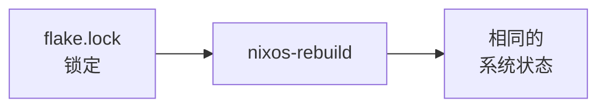
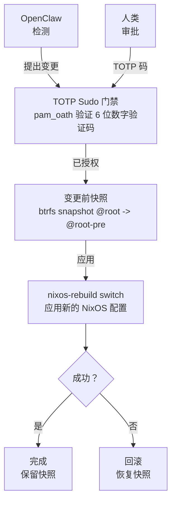
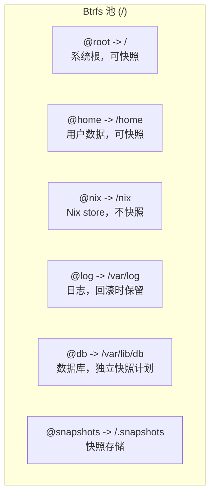
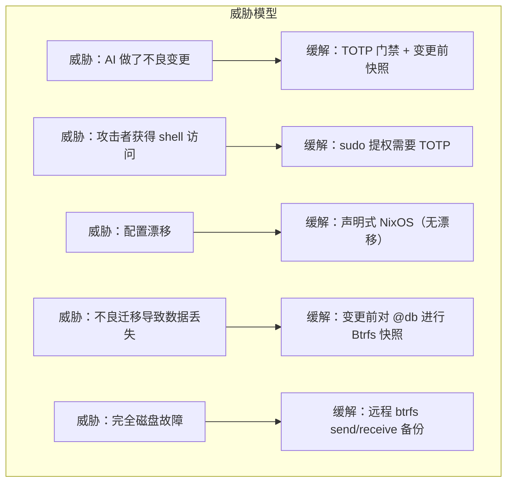
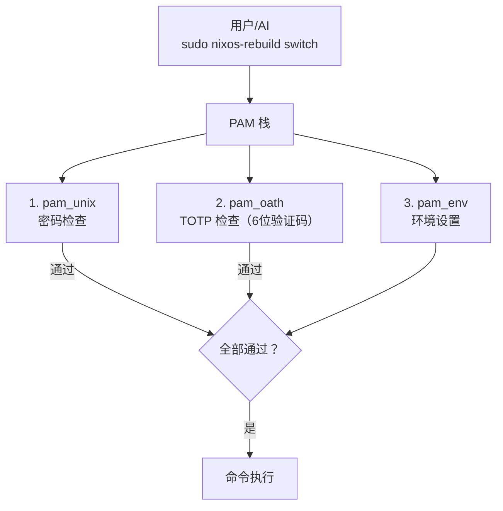

# 架构概览

本文档描述完整的系统架构、组件交互、数据流和故障处理策略。

## 系统层次

架构分层次构建，每一层为其上一层提供保障：

```mermaid
flowchart TB
    subgraph Hardware["硬件 / VPS / VPC"]
        H[通过 nixos-anywhere 配置]
    end

    subgraph BtrfsLayer["Btrfs 文件系统 (子卷)"]
        BL[@root, @home, @nix, @log, @db, @snapshots]
    end

    subgraph Snap["快照层 (Snapper)"]
        S1[变更前快照] --> S2[定时清理]
        S2 --> S3[远程备份]
    end

    subgraph Nix["NixOS 配置"]
        N1[Flake<br/>锁定] --> N2[Modules]
        N2 --> N3[nixos-rebuild]
    end

    subgraph TOTPBox["TOTP 门禁 (pam_oath)"]
        T[保护：nixos-rebuild、systemctl、用户管理、防火墙变更]
    end

    subgraph OpenClawBox["OpenClaw (AI 基础设施运维代理)"]
        O1[监控与检测] --> O2[提出变更]
        O2 --> O3[执行<br/>通过 sudo]
    end

    subgraph HumanBox["人工运维"]
        HO[TOTP 身份验证]
    end

    H --> BtrfsLayer
    BtrfsLayer --> Snap
    Snap --> Nix
    Nix --> TOTPBox
    TOTPBox --> OpenClawBox
    OpenClawBox --> HumanBox
```

## 设计原则

### 1. 回滚优先

每个状态变更操作之前都会创建 Btrfs 快照。如果变更失败，回滚是即时的：

```bash
# 在任何 nixos-rebuild 之前，快照会被自动创建
# 回滚只需一条命令：
sudo btrfs subvolume snapshot /snapshots/@root/pre-rebuild /
sudo reboot
```

### 2. 可复现性

整个系统在 Nix flakes 中定义。相同的 flake 输入产生相同的系统：



### 3. 纵深防御

多层安全保护防止不良变更：

| 层级 | 保护机制 |
|---|---|
| TOTP 门禁 | 防止未授权的 `nixos-rebuild` |
| 变更前快照 | 错误应用后即时回滚 |
| NixOS 代数 | 从 GRUB 进入上一代数启动 |
| Btrfs send/receive | 已知良好状态的异地备份 |
| OpenClaw 策略引擎 | AI 只能在定义的边界内行动 |

### 4. 最小权限

OpenClaw 以专用系统用户运行。它不能直接执行特权命令 — 对于任何破坏性操作，它必须经过 TOTP 门禁的 sudo 路径。

## 组件交互



## 数据流：配置变更

典型的配置变更按如下流程流经系统：

1. **触发** — OpenClaw 检测到问题或运维人员发起变更
2. **提议** — 生成 Nix 配置差异
3. **认证** — 临界操作需要 TOTP 验证码
4. **快照** — Btrfs 快照所有相关子卷
5. **应用** — `nixos-rebuild switch` 应用新配置
6. **验证** — 健康检查确认系统功能正常
7. **提交或回滚** — 成功时，快照保留为恢复点；失败时，恢复快照。

## 故障模式

| 故障 | 检测 | 恢复 |
|---|---|---|
| 错误的 NixOS 配置（无法构建）| `nixos-rebuild` 在构建阶段失败 | 未发生系统变更 — 修复配置后重试 |
| 错误的 NixOS 配置（构建但服务异常）| 切换后健康检查失败 | 回滚到变更前 Btrfs 快照 |
| 错误的 NixOS 配置（无法启动）| 重启后系统无法启动 | 在 GRUB 中选择上一 NixOS 代数 |
| 变更后数据库损坏 | 应用健康检查 / 数据验证 | 从快照恢复 `@db` 子卷 |
| OpenClaw 提出不良变更 | 人类在 TOTP 门禁处审查并拒绝 | 变更从未应用 |
| OpenClaw 超出策略行动 | 策略引擎阻止操作 | 操作被记录并发送警报 |
| 磁盘故障 | Btrfs 设备统计 / SMART 监控 | 从远程备份恢复 (btrfs receive) |

## 子卷映射



:::note 为什么 /nix 不快照
Nix store (`/nix`) 是内容寻址的。每个路径由其哈希标识。对其快照会浪费空间 — 您始终可以从 flake 重建任何 Nix store 路径。相反，快照那些*引用* store 路径的配置。
:::

## 安全模型



### 认证流程



## 下一步

理解了架构之后，让我们开始构建。下一章将介绍如何使用 `nixos-anywhere` 在远程服务器上[引导 NixOS](./bootstrap-nixos-anywhere)。
