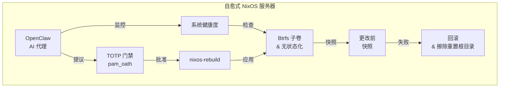

# 使用 NixOS 构建自愈式基础设施

本教程将引导您构建一个**生产级、可自愈的服务器**，它结合了声明式系统管理、写时复制快照、AI 辅助操作以及受 TOTP 保护的关键命令。

## 将要构建的内容

通过本指南，您的服务器将具备以下能力：

- 通过 `nixos-anywhere` 远程安装 **NixOS** —— 无需 ISO 镜像，无需控制台访问
- 原生使用 **Btrfs** 文件系统与精心设计的子卷布局
- 实现 **Impermanence**（“擦除您的挚爱”，即无状态化根环境）以获得临时、无状态的根文件系统
- 在每次系统更改前进行**自动快照**
- 运行 **OpenClaw**（一个 AI 基础设施操作代理），它会监控系统并提出修复建议
- 将**关键操作**（如 `nixos-rebuild switch`、配置更改）隔离在 **TOTP 认证**（动态令牌）门禁之后
- 当出现任何差错（无论是人为还是 AI 造成）时可以**瞬间回滚**

## 案例：原子级数据库升级

假设您的服务器上同时运行着 **PostgreSQL** 和 **MySQL**，您部署了一个 AI 代理来保持它们的更新。传统环境下的数据库升级通常充满风险：如果 PostgreSQL 升级成功了，但 MySQL 升级失败并损坏了数据，该怎么办？

借助于这套自愈架构，整个过程天生安全：

1. **升级前快照：** 在 AI 应用新配置之前，系统会自动为您的系统状态和数据库子卷（例如 `/var/lib/postgresql` 和 `/var/lib/mysql`）创建一个瞬时、只读的 Btrfs 快照。
2. **执行升级：** AI 应用 NixOS 配置更改，更新二进制文件并重启服务。
3. **健康检查：** AI 监控这些服务。假设 PostgreSQL 成功启动，但 MySQL 由于废弃的配置参数而启动失败。
4. **原子回滚：** 由于声明式的系统配置（Nix）和数据存储（Btrfs）紧密结合，回滚是原子级的。系统可瞬间回退这些快照。二进制文件、配置文件和原始数据库数据文件将一起回滚到升级开始前那一微秒的状态。没有部分失败，也无需手动进行混乱的状态恢复。

## 目标读者

- 管理生产级 Linux 服务器的 **DevOps 工程师**
- 设计弹性高可用基础设施的 **SRE**
- 探索 AI 辅助运维的**平台工程师**
- 寻找生产级最佳实践的 **NixOS 爱好者**

## 前置条件

| 需求 | 详情 |
|---|---|
| 目标服务器 | 拥有 Root SSH 访问权限的 VPS 或 VPC，至少 2GB 内存、20GB 磁盘 |
| 本地机器 | Linux 或 macOS，且已[安装 Nix](https://nixos.org/download/) |
| SSH 密钥对 | 如果没有，请执行 `ssh-keygen -t ed25519` |
| 知识储备 | 基础的 Linux 系统管理、SSH 以及对命令行的熟悉 |

:::tip 无需 NixOS 经验
本教程默认您没有任何 NixOS 经验。每一步都从最基础的原理开始解释。不过，需要具备基础的 Linux 系统管理技能（例如 SSH、文件系统、系统服务）。
:::

## 技术栈

| 组件 | 作用 |
|---|---|
| [nixos-anywhere](https://github.com/nix-community/nixos-anywhere) | 通过 SSH 自动化远程安装 NixOS |
| [NixOS](https://nixos.org) | 声明式、可重现的操作系统 |
| [Btrfs](https://btrfs.readthedocs.io/) | 支持快照的写时复制 (COW) 文件系统 |
| [Snapper](http://snapper.io/) | 自动化快照管理 |
| [Impermanence](https://github.com/nix-community/impermanence) | "Erase your darlings" 无状态根文件系统 |
| [OpenClaw](https://github.com/openclaw) | AI 基础设施操作代理 |
| [pam_oath](https://www.nongnu.org/oath-toolkit/) | 基于 TOTP 的 sudo 身份验证 |

## 教程路线图

1. **[架构概览](./architecture)** — 系统设计与组件交互
2. **[使用 nixos-anywhere 引导安装](./bootstrap-nixos-anywhere)** — 在任意服务器上远程安装 NixOS
3. **[Btrfs & 无状态化布局](./btrfs-layout)** — 为快照、无状态根目录和持久化数据设计文件系统
4. **[Btrfs 快照与 Snapper](./btrfs-snapshots)** — 自动创建与清理快照
5. **[安装 OpenClaw](./install-openclaw)** — 设置 AI 基础设施操作代理
6. **[AI 管理的基础设施](./ai-managed-infra)** — 配置 AI 辅助操作
7. **[OpenClaw 上下文管理](./context-management)** — 事件关联、会话连续性与知识学习
8. **[TOTP Sudo 防护](./totp-sudo-protection)** — 将关键命令隔离在 TOTP 之后
8. **[数据库快照策略](./database-snapshot-strategy)** — 结合 Btrfs 的一致性数据库备份
9. **[灾难恢复](./disaster-recovery)** — 完整的数据和系统恢复流程
10. **[AI 安全与回滚](./ai-safety-and-rollback)** — 护栏规则与回滚工作流
11. **[监控与告警](./monitoring-alerting)** — Prometheus、Grafana、Loki 为 OpenClaw 提供可观测性
12. **[Impermanence 设置](./impermanence-setup)** — "擦除你的挚爱" 无状态根文件系统
13. **[安全加固](./security-hardening)** — 防火墙、SSH、Fail2ban、内核与服务加固
14. **[常见问题 (FAQ)](./faq)** — 常见问题与故障排除
15. **[交互式演示](./interactive-demo)** — 动画工作流、终端回放与决策模拟器

:::warning 生产可用性提示
本教程使用了贴近真实生产环境的配置。然而，在将其应用到生产服务器之前，请务必在测试环境（Staging）中对其进行测试。每个环境都有其特殊需求。
:::

## 设计哲学

本架构遵循三个核心原则：

1. **回滚优先** — 在每次更改之前都会生成快照。恢复永远只需一条命令。
2. **深度防御** — AI 可以提议更改，但必须由人类通过 TOTP 批准关键操作。快照是 TOTP 外的最后一道防线。
3. **一切皆声明** — 整个系统的状态都保存在受版本控制的 Nix 配置中。系统不再是雪花服务器（Snowflake Servers）。

让我们从 [架构概览](./architecture) 开始。
