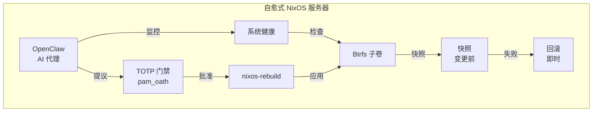

# 使用 NixOS 构建自愈式基础设施

本教程将指导您构建一个**生产级自愈服务器**，它结合了声明式系统管理、写时复制快照、AI 辅助操作和 TOTP 保护的临界操作。

## 您将构建什么

在本指南结束时，您将拥有一个具备以下功能的服务器：

- 通过 `nixos-anywhere` 远程安装 **NixOS** — 无需 ISO，无需控制台访问
- 使用精心设计的子卷布局的 **Btrfs** 文件系统
- 在每次系统变更前进行**自动快照**
- 运行 **OpenClaw**，一个监控并提出修复建议的 AI 基础设施运维代理
- 将**临界操作**（`nixos-rebuild switch`、配置变更）置于 **TOTP 身份验证**之后
- 当出现问题时可以**即时回滚** — 无论是人为还是 AI 导致

## 面向对象

- 正在管理生产 Linux 服务器的 **DevOps 工程师**
- 正在设计弹性基础设施的 **SRE**
- 探索 AI 辅助操作的**平台工程师**
- 寻找生产级模式的 **NixOS 爱好者**

## 前提条件

| 要求 | 详情 |
|---|---|
| 目标服务器 | 具有 root SSH 访问权限的 VPS 或 VPC，2+ GB 内存，20+ GB 磁盘 |
| 本地机器 | 安装了 [Nix](https://nixos.org/download/) 的 Linux 或 macOS |
| SSH 密钥对 | 如果没有，使用 `ssh-keygen -t ed25519` 生成 |
| 知识背景 | 基础 Linux 管理、SSH、命令行操作能力 |

:::tip 无需 NixOS 经验
本教程不假设您有 NixOS 经验。每一步都从基础原理开始讲解。不过，您需要具备基本的 Linux 系统管理技能（SSH、文件系统、服务）。
:::

## 技术栈

| 组件 | 角色 |
|---|---|
| [nixos-anywhere](https://github.com/nix-community/nixos-anywhere) | 通过 SSH 远程安装 NixOS |
| [NixOS](https://nixos.org) | 声明式、可复现的操作系统 |
| [Btrfs](https://btrfs.readthedocs.io/) | 支持快照的写时复制文件系统 |
| [Snapper](http://snapper.io/) | 自动化快照管理 |
| [OpenClaw](https://github.com/openclaw) | AI 基础设施运维代理 |
| [pam_oath](https://www.nongnu.org/oath-toolkit/) | 基于 TOTP 的 sudo 身份验证 |

## 教程路线图

1. **[架构概览](./architecture)** — 系统设计和组件交互
2. **[使用 nixos-anywhere 引导](./bootstrap-nixos-anywhere)** — 远程在任何服务器上安装 NixOS
3. **[Btrfs 子卷布局](./btrfs-layout)** — 为快照和回滚设计文件系统
4. **[Btrfs 快照与 Snapper](./btrfs-snapshots)** — 自动化快照创建和清理
5. **[安装 OpenClaw](./install-openclaw)** — 设置 AI 基础设施运维代理
6. **[AI 管理的基础设施](./ai-managed-infra)** — 配置 AI 辅助操作
7. **[TOTP Sudo 保护](./totp-sudo-protection)** — 将临界操作置于 TOTP 之后
8. **[数据库快照策略](./database-snapshot-strategy)** — 使用 Btrfs 实现一致的数据库备份
9. **[灾难恢复](./disaster-recovery)** — 完整恢复流程
10. **[AI 安全与回滚](./ai-safety-and-rollback)** — 防护措施和回滚工作流
11. **[常见问题](./faq)** — 常见问题和故障排除

:::warning 生产环境就绪
本教程使用现实的、生产级配置。但在应用到生产服务器之前，请始终在预发环境中测试。每个环境都有独特的需求。
:::

## 设计理念

该架构遵循三个核心原则：

1. **回滚优先** — 每次变更前都创建快照。恢复始终只需一条命令。
2. **纵深防御** — AI 可以提出变更，但人类通过 TOTP 批准临界操作。快照捕获 TOTP 未覆盖的问题。
3. **一切皆声明式** — 整个系统状态存在于版本控制的 Nix 配置中。不存在雪花服务器。

让我们从[架构概览](./architecture)开始。
