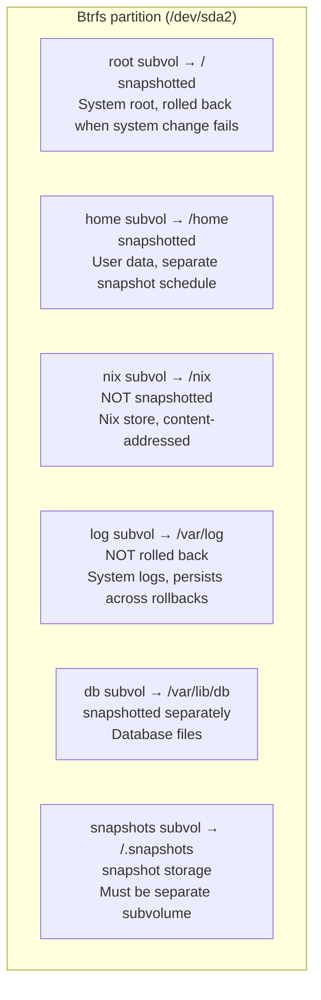

---
sidebar:
  order: 4
title: Btrfs Subvolume Layout
---

# Btrfs Subvolume Layout

A well-designed subvolume layout is the foundation of a rollback-capable system. Each subvolume can be independently snapshotted, mounted with different options, and excluded from rollbacks when persistence is needed.

## Why Btrfs for NixOS

| Feature | Benefit for NixOS |
|---|---|
| Copy-on-write (COW) | Snapshots are instant and space-efficient |
| Subvolumes | Independent snapshot and mount policies per directory tree |
| Compression (zstd) | 30-50% space savings on system files |
| Send/receive | Stream snapshots to a remote backup server |
| Scrub | Detect and repair silent data corruption |
| Online resize | Grow filesystem without downtime |

:::note ext4 vs Btrfs
ext4 is battle-tested but lacks native snapshots. LVM snapshots exist but are slow and fragile under load. Btrfs snapshots are instantaneous, space-efficient (COW), and can be sent to remote hosts. For a rollback-first architecture, Btrfs is the clear choice.
:::

## Subvolume Design



## Why This Layout

### @root (system root)

Everything under `/` that isn't a separate mount. Includes:
- `/etc` — system configuration (managed by NixOS)
- `/var/lib` — service state (except databases)
- `/usr` — minimal, most binaries are in `/nix`

Rolling back `@root` restores the system to a known-good state without touching user data, logs, or databases.

### @home (user data)

Separated so you can:
- Roll back the system without losing user files
- Snapshot user data on a different schedule
- Apply different compression/quota policies

### @nix (Nix store)

```
/nix/store/xxxxxxxx-package-name/
```

Every Nix store path is addressed by its content hash. Snapshotting `/nix` is wasteful because:
1. Store paths are immutable — they never change after creation
2. Any store path can be rebuilt from the flake configuration
3. The store can be large (10-50 GB) and snapshots would consume significant space
4. Garbage collection (`nix-collect-garbage`) handles cleanup

### @log (persistent logs)

Logs **must survive rollbacks**. When a bad configuration is rolled back, you need the logs from the failed state to debug what went wrong. Without this separation, rollback would delete the evidence.

### @db (databases)

Databases need special handling:
- Snapshots must be taken while the database is in a consistent state
- May require `CHECKPOINT` or write-freeze before snapshot
- Separate snapshot schedule from system (more frequent for active databases)
- Separate rollback — you may want to roll back the system but keep current data

### @snapshots (snapshot storage)

Snapper stores snapshots here. It must be its own subvolume to avoid the recursive problem: snapshotting `@root` would include `/.snapshots`, creating a snapshot of all your snapshots.

## Disko Implementation

This is the complete disko module that implements the layout:

```nix title="disk-config.nix"
{ lib, ... }:
{
  disko.devices = {
    disk = {
      main = {
        type = "disk";
        device = "/dev/sda";
        content = {
          type = "gpt";
          partitions = {
            ESP = {
              size = "512M";
              type = "EF00";
              content = {
                type = "filesystem";
                format = "vfat";
                mountpoint = "/boot";
                mountOptions = [ "umask=0077" ];
              };
            };
            root = {
              size = "100%";
              content = {
                type = "btrfs";
                extraArgs = [ "-f" ];
                subvolumes = {
                  "@root" = {
                    mountpoint = "/";
                    mountOptions = [
                      "compress=zstd:1"
                      "noatime"
                      "space_cache=v2"
                    ];
                  };
                  "@home" = {
                    mountpoint = "/home";
                    mountOptions = [
                      "compress=zstd:1"
                      "noatime"
                      "space_cache=v2"
                    ];
                  };
                  "@nix" = {
                    mountpoint = "/nix";
                    mountOptions = [
                      "compress=zstd:1"
                      "noatime"
                      "space_cache=v2"
                    ];
                  };
                  "@log" = {
                    mountpoint = "/var/log";
                    mountOptions = [
                      "compress=zstd:1"
                      "noatime"
                      "space_cache=v2"
                    ];
                  };
                  "@db" = {
                    mountpoint = "/var/lib/db";
                    mountOptions = [
                      "noatime"
                      "space_cache=v2"
                      "nodatacow"
                    ];
                  };
                  "@snapshots" = {
                    mountpoint = "/.snapshots";
                    mountOptions = [
                      "noatime"
                      "space_cache=v2"
                    ];
                  };
                };
              };
            };
          };
        };
      };
    };
  };
}
```

:::warning nodatacow on @db
The `@db` subvolume uses `nodatacow` to disable copy-on-write for database files. Databases like PostgreSQL do their own journaling — COW on top of that causes write amplification and fragmentation. Note: `nodatacow` implies `nodatasum`, so you lose Btrfs checksumming on this subvolume. The database's own integrity checks compensate for this.
:::

## Mount Options Explained

| Option | Purpose |
|---|---|
| `compress=zstd:1` | Zstandard compression level 1 — fast with good ratio (~30% savings) |
| `noatime` | Don't update access timestamps on read — reduces write I/O significantly |
| `space_cache=v2` | Faster free-space tracking — required for large filesystems |
| `nodatacow` | Disable COW for database subvolume — prevents write amplification |

### SSD Detection

If you're on an SSD or NVMe drive, add the `ssd` mount option:

```nix
mountOptions = [
  "compress=zstd:1"
  "noatime"
  "space_cache=v2"
  "ssd"
];
```

Btrfs auto-detects SSDs on most systems, but being explicit doesn't hurt.

## Verifying the Layout

After installation, verify everything is mounted correctly:

```bash
# List all subvolumes
sudo btrfs subvolume list /

# Check mount points and options
findmnt -t btrfs
```

Expected `findmnt` output:

```
TARGET       SOURCE           FSTYPE OPTIONS
/            /dev/sda2[@root] btrfs  rw,noatime,compress=zstd:1,space_cache=v2,subvol=/@root
├─/home      /dev/sda2[@home] btrfs  rw,noatime,compress=zstd:1,space_cache=v2,subvol=/@home
├─/nix       /dev/sda2[@nix]  btrfs  rw,noatime,compress=zstd:1,space_cache=v2,subvol=/@nix
├─/var/log   /dev/sda2[@log]  btrfs  rw,noatime,compress=zstd:1,space_cache=v2,subvol=/@log
├─/var/lib/db /dev/sda2[@db]  btrfs  rw,noatime,space_cache=v2,nodatacow,subvol=/@db
└─/.snapshots /dev/sda2[@snapshots] btrfs rw,noatime,space_cache=v2,subvol=/@snapshots
```

## Checking Compression Ratio

Install `compsize` and check how much space compression saves:

```bash
sudo compsize /
```

Example output:

```
Processed 45231 files, 12847 regular extents (13102 refs), 8423 inline.
Type       Perc     Disk Usage   Uncompressed Referenced
TOTAL       68%      2.1G         3.1G         3.2G
none       100%      1.4G         1.4G         1.4G
zstd        48%      723M         1.7G         1.8G
```

This shows zstd compression is saving about 52% on compressible files.

## Capacity Planning

Monitor disk usage per subvolume:

```bash
# Overall filesystem usage
sudo btrfs filesystem usage /

# Per-subvolume space (requires quota)
sudo btrfs quota enable /
sudo btrfs qgroup show /
```

:::tip Set Quotas for @snapshots
Prevent snapshots from filling the disk:

```bash
# Limit snapshots to 20GB
sudo btrfs qgroup limit 20G /.snapshots
```

Or configure in NixOS:

```nix
# In configuration.nix — run this as an activation script
system.activationScripts.btrfsQuota = ''
  ${pkgs.btrfs-progs}/bin/btrfs quota enable / 2>/dev/null || true
'';
```
:::

## What's Next

The subvolume layout is ready. Next, let's configure [automatic snapshots with Snapper](./btrfs-snapshots) so every system change is protected by a restore point.
