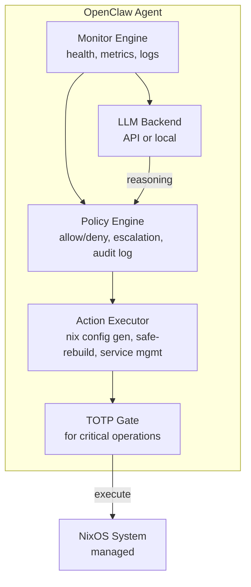

---
sidebar:
  order: 6
title: Install OpenClaw
---

# Install OpenClaw

OpenClaw is an AI-powered infrastructure operator. It monitors system health, proposes configuration changes, and can execute approved operations — all within a policy-defined boundary. Think of it as an AI SRE agent that works alongside your existing NixOS tooling.

## Architecture



## Components

| Component | Role |
|---|---|
| **Monitor Engine** | Collects system metrics, parses logs, detects anomalies |
| **Policy Engine** | Defines what OpenClaw can and cannot do autonomously |
| **Action Executor** | Generates Nix configs, runs safe-rebuild, manages services |
| **LLM Backend** | Reasoning engine — can be a remote API or local model |
| **Audit Log** | Immutable record of all proposals and actions |

## Installation on NixOS

### Add the Flake Input

```nix title="flake.nix"
{
  description = "Self-healing NixOS server";

  inputs = {
    nixpkgs.url = "github:NixOS/nixpkgs/nixos-24.11";
    disko = {
      url = "github:nix-community/disko";
      inputs.nixpkgs.follows = "nixpkgs";
    };
    openclaw = {
      url = "github:openclaw/openclaw";
      inputs.nixpkgs.follows = "nixpkgs";
    };
  };

  outputs = { self, nixpkgs, disko, openclaw, ... }: {
    nixosConfigurations.server = nixpkgs.lib.nixosSystem {
      system = "x86_64-linux";
      modules = [
        disko.nixosModules.disko
        openclaw.nixosModules.default
        ./disk-config.nix
        ./configuration.nix
        ./openclaw-config.nix
      ];
    };
  };
}
```

### OpenClaw NixOS Module

```nix title="openclaw-config.nix"
{ config, pkgs, ... }:
{
  services.openclaw = {
    enable = true;

    # Run as a dedicated system user (not root)
    user = "openclaw";
    group = "openclaw";

    settings = {
      # LLM backend configuration
      llm = {
        # Option 1: Remote API
        provider = "anthropic";
        model = "claude-sonnet-4-20250514";
        # API key is loaded from a file, never in nix config
        apiKeyFile = "/run/secrets/openclaw-api-key";

        # Option 2: Local model (uncomment to use)
        # provider = "ollama";
        # model = "llama3:70b";
        # endpoint = "http://localhost:11434";
      };

      # System integration
      system = {
        # Path to the NixOS configuration
        nixosConfigPath = "/etc/nixos";

        # Use our safe-rebuild wrapper
        rebuildCommand = "safe-rebuild";

        # Snapper integration
        snapperConfigs = [ "root" "home" "db" ];
      };

      # Monitoring targets
      monitoring = {
        enable = true;
        interval = "60s";

        checks = {
          diskUsage = { threshold = 85; };
          memoryUsage = { threshold = 90; };
          loadAverage = { threshold = 4.0; };
          failedUnits = { enable = true; };
          sshBruteForce = { enable = true; threshold = 10; };
          certificateExpiry = { enable = true; warnDays = 14; };
        };
      };

      # Logging and audit
      audit = {
        enable = true;
        logPath = "/var/log/openclaw/audit.jsonl";
        retentionDays = 90;
      };
    };
  };

  # Create the openclaw system user
  users.users.openclaw = {
    isSystemUser = true;
    group = "openclaw";
    home = "/var/lib/openclaw";
    description = "OpenClaw AI infrastructure operator";
  };

  users.groups.openclaw = {};

  # OpenClaw needs limited sudo access (TOTP-gated for critical ops)
  security.sudo.extraRules = [
    {
      users = [ "openclaw" ];
      commands = [
        # Read-only operations — no TOTP needed
        { command = "/run/current-system/sw/bin/systemctl status *"; options = [ "NOPASSWD" ]; }
        { command = "/run/current-system/sw/bin/journalctl *"; options = [ "NOPASSWD" ]; }
        { command = "/run/current-system/sw/bin/btrfs subvolume list *"; options = [ "NOPASSWD" ]; }
        { command = "/run/current-system/sw/bin/snapper list *"; options = [ "NOPASSWD" ]; }

        # Critical operations — require TOTP (configured in chapter 06)
        { command = "/run/current-system/sw/bin/safe-rebuild *"; options = [ "PASSWD" ]; }
        { command = "/run/current-system/sw/bin/nixos-rebuild *"; options = [ "PASSWD" ]; }
        { command = "/run/current-system/sw/bin/systemctl restart *"; options = [ "PASSWD" ]; }
      ];
    }
  ];

  # Ensure log directory exists
  systemd.tmpfiles.rules = [
    "d /var/log/openclaw 0750 openclaw openclaw -"
  ];
}
```

### API Key Management

Never put API keys in Nix configuration. Use a secrets manager:

```bash
# Create a secrets directory (restricted permissions)
sudo mkdir -p /run/secrets
sudo chmod 700 /run/secrets

# Write the API key
echo "sk-ant-..." | sudo tee /run/secrets/openclaw-api-key > /dev/null
sudo chmod 600 /run/secrets/openclaw-api-key
sudo chown openclaw:openclaw /run/secrets/openclaw-api-key
```

:::tip Production Secrets Management
For production, use [agenix](https://github.com/ryantm/agenix) or [sops-nix](https://github.com/Mic92/sops-nix) to manage secrets declaratively with encryption:

```nix
# With agenix:
age.secrets.openclaw-api-key = {
  file = ../secrets/openclaw-api-key.age;
  owner = "openclaw";
  group = "openclaw";
};
```
:::

## Verification

After rebuilding with the OpenClaw configuration:

```bash
# Check service status
sudo systemctl status openclaw

# View recent logs
sudo journalctl -u openclaw -f

# Check OpenClaw can communicate with its LLM backend
sudo -u openclaw openclaw health-check

# View the audit log
sudo cat /var/log/openclaw/audit.jsonl | jq .
```

Expected healthy output:

```
● openclaw.service - OpenClaw AI Infrastructure Operator
     Loaded: loaded (/etc/systemd/system/openclaw.service; enabled)
     Active: active (running) since Mon 2024-01-15 10:00:00 UTC
   Main PID: 1234 (openclaw)
      Tasks: 8 (limit: 4915)
     Memory: 128.0M
     CGroup: /system.slice/openclaw.service
             └─1234 /nix/store/...-openclaw/bin/openclaw --config /etc/openclaw/config.toml

Jan 15 10:00:01 nixos-server openclaw[1234]: Monitor engine started (interval: 60s)
Jan 15 10:00:01 nixos-server openclaw[1234]: Policy engine loaded (12 rules)
Jan 15 10:00:01 nixos-server openclaw[1234]: LLM backend connected (anthropic/claude-sonnet-4-20250514)
Jan 15 10:00:01 nixos-server openclaw[1234]: Audit logging to /var/log/openclaw/audit.jsonl
```

## Security Considerations

1. **Dedicated user** — OpenClaw runs as `openclaw`, not root. It can only escalate via sudo.
2. **TOTP-gated sudo** — Critical commands (rebuild, restart) require TOTP authentication (configured in [Chapter 6](./totp-sudo-protection)).
3. **Read-only defaults** — Monitoring commands run without password. Only write operations require authentication.
4. **Audit trail** — Every action is logged to an append-only JSONL file with timestamps, action type, and outcome.
5. **Policy boundaries** — The policy engine prevents OpenClaw from acting outside defined rules, even if the LLM suggests it.

:::danger Never Give OpenClaw Root Access
OpenClaw should never run as root or have unrestricted sudo. The entire safety model depends on the TOTP gate standing between OpenClaw and destructive operations. If OpenClaw has root, the gate is meaningless.
:::

## What's Next

OpenClaw is installed and running. Next, we'll configure the [AI-managed infrastructure workflow](./ai-managed-infra) — defining what OpenClaw can do autonomously vs. what requires human approval.
