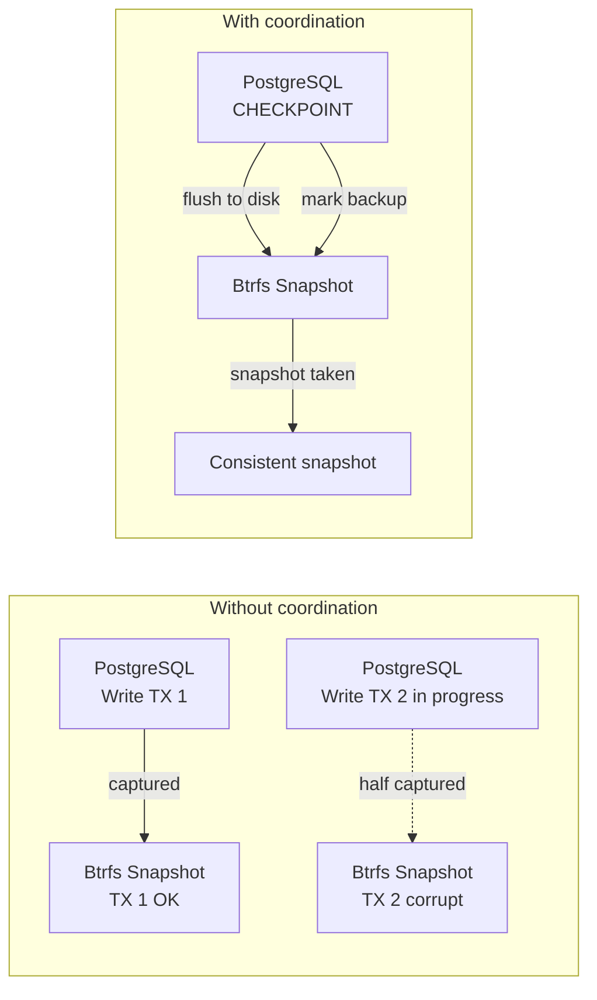
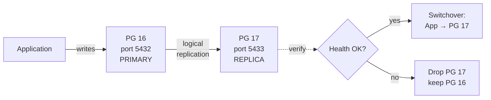

---
sidebar:
  order: 9
title: Database Snapshot Strategy
---

# Database Snapshot Strategy

Databases require special snapshot handling. A naive filesystem snapshot of a running database can capture an inconsistent state — half-written transactions, dirty buffers, incomplete WAL entries. This chapter covers strategies for consistent database snapshots on Btrfs.

## The Consistency Problem



## Strategy Overview

| Database | Snapshot Method |
|---|---|
| PostgreSQL | `CHECKPOINT` + `pg_backup_start()` + Btrfs snapshot + `pg_backup_stop()` |
| SQLite | `PRAGMA wal_checkpoint(TRUNCATE)` + Btrfs snapshot |
| Redis | `BGSAVE` + wait + Btrfs snapshot |
| MySQL/MariaDB | `FLUSH TABLES WITH READ LOCK` + Btrfs snapshot + `UNLOCK TABLES` |

## PostgreSQL Consistent Snapshots

### NixOS PostgreSQL Configuration

```nix title="modules/postgresql.nix"
{ config, pkgs, ... }:
{
  services.postgresql = {
    enable = true;
    package = pkgs.postgresql_16;

    # Store data on the @db subvolume
    dataDir = "/var/lib/db/postgresql";

    settings = {
      # WAL configuration for reliable backup
      wal_level = "replica";
      archive_mode = "on";
      archive_command = "cp %p /var/lib/db/wal-archive/%f";

      # Checkpoint settings
      checkpoint_timeout = "15min";
      max_wal_size = "1GB";
    };
  };

  # Ensure WAL archive directory exists
  systemd.tmpfiles.rules = [
    "d /var/lib/db/wal-archive 0700 postgres postgres -"
  ];
}
```

### Consistent Snapshot Script

```nix title="modules/db-snapshot.nix"
{ config, pkgs, ... }:
let
  dbSnapshot = pkgs.writeShellScriptBin "db-snapshot" ''
    set -euo pipefail

    TIMESTAMP=$(date +%Y%m%d-%H%M%S)
    SNAP_NAME="@db-$TIMESTAMP"
    SNAP_PATH="/.snapshots/$SNAP_NAME"

    echo "=== Database Consistent Snapshot ==="
    echo "Timestamp: $TIMESTAMP"
    echo "Target:    $SNAP_PATH"
    echo ""

    # Step 1: Force a checkpoint (flush dirty buffers to disk)
    echo "[1/5] Forcing PostgreSQL checkpoint..."
    sudo -u postgres psql -c "CHECKPOINT;"

    # Step 2: Start backup mode (PostgreSQL notes the WAL position)
    echo "[2/5] Starting backup mode..."
    BACKUP_LABEL=$(sudo -u postgres psql -t -c \
      "SELECT pg_backup_start('btrfs-snapshot-$TIMESTAMP', false);")
    echo "       Backup LSN: $BACKUP_LABEL"

    # Step 3: Take the Btrfs snapshot
    echo "[3/5] Creating Btrfs snapshot..."
    sudo btrfs subvolume snapshot -r /var/lib/db "$SNAP_PATH"

    # Step 4: Stop backup mode
    echo "[4/5] Stopping backup mode..."
    sudo -u postgres psql -c "SELECT pg_backup_stop(false);" > /dev/null

    # Step 5: Verify
    echo "[5/5] Verifying snapshot..."
    sudo btrfs subvolume show "$SNAP_PATH"

    echo ""
    echo "Snapshot created: $SNAP_PATH"
    echo "To restore: sudo btrfs subvolume snapshot $SNAP_PATH /var/lib/db"
  '';

  dbRestore = pkgs.writeShellScriptBin "db-restore" ''
    set -euo pipefail

    SNAP_PATH="''${1:?Usage: db-restore <snapshot-path>}"

    if [ ! -d "$SNAP_PATH" ]; then
      echo "Error: Snapshot not found: $SNAP_PATH"
      exit 1
    fi

    echo "=== Database Restore ==="
    echo "Source: $SNAP_PATH"
    echo ""
    echo "WARNING: This will stop PostgreSQL and replace the database."
    read -r -p "Continue? [y/N] " confirm
    if [ "$confirm" != "y" ]; then
      echo "Aborted."
      exit 0
    fi

    # Step 1: Stop PostgreSQL
    echo "[1/4] Stopping PostgreSQL..."
    sudo systemctl stop postgresql

    # Step 2: Move current data aside
    echo "[2/4] Moving current data aside..."
    TIMESTAMP=$(date +%Y%m%d-%H%M%S)
    sudo mv /var/lib/db /var/lib/db-old-$TIMESTAMP

    # Step 3: Restore from snapshot (create read-write copy)
    echo "[3/4] Restoring from snapshot..."
    sudo btrfs subvolume snapshot "$SNAP_PATH" /var/lib/db

    # Step 4: Start PostgreSQL
    echo "[4/4] Starting PostgreSQL..."
    sudo systemctl start postgresql

    # Verify
    echo ""
    echo "Restore complete. Verifying..."
    sudo -u postgres psql -c "SELECT version();"
    echo "Old data saved to: /var/lib/db-old-$TIMESTAMP"
  '';
in
{
  environment.systemPackages = [ dbSnapshot dbRestore ];
}
```

## Automated Database Snapshots

Schedule regular consistent snapshots:

```nix title="modules/db-snapshot-timer.nix"
{ config, pkgs, ... }:
{
  # Take a consistent DB snapshot every 6 hours
  systemd.services.db-snapshot = {
    description = "Consistent database Btrfs snapshot";
    serviceConfig = {
      Type = "oneshot";
      # Uses the db-snapshot script from modules/db-snapshot.nix above
      ExecStart = "/run/current-system/sw/bin/db-snapshot";
    };
  };

  systemd.timers.db-snapshot = {
    wantedBy = [ "timers.target" ];
    timerConfig = {
      OnCalendar = "*-*-* 00,06,12,18:00:00";  # Every 6 hours
      Persistent = true;
      RandomizedDelaySec = "5m";
    };
  };
}
```

## SQLite Snapshot Strategy

SQLite is simpler — checkpoint the WAL and snapshot:

```bash
#!/usr/bin/env bash
set -euo pipefail

DB_PATH="${1:?Usage: sqlite-snapshot <db-path>}"
TIMESTAMP=$(date +%Y%m%d-%H%M%S)

# Checkpoint the WAL (flush all WAL pages to the main database file)
sqlite3 "$DB_PATH" "PRAGMA wal_checkpoint(TRUNCATE);"

# Now the database file is self-contained — snapshot is safe
sudo btrfs subvolume snapshot -r /var/lib/db "/.snapshots/@db-sqlite-$TIMESTAMP"

echo "SQLite snapshot created: /.snapshots/@db-sqlite-$TIMESTAMP"
```

## Redis Snapshot Strategy

```bash
#!/usr/bin/env bash
set -euo pipefail

TIMESTAMP=$(date +%Y%m%d-%H%M%S)

# Record current save timestamp
BEFORE=$(redis-cli LASTSAVE)

# Trigger background save
redis-cli BGSAVE

# Wait for save to complete (LASTSAVE changes when done)
while [ "$(redis-cli LASTSAVE)" = "$BEFORE" ]; do
  sleep 1
done

# Snapshot the data directory
sudo btrfs subvolume snapshot -r /var/lib/db "/.snapshots/@db-redis-$TIMESTAMP"

echo "Redis snapshot created: /.snapshots/@db-redis-$TIMESTAMP"
```

## Snapshot Retention for Databases

Database snapshots consume more space than system snapshots due to data churn. Configure aggressive cleanup:

```
Timeline:
  ├── Last 48 hours:  hourly snapshots  (48 snapshots)
  ├── Last 2 weeks:   daily snapshots   (14 snapshots)
  ├── Last 2 months:  weekly snapshots  (8 snapshots)
  └── Last 6 months:  monthly snapshots (6 snapshots)

Total retained: ~76 snapshots
Estimated space: 2-5x the database size (depends on churn)
```

## Monitoring

```bash
# Check database snapshot sizes
sudo btrfs filesystem du -s /.snapshots/@db-*

# Check exclusive space (would be freed if deleted)
sudo btrfs qgroup show -reF / | grep "db"

# Alert if database snapshots exceed threshold
DB_SNAP_SIZE=$(sudo du -sb /.snapshots/@db-* 2>/dev/null | awk '{sum+=$1} END {print sum}')
DB_SNAP_GB=$((DB_SNAP_SIZE / 1073741824))
if [ "$DB_SNAP_GB" -gt 50 ]; then
  echo "WARNING: Database snapshots consuming ${DB_SNAP_GB}GB"
fi
```

## OpenClaw Integration

OpenClaw can manage database snapshots as part of its monitoring:

```json
{
  "proposal_id": "prop-20240115-db-001",
  "issue": "Database snapshot age exceeds 12 hours",
  "proposed_actions": [
    {
      "tier": 1,
      "action": "database-snapshot",
      "command": "db-snapshot",
      "impact": "Creates consistent snapshot of PostgreSQL",
      "risk": "low"
    }
  ]
}
```

## Zero-Downtime Database Upgrades

:::danger Snapshot-Only Rollback Loses Data
A Btrfs snapshot captures a point-in-time state. If a database upgrade fails **after** new data has been written, rolling back to the pre-upgrade snapshot **discards all writes that occurred after the snapshot**. For production databases with continuous traffic, this is unacceptable.
:::

### The Problem

```
t0: Btrfs snapshot taken
t1: PostgreSQL 16→17 upgrade starts
t2: New orders, payments, user signups arrive    ← LIVE TRAFFIC
t3: Upgrade fails — PG 17 won't start
t4: Rollback to t0 snapshot → data from t1–t3 LOST
```

Snapshot-only rollback is safe when:
- The database is offline during the upgrade (planned maintenance window)
- No writes occur between snapshot and rollback (read-only replicas)
- Data loss is acceptable (dev/staging environments)

For production with zero downtime requirements, use one of the strategies below.

### Strategy 1: Logical Replication (Recommended)

Run old and new versions simultaneously. All writes replicate in real-time. Zero data loss, zero downtime.



#### NixOS Configuration

```nix title="modules/pg-upgrade-replication.nix"
{ config, pkgs, ... }:
{
  # Old PostgreSQL instance (current production)
  services.postgresql = {
    enable = true;
    package = pkgs.postgresql_16;
    dataDir = "/var/lib/db/postgresql";
    port = 5432;
    settings = {
      wal_level = "logical";       # Required for logical replication
      max_replication_slots = 4;
      max_wal_senders = 4;
    };
  };

  # New PostgreSQL instance (upgrade target)
  # Enable this when ready to start the upgrade
  systemd.services.postgresql-new = {
    description = "PostgreSQL 17 (upgrade target)";
    after = [ "network.target" ];
    serviceConfig = {
      User = "postgres";
      ExecStart = "${pkgs.postgresql_17}/bin/postgres -D /var/lib/db/postgresql-new -p 5433";
      ExecStartPre = pkgs.writeShellScript "pg17-init" ''
        if [ ! -f /var/lib/db/postgresql-new/PG_VERSION ]; then
          ${pkgs.postgresql_17}/bin/initdb -D /var/lib/db/postgresql-new
          echo "port = 5433" >> /var/lib/db/postgresql-new/postgresql.conf
          echo "wal_level = logical" >> /var/lib/db/postgresql-new/postgresql.conf
        fi
      '';
    };
  };
}
```

#### Upgrade Procedure

```bash
#!/usr/bin/env bash
set -euo pipefail

echo "=== Zero-Downtime PostgreSQL Upgrade ==="

# Step 1: Take safety snapshot (belt-and-suspenders)
echo "[1/7] Creating Btrfs safety snapshot..."
db-snapshot

# Step 2: Start the new PostgreSQL instance
echo "[2/7] Starting PostgreSQL 17..."
sudo systemctl start postgresql-new
sleep 5

# Step 3: Create the schema on PG 17 (use pg_dump --schema-only)
echo "[3/7] Copying schema to PG 17..."
sudo -u postgres pg_dump -p 5432 --schema-only | \
  sudo -u postgres psql -p 5433

# Step 4: Set up logical replication
echo "[4/7] Setting up logical replication..."
sudo -u postgres psql -p 5432 -c \
  "CREATE PUBLICATION upgrade_pub FOR ALL TABLES;"

sudo -u postgres psql -p 5433 -c \
  "CREATE SUBSCRIPTION upgrade_sub
   CONNECTION 'host=/run/postgresql port=5432 dbname=postgres'
   PUBLICATION upgrade_pub;"

# Step 5: Wait for initial sync to complete
echo "[5/7] Waiting for initial data sync..."
while true; do
  STATE=$(sudo -u postgres psql -p 5433 -t -c \
    "SELECT srsubstate FROM pg_subscription_rel LIMIT 1;" | tr -d ' ')
  [ "$STATE" = "r" ] && break  # 'r' = ready (synced)
  echo "  Syncing... (state: $STATE)"
  sleep 5
done
echo "  Initial sync complete."

# Step 6: Verify data consistency
echo "[6/7] Verifying row counts..."
OLD_COUNT=$(sudo -u postgres psql -p 5432 -t -c \
  "SELECT sum(n_live_tup) FROM pg_stat_user_tables;")
NEW_COUNT=$(sudo -u postgres psql -p 5433 -t -c \
  "SELECT sum(n_live_tup) FROM pg_stat_user_tables;")
echo "  PG 16 rows: $OLD_COUNT"
echo "  PG 17 rows: $NEW_COUNT"

# Step 7: Switchover (update application connection)
echo "[7/7] Ready for switchover."
echo ""
echo "To complete the upgrade:"
echo "  1. Update application connection to port 5433"
echo "  2. Verify application health"
echo "  3. Drop subscription: psql -p 5433 -c 'DROP SUBSCRIPTION upgrade_sub;'"
echo "  4. Drop publication:  psql -p 5432 -c 'DROP PUBLICATION upgrade_pub;'"
echo "  5. Stop old instance:  systemctl stop postgresql"
echo ""
echo "To abort the upgrade:"
echo "  1. Stop new instance:  systemctl stop postgresql-new"
echo "  2. Old PG 16 is untouched — no data lost"
```

### Strategy 2: WAL Replay on Rollback

If you must use snapshot rollback, archive WAL continuously so you can **replay writes on top of the restored snapshot**. This recovers data written between the snapshot and the failure.

```
t0: Snapshot taken (WAL archiving active)
t3: Upgrade fails
t4: Rollback to t0 snapshot
t5: Replay WAL from t0 → t3   ← recovers post-snapshot writes
t6: Database is at t3 state with all data intact
```

#### NixOS Configuration

WAL archiving is already configured in the [PostgreSQL configuration above](#nixos-postgresql-configuration). The key settings:

```nix
settings = {
  wal_level = "replica";
  archive_mode = "on";
  archive_command = "cp %p /var/lib/db/wal-archive/%f";
};
```

#### Restore with WAL Replay

```bash title="db-restore-with-wal"
#!/usr/bin/env bash
set -euo pipefail

SNAP_PATH="${1:?Usage: db-restore-with-wal <snapshot-path>}"

echo "=== Database Restore with WAL Replay ==="

# Step 1: Stop PostgreSQL
echo "[1/5] Stopping PostgreSQL..."
sudo systemctl stop postgresql

# Step 2: Move current data aside (preserve WAL archive!)
echo "[2/5] Preserving WAL archive and moving data..."
TIMESTAMP=$(date +%Y%m%d-%H%M%S)
sudo cp -a /var/lib/db/wal-archive /tmp/wal-archive-$TIMESTAMP
sudo mv /var/lib/db /var/lib/db-old-$TIMESTAMP

# Step 3: Restore from snapshot
echo "[3/5] Restoring from snapshot..."
sudo btrfs subvolume snapshot "$SNAP_PATH" /var/lib/db

# Step 4: Configure WAL replay (Point-in-Time Recovery)
echo "[4/5] Configuring PITR..."
sudo cp -a /tmp/wal-archive-$TIMESTAMP /var/lib/db/wal-archive

# Create recovery signal file
sudo touch /var/lib/db/postgresql/recovery.signal
cat <<EOF | sudo tee /var/lib/db/postgresql/postgresql.auto.conf > /dev/null
restore_command = 'cp /var/lib/db/wal-archive/%f %p'
recovery_target = 'immediate'
recovery_target_action = 'promote'
EOF
sudo chown postgres:postgres /var/lib/db/postgresql/recovery.signal
sudo chown postgres:postgres /var/lib/db/postgresql/postgresql.auto.conf

# Step 5: Start PostgreSQL (it will replay WAL automatically)
echo "[5/5] Starting PostgreSQL with WAL replay..."
sudo systemctl start postgresql

echo ""
echo "PostgreSQL is replaying WAL files to recover post-snapshot data."
echo "Monitor progress: sudo journalctl -u postgresql -f"
echo "Old data saved to: /var/lib/db-old-$TIMESTAMP"
```

### Strategy 3: Read Replica Promotion

Upgrade a replica instead of the primary. The primary is never touched until the upgrade is verified.

```
1. Primary (PG 16) serves traffic normally
2. Create streaming replica of primary
3. Promote replica, upgrade to PG 17 on the replica
4. Verify PG 17 health on replica
5. If OK  → switch application to replica (now new primary)
6. If BAD → destroy replica, primary untouched
```

:::caution Replication Lag
Streaming replication has a small lag (typically under 1 second). During the switchover moment, you may lose at most that lag window of writes. For most applications this is acceptable; for financial transactions, use logical replication (Strategy 1) instead.
:::

### Which Strategy to Use

| Scenario | Strategy | Data Loss | Downtime | Complexity |
|---|---|---|---|---|
| Config-only change (no data risk) | Snapshot rollback | None | None | Low |
| Minor version upgrade (16.1→16.2) | WAL replay | None | Seconds | Medium |
| Major version upgrade (16→17) | Logical replication | None | None | High |
| Emergency rollback | Read replica | Sub-second | Seconds | Medium |
| Dev/staging environments | Snapshot rollback | Acceptable | None | Low |

### OpenClaw Upgrade Orchestration

OpenClaw selects the appropriate strategy based on the upgrade type:

```json
{
  "proposal_id": "prop-20240315-dbupgrade-001",
  "issue": "PostgreSQL 16 → 17 upgrade available",
  "analysis": {
    "upgrade_type": "major_version",
    "traffic_level": "active",
    "data_loss_tolerance": "none"
  },
  "proposed_actions": [
    {
      "tier": 3,
      "action": "pg-major-upgrade",
      "strategy": "logical_replication",
      "steps": [
        "Create Btrfs safety snapshot",
        "Initialize PG 17 instance on port 5433",
        "Set up logical replication PG 16 → PG 17",
        "Wait for initial sync + verify row counts",
        "Switchover application connection",
        "Tear down PG 16 after 24h soak period"
      ],
      "rollback": "Stop PG 17, application remains on PG 16",
      "impact": "Zero downtime, zero data loss",
      "risk": "high",
      "requires_totp": true
    }
  ]
}
```

:::tip Test Your Restores
A backup that hasn't been tested is not a backup. Schedule regular restore tests:

```bash
# Restore to a temporary location and verify
sudo btrfs subvolume snapshot /.snapshots/@db-20240115-120000 /tmp/db-test
sudo -u postgres pg_isready -h /tmp/db-test
sudo btrfs subvolume delete /tmp/db-test
```
:::

## What's Next

Database snapshots are configured for consistency, and zero-downtime upgrade strategies ensure no data loss during version changes. Next, we'll put it all together in a [disaster recovery plan](./disaster-recovery) that covers every failure scenario.
