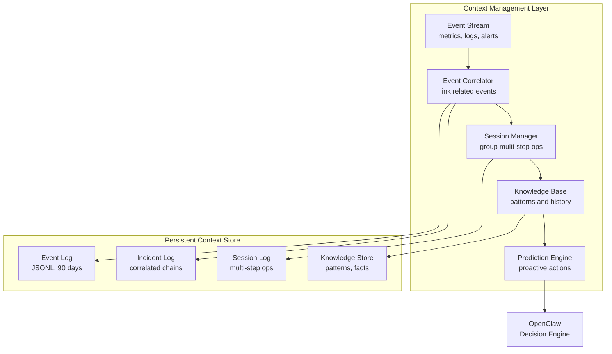
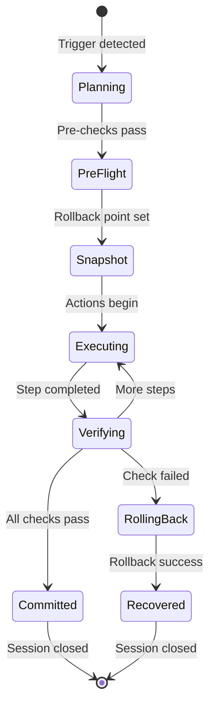

---
sidebar:
  order: 16
title: OpenClaw Context Management
---

import ContextTimeline from '../../components/ContextTimeline.jsx';

# OpenClaw Context Management

Without context management, every monitoring cycle is a blank slate — OpenClaw sees a high memory alert and knows nothing about the last 30 minutes of creeping memory growth. This chapter designs the **context layer** that gives OpenClaw memory, continuity, and the ability to learn from past operations.

## The Problem: Stateless AI Operations

Traditional monitoring treats each alert independently:

```
10:00  Memory: 72%  → No action
10:15  Memory: 81%  → No action
10:22  GC pause 800ms → No action (different metric)
10:30  Memory: 91%  → ALERT! Restart service.
```

With context management, OpenClaw connects the dots:

```
10:00  Memory: 72%  → Logged to trend baseline
10:15  Memory: 81%  → Trend: +9% in 15min → Open INC-001
10:22  GC pause 800ms → Correlated to INC-001 → Memory leak hypothesis
10:30  Memory: 91%  → INC-001 escalated → Restart with confidence (root cause known)
10:32  Knowledge saved: "app-worker leaks after 48h uptime"
```

**The difference**: context-aware OpenClaw acts with understanding, not just thresholds.

## Interactive Demo: Context in Action

<ContextTimeline lang="en" client:only="react" />

## Context Architecture



## Context Store Configuration

```nix title="openclaw-context.nix"
{ config, pkgs, ... }:

{
  services.openclaw.settings.context = {
    enable = true;

    # Persistent context storage
    store = {
      path = "/var/lib/openclaw/context";
      # How long to retain different context types
      retention = {
        events = "7d";       # Raw events: 7 days
        incidents = "90d";   # Correlated incidents: 90 days
        sessions = "90d";    # Operation sessions: 90 days
        knowledge = "365d";  # Learned patterns: 1 year
      };
      # Maximum store size (auto-prune oldest when exceeded)
      maxSizeMB = 500;
    };

    # Event correlation engine
    correlation = {
      enable = true;

      # Time window for correlating related events
      correlationWindow = "30m";

      # Correlation rules
      rules = [
        {
          name = "memory-pressure";
          description = "Correlate memory metrics with GC events and OOM signals";
          triggers = [ "memory_usage_high" "gc_pause_long" "oom_kill" ];
          correlateBy = "service";  # Group by affected service
        }
        {
          name = "service-degradation";
          description = "Link error rate spikes with latency increases";
          triggers = [ "error_rate_high" "latency_p99_high" "connection_refused" ];
          correlateBy = "service";
        }
        {
          name = "disk-cascade";
          description = "Connect disk pressure to service failures";
          triggers = [ "disk_usage_high" "write_error" "service_failed" ];
          correlateBy = "mountpoint";
        }
        {
          name = "security-incident";
          description = "Group related security events";
          triggers = [ "ssh_brute_force" "sudo_failure" "port_scan" "unusual_process" ];
          correlateBy = "source_ip";
        }
      ];
    };

    # Session management for multi-step operations
    sessions = {
      enable = true;

      # Auto-create sessions for multi-step operations
      autoSessionTriggers = [
        "nixos-rebuild"        # System upgrades
        "database-migration"   # DB schema changes
        "security-update"      # CVE patches
        "disaster-recovery"    # DR operations
      ];

      # Session timeout — auto-close stale sessions
      sessionTimeout = "2h";

      # Track rollback boundaries per session
      trackRollbackPoints = true;
    };

    # Knowledge base — learn from past operations
    knowledge = {
      enable = true;

      # Minimum occurrences before a pattern is considered "known"
      patternThreshold = 2;

      # Categories of knowledge to track
      categories = [
        "service-behavior"     # How services behave under stress
        "failure-patterns"     # Recurring failure modes
        "resolution-playbooks" # What fixes work for what problems
        "timing-patterns"      # Time-of-day, day-of-week correlations
        "capacity-trends"      # Resource growth over time
      ];

      # Feed knowledge back into decision making
      influenceDecisions = true;

      # Confidence decay — old patterns lose weight over time
      confidenceDecayDays = 90;
    };

    # Prediction engine — proactive actions
    prediction = {
      enable = true;

      # Predict issues based on patterns and trends
      predictors = [
        {
          name = "memory-leak-cycle";
          description = "Predict memory leaks based on uptime patterns";
          metric = "process_uptime";
          pattern = "cyclic_degradation";
          action = "schedule-graceful-restart";
          tier = 1;
        }
        {
          name = "disk-growth";
          description = "Predict disk full based on growth rate";
          metric = "disk_usage_percent";
          pattern = "linear_growth";
          action = "preemptive-cleanup";
          tier = 1;
          leadTime = "6h";
        }
        {
          name = "certificate-renewal";
          description = "Schedule certificate renewal before expiry";
          metric = "cert_days_remaining";
          pattern = "countdown";
          action = "trigger-acme-renewal";
          tier = 2;
          leadTime = "14d";
        }
      ];
    };
  };

  # Persist context store across reboots (required with Impermanence)
  environment.persistence."/persist".directories = [
    {
      directory = "/var/lib/openclaw/context";
      user = "openclaw";
      group = "openclaw";
      mode = "0750";
    }
  ];
}
```

## Event Correlation

The correlation engine links events that share a causal relationship, turning noisy alerts into coherent incidents.

### Correlation Data Model

```json
{
  "incident_id": "INC-001",
  "status": "resolved",
  "opened": "2024-03-14T10:15:00Z",
  "resolved": "2024-03-14T10:32:00Z",
  "duration_minutes": 17,
  "correlation_rule": "memory-pressure",
  "service": "app-worker",
  "events": [
    {
      "time": "2024-03-14T10:00:00Z",
      "type": "metric",
      "detail": "memory_usage: 72% (baseline logged)"
    },
    {
      "time": "2024-03-14T10:15:00Z",
      "type": "metric",
      "detail": "memory_usage: 81% (trend: +9% in 15m)"
    },
    {
      "time": "2024-03-14T10:22:00Z",
      "type": "log",
      "detail": "GC pause 800ms (correlated: memory pressure)"
    },
    {
      "time": "2024-03-14T10:30:00Z",
      "type": "metric",
      "detail": "memory_usage: 91% (threshold breach)"
    },
    {
      "time": "2024-03-14T10:31:00Z",
      "type": "action",
      "detail": "Tier 1: restart app-worker (snapshot #42)"
    }
  ],
  "resolution": {
    "action": "service-restart",
    "effective": true,
    "memory_after": "45%"
  },
  "knowledge_extracted": {
    "pattern": "memory-leak-on-uptime",
    "detail": "app-worker leaks memory after 48h uptime",
    "confidence": "medium",
    "recommended_action": "proactive restart at 47h"
  }
}
```

### How Correlation Improves Decisions

| Without Context | With Context |
|---|---|
| Alert: memory 91% — restart | Incident: 30min trend, GC evidence — restart with root cause |
| Alert: disk 87% — clean logs | Trend: 2%/day growth — clean logs + propose config fix |
| Alert: nginx failed — restart | Correlated: failed after rebuild — rollback, not restart |
| Alert: SSH failures — ban IP | Pattern: same subnet daily — propose permanent block rule |

## Operation Sessions

Sessions group related actions into atomic operations with shared rollback boundaries.

### Session Lifecycle



### Session Data Model

```json
{
  "session_id": "SES-042",
  "type": "database-migration",
  "status": "committed",
  "opened": "2024-03-14T14:00:00Z",
  "closed": "2024-03-14T14:12:00Z",
  "goal": "Upgrade PostgreSQL 15 to 16",
  "rollback_boundary": {
    "snapshots": {
      "root": 42,
      "db": 15
    },
    "logical_backup": "/var/backups/pg_dumpall_20240314.sql.zst"
  },
  "steps": [
    { "name": "pre-flight", "status": "passed", "duration_s": 8 },
    { "name": "snapshot", "status": "created", "duration_s": 1 },
    { "name": "logical-backup", "status": "completed", "duration_s": 154, "size_mb": 1200 },
    { "name": "nixos-rebuild", "status": "completed", "duration_s": 45, "totp": true },
    { "name": "health-check", "status": "passed", "checks": 5, "duration_s": 12 }
  ],
  "context_from_history": [
    "SES-031: PG 14→15 had shared_buffers issue — added extra validation",
    "INC-019: PG connection timeout — added connection pool check"
  ],
  "knowledge_produced": {
    "pattern": "pg-major-upgrade",
    "detail": "PG 15→16 safe with current config, 12min total",
    "confidence": "high"
  }
}
```

## Knowledge Base

The knowledge base stores patterns learned from past incidents and operations.

### Knowledge Categories

```nix title="Knowledge structure"
# The knowledge base organizes learned patterns into categories:

knowledge = {
  service-behavior = [
    {
      service = "app-worker";
      pattern = "memory-leak-on-uptime";
      detail = "Leaks ~200MB/hour after 48h uptime";
      confidence = "high";  # Confirmed 3 times
      action = "proactive restart at 47h";
      learned = "2024-03-14";
      lastConfirmed = "2024-03-20";
    }
  ];

  failure-patterns = [
    {
      pattern = "post-rebuild-nginx-failure";
      detail = "Nginx fails if config syntax changes between nixpkgs versions";
      rootCause = "Upstream config format change";
      resolution = "Check nginx -t before rebuild commit";
      confidence = "medium";
    }
  ];

  resolution-playbooks = [
    {
      trigger = "postgresql-connection-refused";
      steps = [
        "Check pg_hba.conf (snapper diff last change)"
        "Check max_connections (SHOW max_connections)"
        "Check disk space on @db"
        "Restart if config unchanged"
      ];
      successRate = "87%";
      averageResolutionTime = "3m";
    }
  ];

  timing-patterns = [
    {
      pattern = "monday-morning-load-spike";
      detail = "CPU spikes to 85% between 09:00-09:30 on Mondays";
      cause = "Batch job + user logins";
      action = "Ignore — normal pattern, do not restart services";
      confidence = "high";
    }
  ];

  capacity-trends = [
    {
      resource = "disk-/var/lib/db";
      growthRate = "1.2 GB/week";
      currentUsage = "45%";
      projectedFull = "2024-06-15";
      recommendation = "Plan disk expansion or archival by May";
    }
  ];
};
```

### Knowledge-Informed Decisions

When OpenClaw evaluates a new event, it queries the knowledge base:

```
Input:  Memory at 78%, app-worker uptime: 46h
Query:  knowledge.where(service="app-worker", metric="memory")

Match:  "app-worker leaks ~200MB/h after 48h" (confidence: high)

Decision: Don't wait for 90% threshold.
          Schedule proactive restart in 2h (low-traffic window).
          This is a KNOWN pattern — act preemptively.
```

Compare without knowledge:

```
Input:  Memory at 78%, app-worker uptime: 46h

Decision: Memory below 90% threshold. No action.
          → In 4 hours: emergency restart at 95%, users impacted.
```

## Context-Aware LLM Prompting

The context layer enriches the LLM prompt with relevant history:

```nix title="openclaw-llm-context.nix"
{ config, ... }:

{
  services.openclaw.settings.llm.contextInjection = {
    enable = true;

    # What context to include in LLM prompts
    include = {
      # Recent events (last N events for the affected service)
      recentEvents = 20;

      # Active incidents
      activeIncidents = true;

      # Current session state (if in a session)
      currentSession = true;

      # Relevant knowledge base entries
      relevantKnowledge = 5;

      # Recent actions and their outcomes
      recentActions = 10;

      # System state summary
      systemSummary = true;
    };

    # Token budget for context (to avoid exceeding LLM limits)
    maxContextTokens = 4000;

    # Priority order when truncating
    priority = [
      "currentSession"       # Most important: current operation state
      "activeIncidents"      # Second: what's happening right now
      "relevantKnowledge"    # Third: what we know
      "recentActions"        # Fourth: what we did recently
      "recentEvents"         # Fifth: raw event stream
      "systemSummary"        # Sixth: general state
    ];
  };
}
```

### Example: Enriched LLM Prompt

```
=== SYSTEM CONTEXT ===

Current State:
  CPU: 34%  Memory: 78%  Disk: 62%  Load: 1.2
  Services: 23 active, 0 failed
  Last rebuild: 6h ago (successful)

Active Incident:
  INC-047: memory-pressure on app-worker
  Events: memory 72% → 78% in 20min, trending up
  Correlation: app-worker uptime = 46h

Knowledge Match:
  PATTERN: app-worker leaks memory after 48h (confidence: HIGH)
  Last occurrence: 3 days ago (INC-001), resolved by restart
  Proactive action: restart before 48h in low-traffic window

Recent Actions:
  6h ago: nixos-rebuild (successful, SES-041)
  3d ago: app-worker restart for memory leak (successful)

Current Session: None

=== ALERT ===
Memory usage trending up: 78% (threshold: 90%)
Service: app-worker (PID 4521, uptime: 46h)

Please analyze and propose actions.
```

## Verification

After enabling context management:

```bash
# Check context store
ls -la /var/lib/openclaw/context/
# Should show: events/ incidents/ sessions/ knowledge/

# View active incidents
sudo openclaw context incidents --active
# INC-047  memory-pressure  app-worker  OPEN  20min

# View knowledge base
sudo openclaw context knowledge --list
# 12 patterns, 5 playbooks, 3 timing patterns, 2 capacity trends

# View current session (if any)
sudo openclaw context session --current
# No active session

# Check correlation stats
sudo openclaw context stats
# Events processed: 14,521
# Incidents created: 47
# Patterns learned: 12
# Predictions made: 8 (7 accurate)
# Average incident duration: 8.3 min (vs 23.1 min without context)

# View a specific incident chain
sudo openclaw context incident INC-047 --timeline
```

## Context Management Metrics

| Metric | What It Measures | Target |
|---|---|---|
| Correlation accuracy | Events correctly grouped | &gt;85% |
| False correlation rate | Unrelated events grouped | &lt;5% |
| Mean time to correlate | Event to incident link | &lt;2 min |
| Knowledge base size | Active patterns | 10-50 |
| Prediction accuracy | Proactive actions that prevented incidents | &gt;70% |
| Context-informed decisions | Decisions using history vs. threshold-only | &gt;60% |
| Session success rate | Multi-step operations completed | &gt;95% |

:::tip Context Is the Difference Between Alert Fatigue and Intelligence
Without context, OpenClaw is a sophisticated threshold alerter. With context, it becomes an operator who remembers, learns, and anticipates. Start with event correlation — even basic linking reduces alert noise by 40-60%.
:::

:::warning Context Store Security
The context store contains operational patterns and system behavior. Treat it as sensitive data:
- Restrict access to the `openclaw` user
- Include it in your backup strategy
- Purge knowledge entries that contain sensitive details (passwords in error logs, etc.)
:::
