---
sidebar:
  order: 2
title: Architecture Overview
---

# Architecture Overview

This page describes the full system architecture, component interactions, data flows, and failure handling strategies.

:::info AI-First Design
This architecture is specifically designed for **AI-operated infrastructure**. Every design decision considers: AI can make mistakes, AI can hallucinate, AI can misunderstand system state. The architecture must be safe even when the AI is wrong.
:::

## Why AI Safety Matters

Large Language Models (LLMs) like those powering OpenClaw can:

- **Hallucinate problems** — detect issues that don't exist
- **Propose wrong fixes** — suggest commands that would break the system
- **Misread state** — believe the system is in a different state than reality
- **Chain errors** — make a second mistake trying to fix the first

This architecture assumes AI **will** make mistakes. The safety layers exist specifically because AI is involved, not despite it.

## System Layers

The architecture is built in layers, each providing guarantees to the layer above:

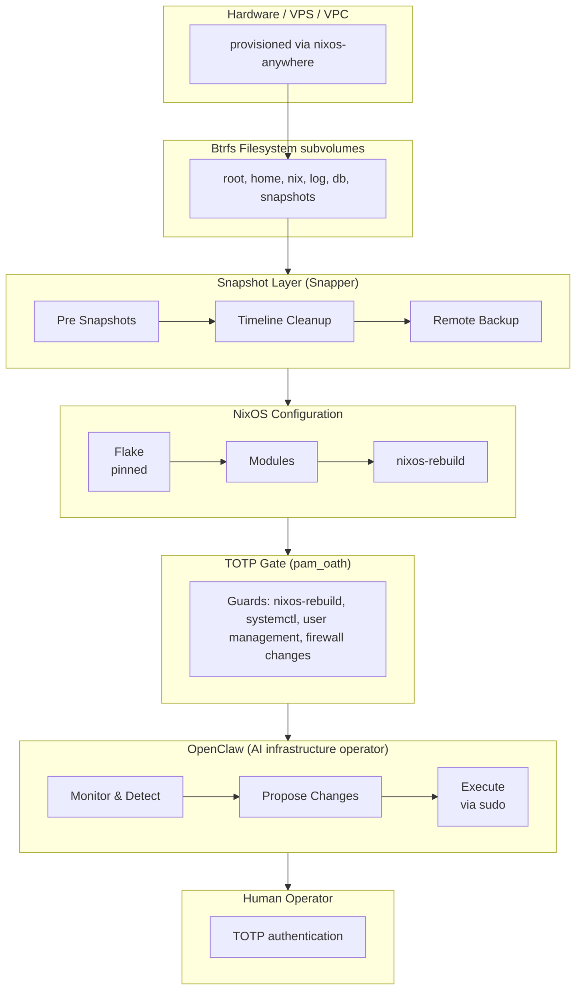

## Design Principles

### 1. Rollback-First

Every state-changing operation is preceded by a Btrfs snapshot. **This is the atomicity guarantee** — if anything goes wrong, you can always return to the exact previous state.

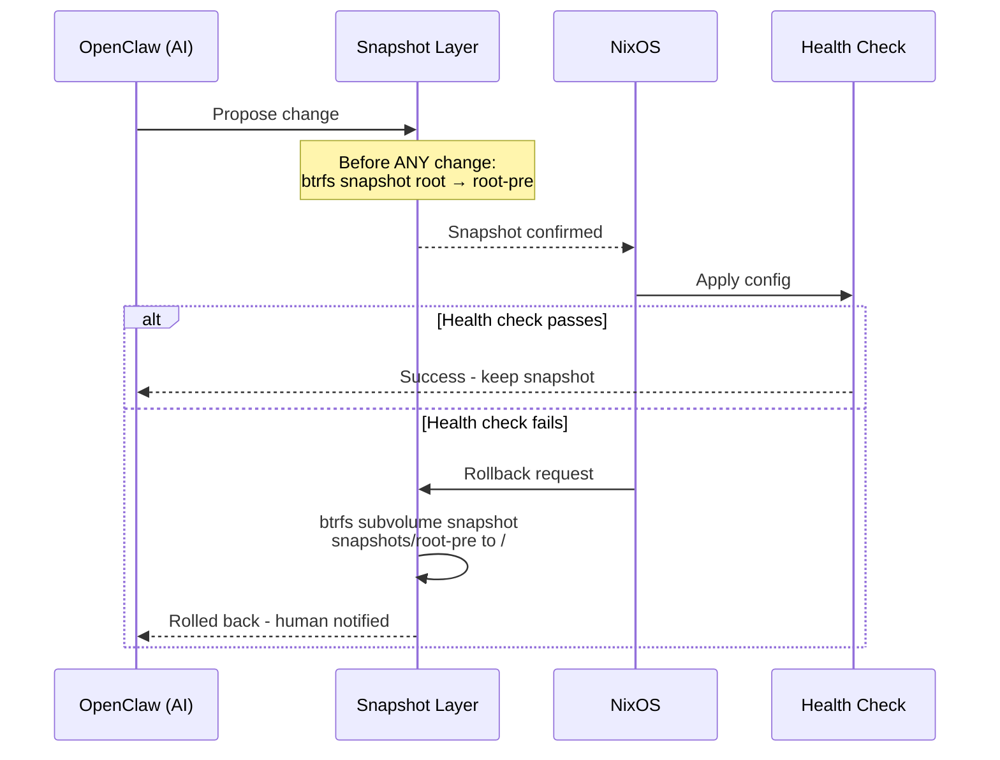

**Atomic Rollback Guarantees:**

| Guarantee | How It's Enforced |
|---|---|
| **Pre-change snapshot** | Snapper automatically snapshots before every `nixos-rebuild` |
| **Immutable snapshot** | Btrfs snapshots are read-only by default |
| **Single-command rollback** | `sudo btrfs subvolume snapshot /snapshots/@root/pre-rebuild /` |
| **Verified state** | Health checks confirm system is operational before "committing" |
| **Multiple rollback layers** | Btrfs snapshot → NixOS generation → Remote backup |

:::danger The AI Cannot Bypass Rollback
Even if OpenClaw tries to execute a change, the snapshot is taken **before** any change is applied. The AI cannot skip this safety layer — it's enforced at the system level by Snapper hooks.
:::

### 2. Reproducibility

The entire system is defined in Nix flakes. Two identical flake inputs produce identical systems:

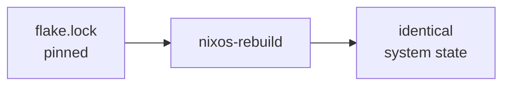

### 3. Defense-in-Depth

Multiple safety layers protect against bad changes:

| Layer | Protection |
|---|---|
| TOTP gate | Prevents unauthorized `nixos-rebuild` |
| Pre-rebuild snapshots | Instant rollback after bad apply |
| NixOS generations | Boot into previous generation from GRUB |
| Btrfs send/receive | Off-site backup of known-good state |
| OpenClaw policy engine | AI can only act within defined boundaries |

### 4. Least Privilege

OpenClaw runs as a dedicated system user. It cannot directly execute privileged commands — it must go through the TOTP-gated sudo path for anything destructive.

### 5. AI Hallucination Mitigation

This architecture assumes AI **will** make errors. Multiple layers protect against AI hallucinations:

| AI Risk | Mitigation in This Architecture |
|---|---|
| **Hallucinates a problem** | Policy engine only acts on verified metrics, not AI interpretation |
| **Proposes wrong fix** | TOTP gate requires human approval for all system changes |
| **Misreads system state** | Health checks verify actual state after any change |
| **Applies change at wrong time** | Cooldown periods between actions prevent rapid-fire errors |
| **Cascading failures** | Pre-change snapshot enables instant rollback to known good state |

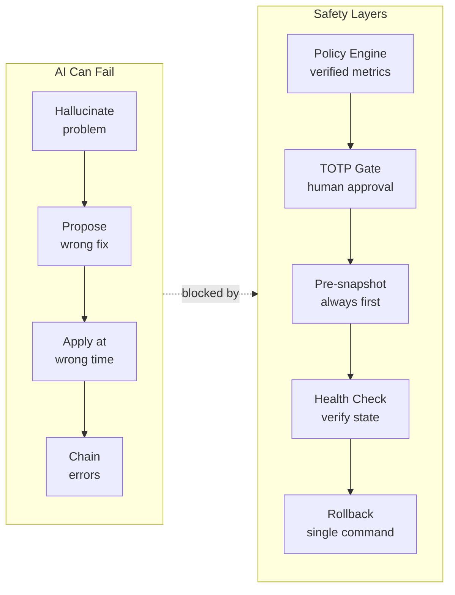

**Key insight**: The AI proposes, but the **architecture decides**. Human approval and automated snapshots are not optional — they are enforced by the system, not by the AI.

## Component Interactions

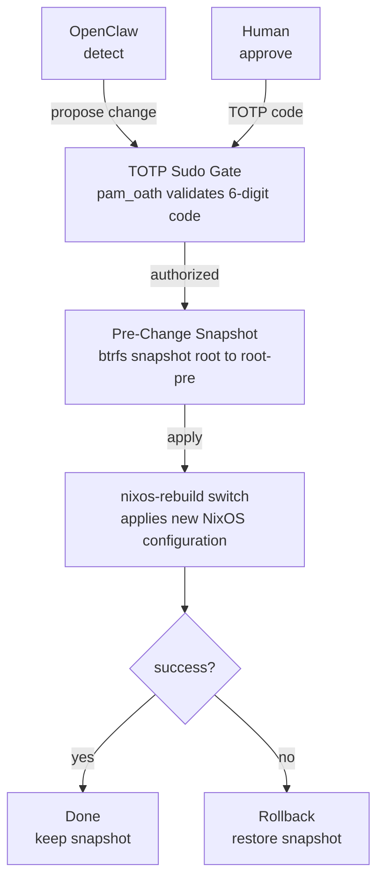

## OpenClaw: The AI Infrastructure Operator

### What is OpenClaw?

OpenClaw is an AI-powered agent that acts as your **digital on-call SRE**. It doesn't replace human operators — it augments them by handling routine monitoring, analysis, and can execute low-risk operations autonomously while escalating high-risk changes to humans.

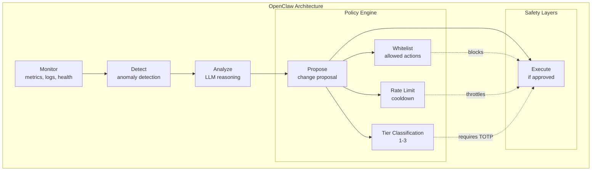

### Core Responsibilities

| Responsibility | Description |
|---|---|
| **Monitoring** | Continuously collect system metrics (CPU, memory, disk, services) |
| **Detection** | Identify anomalies, degraded services, security issues |
| **Analysis** | Use LLM to analyze root cause and propose solutions |
| **Execution** | Execute approved changes with full audit trail |

### Why OpenClaw? (Not Just Another Automation Tool)

Unlike traditional automation (Ansible, Terraform), OpenClaw:

| Traditional Automation | OpenClaw (AI Operator) |
|---|---|
| Declarative desired state | Learns and adapts to system behavior |
| Fixed playbooks | Generates novel solutions for novel problems |
| No context understanding | Uses LLM to understand context |
| Human writes all logic | AI suggests, human approves |
| Static | Improves from feedback |

### The Three-Tier Operation Model

OpenClaw classifies every action into one of three tiers:

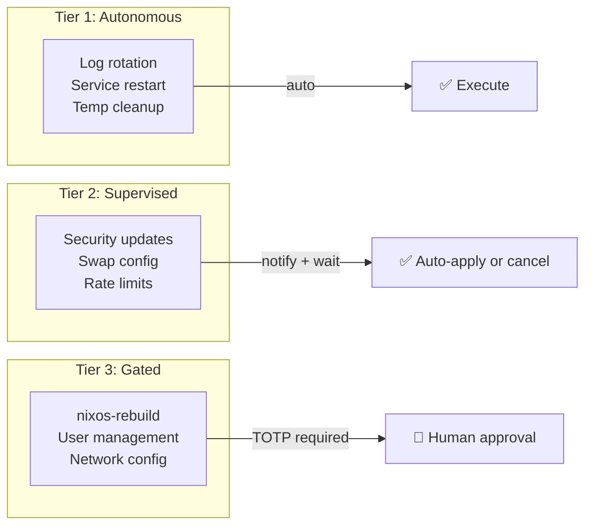

**Tier 1 — Autonomous (No Approval)**
- Low-risk, reversible operations
- Auto-executed immediately
- Examples: log rotation, service restart after failure, temp file cleanup

**Tier 2 — Supervised (Notification + Auto-Apply)**
- Medium-risk operations
- Notifies human, auto-applies after window (default: 30 min)
- Examples: security patches, swap configuration

**Tier 3 — Gated (TOTP Required)**
- High-risk operations
- Requires explicit human approval via TOTP
- Examples: `nixos-rebuild switch`, user management, firewall changes

### OpenClaw Policy Engine

The policy engine is the **safety boundary** that prevents OpenClaw from overreaching. It's defined in Nix:

```nix
services.openclaw.settings.policy = {
  # Tier 1: What AI can do autonomously
  autonomous = {
    allowedActions = [
      "restart-failed-service"
      "rotate-logs"
      "clean-temp-files"
    ];
    constraints = {
      maxActionsPerHour = 5;
      maxRestartsPerServicePerHour = 3;
    };
  };
  
  # Tier 2: What AI proposes but waits for
  supervised = {
    allowedActions = [
      "security-package-update"
      "add-swap"
    ];
    defaultWindow = "30m";
  };
  
  # Tier 3: What AI cannot do without human
  gated = {
    actions = [
      "nixos-rebuild-switch"
      "user-management"
    ];
    requireTOTP = true;
  };
  
  # Global safety limits
  safety = {
    emergencyStopFile = "/var/lib/openclaw/STOP";
    maxChangesPerDay = 20;
    requirePreSnapshot = true;
    autoRollbackOnFailure = true;
  };
};
```

### OpenClaw in the Architecture

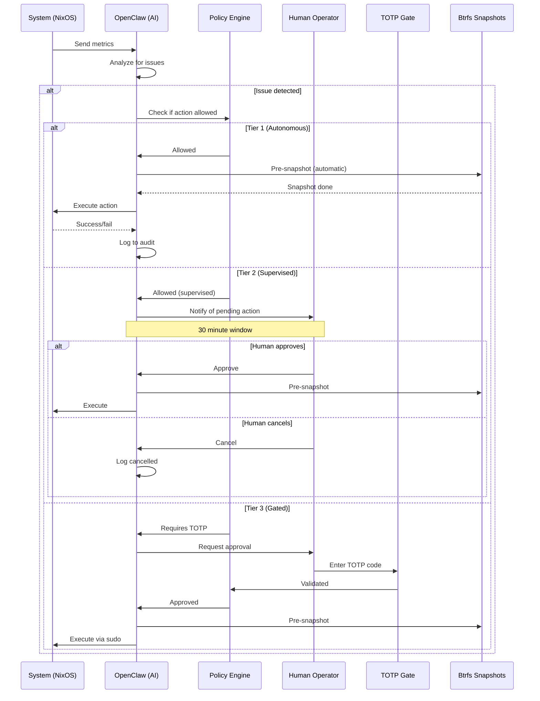

### AI Hallucination Protection

OpenClaw's design explicitly addresses AI hallucinations:

| Hallucination Type | Protection |
|---|---|
| **Hallucinated problem** | Only acts on verified metrics, not LLM interpretation |
| **Wrong fix proposed** | Policy whitelist prevents unauthorized actions |
| **Wrong target** | Human reviews diff before TOTP approval |
| **Feedback loop** | Rate limiting + cooldown periods |
| **Confidence too high** | Always logs uncertainty, requires human for Tier 3 |

:::danger OpenClaw Is Not Root
OpenClaw runs as a dedicated user (`openclaw`), not root. Even if the LLM suggests a root-level command, OpenClaw cannot execute it without going through the TOTP-gated sudo path. **Never give OpenClaw root access** — it would bypass every safety layer.
:::

### Rollback Skills for OpenClaw

OpenClaw doesn't guess how to recover — it has **structured rollback skills** defined as Nix modules. These skills are atomic, tested, and guaranteed to work.

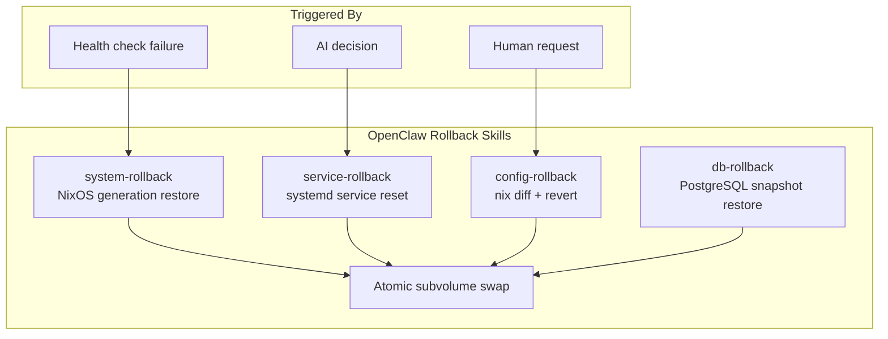

#### Skill 1: System Rollback (NixOS Generation)

Restores system to a previous NixOS generation:

```nix
# Implemented as a Nix module
systemRollback = {
  description = "Rollback to previous NixOS generation";
  
  # Only executes pre-verified commands
  command = ''
    # Get previous generation
    PREV_GEN=$(nix-env --list-generations | grep -B1 current | head -1 | awk '{print $1}')
    
    # Activate previous generation
    sudo /nix/var/nix/profiles/system/bin/switch-to-configuration switch --specialisations "$PREV_GEN"
  '';
  
  # Prerequisites
  requiresSnapshot = true;
  verifyBefore = ["health-check", "ssh-accessible"];
  verifyAfter = ["health-check", "disk-space"];
};
```

**When used:**
- `nixos-rebuild` fails health check after apply
- System becomes unreachable after reboot
- OpenClaw detects boot failure

#### Skill 2: Service Rollback (systemd)

Restarts a service to known-good state:

```nix
serviceRollback = {
  description = "Rollback a systemd service";
  
  command = ''
    SERVICE=$1  # Passed by OpenClaw
    
    # Stop the service
    sudo systemctl stop "$SERVICE"
    
    # Restore config from last known good
    sudo cp /var/lib/openclaw/service-backups/"$SERVICE"/* /etc/systemd/system/
    
    # Reload and restart
    sudo systemctl daemon-reload
    sudo systemctl restart "$SERVICE"
    
    # Verify
    sudo systemctl status "$SERVICE"
  '';
  
  # Only for allowed services (policy whitelist)
  allowedServices = ["nginx", "postgresql", "docker"];
  maxRollbacksPerHour = 3;
};
```

**When used:**
- Service in crash loop
- Service responding with errors
- Configuration drift detected

#### Skill 3: Config Rollback (Nix Diff Revert)

Reverts specific Nix configuration changes:

```nix
configRollback = {
  description = "Revert specific Nix config changes";
  
  command = ''
    # Get the diff between current and previous
    nix diff /etc/nixos/configuration.nix > /tmp/config-diff
    
    # Show what changed
    cat /tmp/config-diff
    
    # Revert to previous commit in git
    cd /etc/nixos
    sudo git revert HEAD --no-commit
    
    # Rebuild
    sudo nixos-rebuild switch
  '';
  
  requiresSnapshot = true;
  alwaysGated = true;  # Always requires TOTP
};
```

**When used:**
- Partial configuration change caused issues
- Want to keep most changes, revert only one
- Human identifies specific problematic change

#### Skill 4: Database Rollback (Btrfs Snapshot)

Restores database subvolume from Btrfs snapshot:

```nix
dbRollback = {
  description = "Restore database from Btrfs snapshot";
  
  command = ''
    DB_PATH=$1  # e.g., /var/lib/postgresql
    SNAPSHOT=$2  # e.g., pre-change-20240115
    
    # Stop database
    sudo systemctl stop postgresql
    
    # Create backup of current state (in case rollback fails)
    sudo btrfs subvolume snapshot "$DB_PATH" "$DB_PATH-broken-$(date +%s)"
    
    # Restore from snapshot
    sudo btrfs subvolume snapshot "$SNAPSHOT" "$DB_PATH"
    
    # Fix permissions
    sudo chown -R postgres:postgres "$DB_PATH"
    
    # Start database
    sudo systemctl start postgresql
    
    # Verify
    sudo -u postgres pg_isready
  '';
  
  requiresSnapshot = true;
  requiresTOTP = true;
  createsSnapshot = true;  # Creates backup before rollback
};
```

**When used:**
- Database corruption after schema migration
- Data integrity check failed
- Accidental data deletion

#### Rollback Skill Configuration

All rollback skills are configured in the policy:

```nix
services.openclaw.settings.policy.rollback = {
  # Enable rollback skills
  enableSystemRollback = true;
  enableServiceRollback = true;
  enableConfigRollback = true;
  enableDbRollback = true;
  
  # Constraints
  maxRollbacksPerHour = 5;
  maxRollbacksPerDay = 20;
  requireSnapshotBeforeRollback = true;
  
  # Auto-rollback triggers (AI can trigger without human approval)
  autoRollbackOnHealthCheckFail = true;
  autoRollbackOnServiceCrash = false;  # Always requires approval
  
  # Cooldown between rollbacks
  rollbackCooldownMinutes = 5;
  
  # Rollback chain limit (prevent rollback loops)
  maxConsecutiveRollbacks = 2;
  
  # Always notify human after rollback
  notifyAfterRollback = true;
};
```

#### Why Rollback as Skills Matters

| Problem with Ad-Hoc Rollback | How Skills Solve It |
|---|---|
| AI doesn't know correct commands | Pre-defined, tested commands |
| Rollback breaks more things | Creates snapshot before rollback |
| No verification | Health checks before/after |
| Rollback loops | Cooldown + chain limit |
| Root cause not diagnosed | Logs full rollback context |

:::info Rollback Is Not Failure
A rollback is **not** a failure — it's a safety mechanism working as intended. If OpenClaw triggers a rollback, it means the safety architecture is functioning correctly. Review the audit log to understand what went wrong and adjust the policy or health checks accordingly.
:::

## Data Flow: Configuration Change

A typical configuration change flows through the system like this:

1. **Trigger** — OpenClaw detects an issue or operator initiates a change
2. **Propose** — A Nix configuration diff is generated
3. **Authenticate** — TOTP code is required for critical operations
4. **Snapshot** — Btrfs snapshots all relevant subvolumes
5. **Apply** — `nixos-rebuild switch` applies the new configuration
6. **Verify** — Health checks confirm the system is functional
7. **Commit or Rollback** — On success, the snapshot is retained as a restore point. On failure, the snapshot is restored.

## Failure Modes

### AI-Specific Failures (Why We Need These Safeguards)

| AI Failure | Detection | Recovery |
|---|---|---|
| AI hallucinates a problem doesn't exist | Human reviews proposal at TOTP gate | Change never applied |
| AI proposes harmful command | Policy engine blocks non-allowed actions | Alert sent to operator |
| AI proposes correct fix but wrong target | Human reviews diff before approval | Change requires TOTP |
| AI applies change incorrectly | Health check fails after switch | Rollback to pre-change snapshot |
| AI in feedback loop (keeps trying same fix) | Rate limiting in policy engine | Cooldown enforced |

### System Failures

| Failure | Detection | Recovery |
|---|---|---|
| Bad NixOS config (won't build) | `nixos-rebuild` fails at build stage | No system change occurred — fix config and retry |
| Bad NixOS config (builds but breaks services) | Health check fails after switch | Rollback to pre-change Btrfs snapshot |
| Bad NixOS config (breaks boot) | System doesn't come up after reboot | Select previous NixOS generation in GRUB |
| Database corruption after change | Application health check / data validation | Restore `@db` subvolume from snapshot |
| OpenClaw proposes bad change | Human reviews and rejects at TOTP gate | Change never applied |
| OpenClaw acts outside policy | Policy engine blocks the action | Action logged and alert sent |
| Disk failure | Btrfs device stats / SMART monitoring | Restore from remote backup (btrfs receive) |

## Subvolume Map

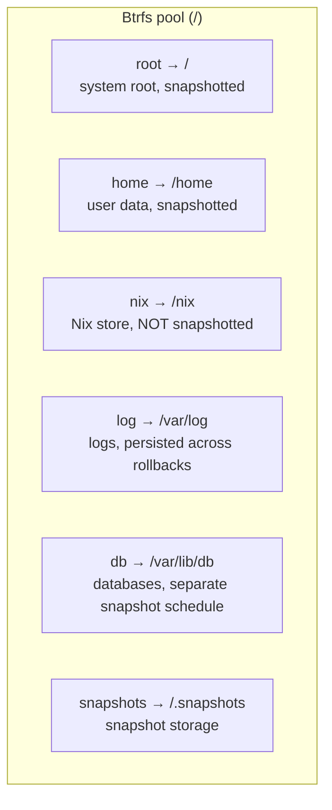

:::note Why /nix Is Not Snapshotted
The Nix store (`/nix`) is content-addressed. Every path is identified by its hash. Snapshotting it would waste space — you can always rebuild any Nix store path from the flake. Instead, snapshot the configuration that *references* the store paths.
:::

## Security Model

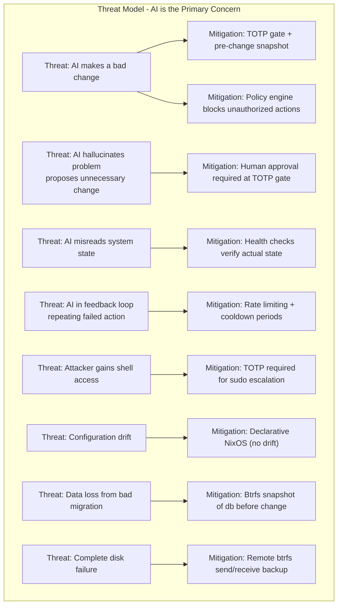

### Authentication Flow

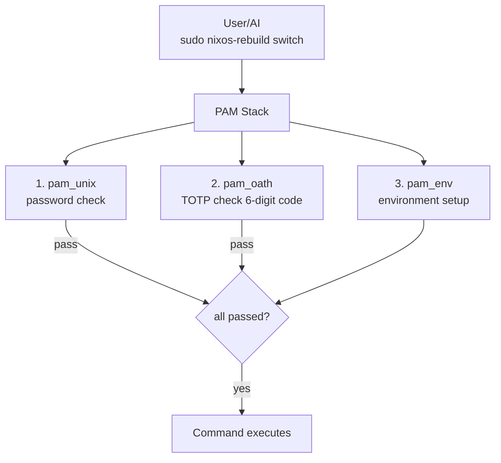

## What's Next

With the architecture understood, let's start building. The next chapter walks through [bootstrapping NixOS on a remote server](./bootstrap-nixos-anywhere) using `nixos-anywhere`.
