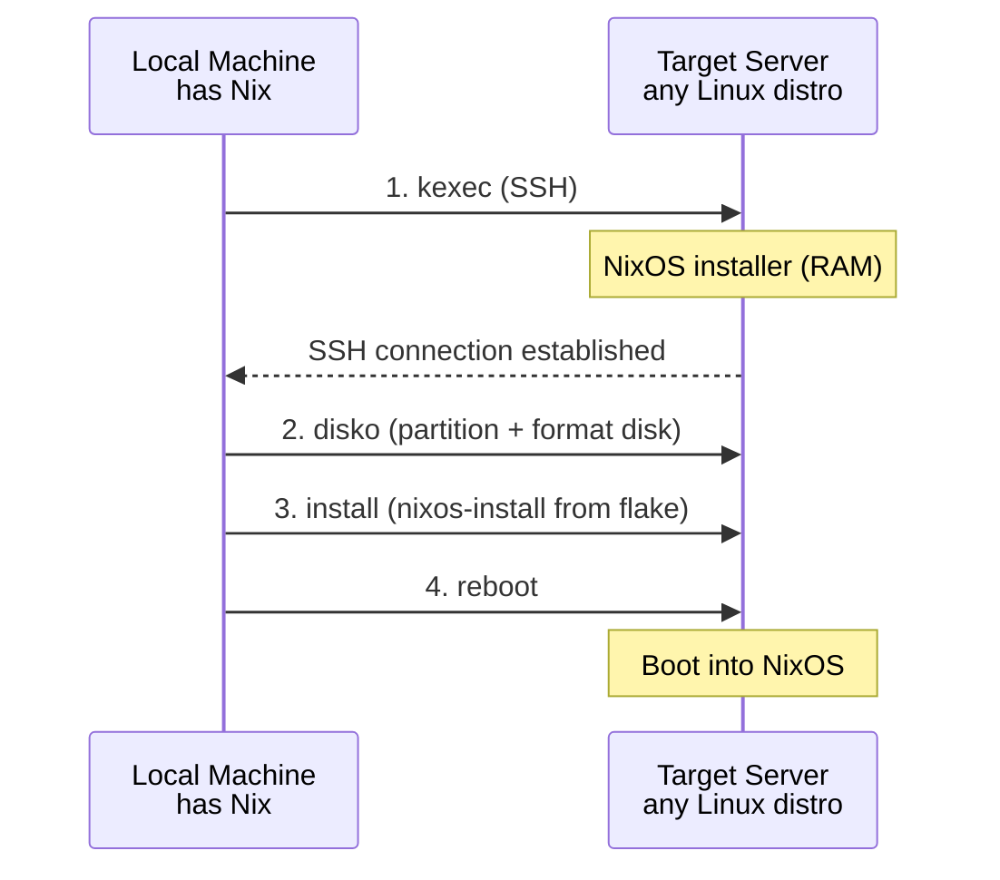

---
sidebar:
  order: 3
title: 使用 nixos-anywhere 引导安装
---

# 使用 nixos-anywhere 引导安装

`nixos-anywhere` 可以在任何拥有 root SSH 访问权限的 Linux 服务器上安装 NixOS，无需 ISO 镜像、控制台访问或特定于云厂商的工具。它的工作原理是通过 kexec 将服务器引导进内存中的 NixOS 安装器，完成磁盘分区后安装你声明式定义的系统配置。

## 工作原理



## 前置条件

本地机器需要：

```bash
# Install Nix if you don't have it
curl --proto '=https' --tlsv1.2 -sSf -L https://install.determinate.systems/nix | sh

# Verify nix is available
nix --version
```

目标服务器需要：
- 已配置公钥的 root SSH 访问权限
- 至少 2 GB 内存（kexec 安装器运行在内存中）
- 至少 20 GB 磁盘空间

:::warning 破坏性操作
`nixos-anywhere` 会**擦除目标磁盘上的所有数据**。请确保已做好备份，并仔细核对目标服务器的 IP 地址。
:::

## 项目结构

为 NixOS 配置创建本地目录：

```bash
mkdir -p nixos-config && cd nixos-config
```

## Flake 配置

创建 `flake.nix`，这是整个系统配置的入口：

```nix title="flake.nix"
{
  description = "Self-healing NixOS server";

  inputs = {
    nixpkgs.url = "github:NixOS/nixpkgs/nixos-24.11";
    disko = {
      url = "github:nix-community/disko";
      inputs.nixpkgs.follows = "nixpkgs";
    };
  };

  outputs = { self, nixpkgs, disko, ... }: {
    nixosConfigurations.server = nixpkgs.lib.nixosSystem {
      system = "x86_64-linux";
      modules = [
        disko.nixosModules.disko
        ./disk-config.nix
        ./configuration.nix
      ];
    };
  };
}
```

## Disko 磁盘配置

这里定义了 `nixos-anywhere` 将要应用的磁盘布局。我们使用 GPT 分区表，包含一个 EFI 系统分区和一个带子卷的 Btrfs 分区：

```nix title="disk-config.nix"
{ lib, ... }:
{
  disko.devices = {
    disk = {
      main = {
        type = "disk";
        # Change this to match your target server's disk
        # Common: /dev/sda, /dev/vda, /dev/nvme0n1
        device = "/dev/sda";
        content = {
          type = "gpt";
          partitions = {
            ESP = {
              size = "512M";
              type = "EF00";
              content = {
                type = "filesystem";
                format = "vfat";
                mountpoint = "/boot";
                mountOptions = [ "umask=0077" ];
              };
            };
            root = {
              size = "100%";
              content = {
                type = "btrfs";
                extraArgs = [ "-f" ]; # force overwrite
                subvolumes = {
                  "@root" = {
                    mountpoint = "/";
                    mountOptions = [
                      "compress=zstd:1"
                      "noatime"
                      "space_cache=v2"
                    ];
                  };
                  "@home" = {
                    mountpoint = "/home";
                    mountOptions = [
                      "compress=zstd:1"
                      "noatime"
                      "space_cache=v2"
                    ];
                  };
                  "@nix" = {
                    mountpoint = "/nix";
                    mountOptions = [
                      "compress=zstd:1"
                      "noatime"
                      "space_cache=v2"
                    ];
                  };
                  "@log" = {
                    mountpoint = "/var/log";
                    mountOptions = [
                      "compress=zstd:1"
                      "noatime"
                      "space_cache=v2"
                    ];
                  };
                  "@db" = {
                    mountpoint = "/var/lib/db";
                    mountOptions = [
                      "noatime"
                      "space_cache=v2"
                      "nodatacow"
                    ];
                  };
                  "@snapshots" = {
                    mountpoint = "/.snapshots";
                    mountOptions = [
                      "noatime"
                      "space_cache=v2"
                    ];
                  };
                };
              };
            };
          };
        };
      };
    };
  };
}
```

:::tip 磁盘设备名称
`device` 字段必须与目标服务器的主磁盘一致。常见名称：
- **KVM/QEMU VPS**：`/dev/vda`
- **Hetzner 独立服务器**：`/dev/nvme0n1`
- **通用 VPS**：`/dev/sda`

可以在开始之前在目标服务器上运行 `lsblk` 查看。
:::

## 系统配置

```nix title="configuration.nix"
{ config, pkgs, ... }:
{
  # Boot
  boot.loader.systemd-boot.enable = true;
  boot.loader.efi.canTouchEfiVariables = true;

  # Networking
  networking.hostName = "nixos-server";
  networking.firewall = {
    enable = true;
    allowedTCPPorts = [ 22 ];
  };

  # Enable SSH
  services.openssh = {
    enable = true;
    settings = {
      PermitRootLogin = "prohibit-password";
      PasswordAuthentication = false;
    };
  };

  # Your SSH public key
  users.users.root.openssh.authorizedKeys.keys = [
    "ssh-ed25519 AAAAC3Nz... your-key-here"
  ];

  # Create an admin user
  users.users.admin = {
    isNormalUser = true;
    extraGroups = [ "wheel" ];
    openssh.authorizedKeys.keys = [
      "ssh-ed25519 AAAAC3Nz... your-key-here"
    ];
  };

  # Basic packages
  environment.systemPackages = with pkgs; [
    vim
    git
    htop
    btrfs-progs
    compsize
  ];

  # Enable Btrfs scrub timer
  services.btrfs.autoScrub = {
    enable = true;
    interval = "weekly";
    fileSystems = [ "/" ];
  };

  # Timezone and locale
  time.timeZone = "UTC";
  i18n.defaultLocale = "en_US.UTF-8";

  system.stateVersion = "24.11";
}
```

## 运行 nixos-anywhere

配置准备就绪后，在目标服务器上安装 NixOS：

```bash
# Replace TARGET_IP with your server's IP address
nix run github:nix-community/nixos-anywhere -- \
  --flake .#server \
  --target-host root@TARGET_IP
```

整个过程需要 5-15 分钟，取决于网络速度。你会看到以下步骤：

1. **SSH 连接**到目标服务器
2. **kexec** 引导进内存中的 NixOS 安装器
3. 通过 disko 进行**磁盘分区**
4. 从 flake 执行 **NixOS 安装**
5. **重启**进入新系统

:::note 连接断开是正常现象
SSH 连接会在服务器重启进入 kexec 安装器时断开，在最终安装完成后也会再次断开。这是正常行为，`nixos-anywhere` 会自动重新连接。
:::

## 安装后验证

安装完成后，SSH 登录到新的 NixOS 服务器：

```bash
ssh admin@TARGET_IP
```

验证系统状态：

```bash
# Check NixOS version
nixos-version

# Verify Btrfs subvolumes
sudo btrfs subvolume list /
# Should show: @root, @home, @nix, @log, @db, @snapshots

# Check Btrfs filesystem
sudo btrfs filesystem show /

# Check mount points
findmnt -t btrfs

# Verify compression is active
sudo compsize /
```

`btrfs subvolume list /` 的预期输出：

```
ID 256 gen 50 top level 5 path @root
ID 257 gen 50 top level 5 path @home
ID 258 gen 48 top level 5 path @nix
ID 259 gen 45 top level 5 path @log
ID 260 gen 42 top level 5 path @db
ID 261 gen 40 top level 5 path @snapshots
```

## 故障排除

### kexec 后出现「Connection refused」

服务器的主机密钥在 kexec 后会改变，需要删除旧密钥：

```bash
ssh-keygen -R TARGET_IP
```

### 找不到磁盘设备

如果 disko 无法找到磁盘，SSH 登录到安装器中检查：

```bash
# During the installer phase, SSH in with:
ssh root@TARGET_IP -p 22
lsblk
```

用正确的设备路径更新 `disk-config.nix`。

### 安装时内存不足

kexec 安装器运行在内存中。如果服务器可用内存不足 1.5 GB，安装可能失败。可以考虑：

- 在运行 nixos-anywhere 之前停止不必要的服务
- 使用内存更大的服务器
- 添加 `--build-on-remote` 参数，在目标服务器上编译系统

```bash
nix run github:nix-community/nixos-anywhere -- \
  --flake .#server \
  --target-host root@TARGET_IP \
  --build-on-remote
```

## 生产环境建议

:::tip 锁定所有依赖
始终使用 `flake.lock` 锁定 nixpkgs 版本。有意识地运行 `nix flake update`，而不是意外触发。将 lock 文件提交到版本控制中。
:::

:::tip 先在本地测试
部署到真实服务器之前，先在虚拟机中测试配置：

```bash
# Build and run in a QEMU VM
nix run .#nixosConfigurations.server.config.system.build.vm
```
:::

:::tip 幂等重建
初始安装完成后，使用 `nixos-rebuild` 管理服务器：

```bash
# On the server
sudo nixos-rebuild switch --flake /etc/nixos#server

# Or remotely
nixos-rebuild switch --flake .#server \
  --target-host admin@TARGET_IP \
  --use-remote-sudo
```
:::

## 下一步

服务器已经运行了带有 Btrfs 的 NixOS。接下来，让我们深入了解 [Btrfs 子卷布局](./btrfs-layout)，理解每个子卷存在的意义。
