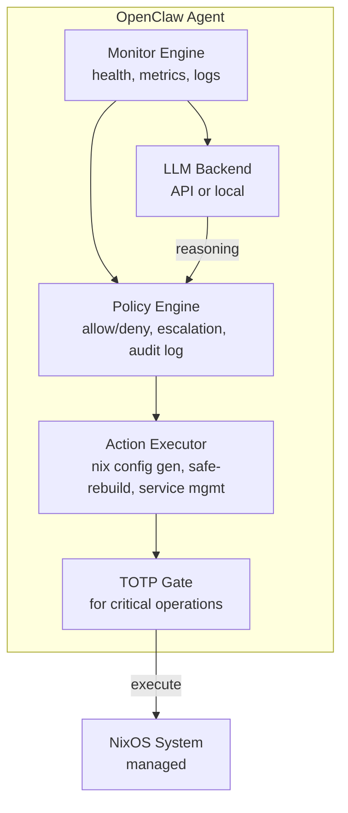

---
sidebar:
  order: 6
title: 安装 OpenClaw
---

# 安装 OpenClaw

OpenClaw 是一个 AI 驱动的基础设施运维代理。它负责监控系统健康状态、提出配置变更建议，并在策略允许的范围内执行已批准的操作。可以把它理解为一个与现有 NixOS 工具链协同工作的 AI SRE 代理。

## 架构



## 组件

| 组件 | 职责 |
|---|---|
| **Monitor Engine** | 采集系统指标、解析日志、检测异常 |
| **Policy Engine** | 定义 OpenClaw 可以和不可以自主执行的操作 |
| **Action Executor** | 生成 Nix 配置、运行 safe-rebuild、管理服务 |
| **LLM Backend** | 推理引擎 - 可接入远程 API 或本地模型 |
| **Audit Log** | 所有提案和操作的不可变记录 |

## 在 NixOS 上安装

### 添加 Flake 输入

```nix title="flake.nix"
{
  description = "Self-healing NixOS server";

  inputs = {
    nixpkgs.url = "github:NixOS/nixpkgs/nixos-24.11";
    disko = {
      url = "github:nix-community/disko";
      inputs.nixpkgs.follows = "nixpkgs";
    };
    openclaw = {
      url = "github:openclaw/openclaw";
      inputs.nixpkgs.follows = "nixpkgs";
    };
  };

  outputs = { self, nixpkgs, disko, openclaw, ... }: {
    nixosConfigurations.server = nixpkgs.lib.nixosSystem {
      system = "x86_64-linux";
      modules = [
        disko.nixosModules.disko
        openclaw.nixosModules.default
        ./disk-config.nix
        ./configuration.nix
        ./openclaw-config.nix
      ];
    };
  };
}
```

### OpenClaw NixOS 模块

```nix title="openclaw-config.nix"
{ config, pkgs, ... }:
{
  services.openclaw = {
    enable = true;

    # Run as a dedicated system user (not root)
    user = "openclaw";
    group = "openclaw";

    settings = {
      # LLM backend configuration
      llm = {
        # Option 1: Remote API
        provider = "anthropic";
        model = "claude-sonnet-4-20250514";
        # API key is loaded from a file, never in nix config
        apiKeyFile = "/run/secrets/openclaw-api-key";

        # Option 2: Local model (uncomment to use)
        # provider = "ollama";
        # model = "llama3:70b";
        # endpoint = "http://localhost:11434";
      };

      # System integration
      system = {
        # Path to the NixOS configuration
        nixosConfigPath = "/etc/nixos";

        # Use our safe-rebuild wrapper
        rebuildCommand = "safe-rebuild";

        # Snapper integration
        snapperConfigs = [ "root" "home" "db" ];
      };

      # Monitoring targets
      monitoring = {
        enable = true;
        interval = "60s";

        checks = {
          diskUsage = { threshold = 85; };
          memoryUsage = { threshold = 90; };
          loadAverage = { threshold = 4.0; };
          failedUnits = { enable = true; };
          sshBruteForce = { enable = true; threshold = 10; };
          certificateExpiry = { enable = true; warnDays = 14; };
        };
      };

      # Logging and audit
      audit = {
        enable = true;
        logPath = "/var/log/openclaw/audit.jsonl";
        retentionDays = 90;
      };
    };
  };

  # Create the openclaw system user
  users.users.openclaw = {
    isSystemUser = true;
    group = "openclaw";
    home = "/var/lib/openclaw";
    description = "OpenClaw AI infrastructure operator";
  };

  users.groups.openclaw = {};

  # OpenClaw needs limited sudo access (TOTP-gated for critical ops)
  security.sudo.extraRules = [
    {
      users = [ "openclaw" ];
      commands = [
        # Read-only operations — no TOTP needed
        { command = "/run/current-system/sw/bin/systemctl status *"; options = [ "NOPASSWD" ]; }
        { command = "/run/current-system/sw/bin/journalctl *"; options = [ "NOPASSWD" ]; }
        { command = "/run/current-system/sw/bin/btrfs subvolume list *"; options = [ "NOPASSWD" ]; }
        { command = "/run/current-system/sw/bin/snapper list *"; options = [ "NOPASSWD" ]; }

        # Critical operations — require TOTP (configured in chapter 06)
        { command = "/run/current-system/sw/bin/safe-rebuild *"; options = [ "PASSWD" ]; }
        { command = "/run/current-system/sw/bin/nixos-rebuild *"; options = [ "PASSWD" ]; }
        { command = "/run/current-system/sw/bin/systemctl restart *"; options = [ "PASSWD" ]; }
      ];
    }
  ];

  # Ensure log directory exists
  systemd.tmpfiles.rules = [
    "d /var/log/openclaw 0750 openclaw openclaw -"
  ];
}
```

### API 密钥管理

切勿将 API 密钥写入 Nix 配置文件。请使用密钥管理工具：

```bash
# Create a secrets directory (restricted permissions)
sudo mkdir -p /run/secrets
sudo chmod 700 /run/secrets

# Write the API key
echo "sk-ant-..." | sudo tee /run/secrets/openclaw-api-key > /dev/null
sudo chmod 600 /run/secrets/openclaw-api-key
sudo chown openclaw:openclaw /run/secrets/openclaw-api-key
```

:::tip 生产环境密钥管理
在生产环境中，建议使用 [agenix](https://github.com/ryantm/agenix) 或 [sops-nix](https://github.com/Mic92/sops-nix) 以声明式方式管理加密密钥：

```nix
# With agenix:
age.secrets.openclaw-api-key = {
  file = ../secrets/openclaw-api-key.age;
  owner = "openclaw";
  group = "openclaw";
};
```
:::

## 验证

使用 OpenClaw 配置重新构建系统后，执行以下验证：

```bash
# Check service status
sudo systemctl status openclaw

# View recent logs
sudo journalctl -u openclaw -f

# Check OpenClaw can communicate with its LLM backend
sudo -u openclaw openclaw health-check

# View the audit log
sudo cat /var/log/openclaw/audit.jsonl | jq .
```

正常运行时的预期输出：

```
● openclaw.service - OpenClaw AI Infrastructure Operator
     Loaded: loaded (/etc/systemd/system/openclaw.service; enabled)
     Active: active (running) since Mon 2024-01-15 10:00:00 UTC
   Main PID: 1234 (openclaw)
      Tasks: 8 (limit: 4915)
     Memory: 128.0M
     CGroup: /system.slice/openclaw.service
             └─1234 /nix/store/...-openclaw/bin/openclaw --config /etc/openclaw/config.toml

Jan 15 10:00:01 nixos-server openclaw[1234]: Monitor engine started (interval: 60s)
Jan 15 10:00:01 nixos-server openclaw[1234]: Policy engine loaded (12 rules)
Jan 15 10:00:01 nixos-server openclaw[1234]: LLM backend connected (anthropic/claude-sonnet-4-20250514)
Jan 15 10:00:01 nixos-server openclaw[1234]: Audit logging to /var/log/openclaw/audit.jsonl
```

## 安全注意事项

1. **专用用户** - OpenClaw 以 `openclaw` 用户身份运行，而非 root。只能通过 sudo 进行权限提升。
2. **TOTP 门控的 sudo** - 关键命令（rebuild、restart）需要 TOTP 认证（在[第 6 章](./totp-sudo-protection)中配置）。
3. **默认只读** - 监控类命令无需密码即可执行，只有写操作才需要认证。
4. **审计追踪** - 每个操作都会记录到仅追加的 JSONL 文件中，包含时间戳、操作类型和结果。
5. **策略边界** - 即使 LLM 建议执行某操作，策略引擎也会阻止 OpenClaw 超出预定义规则的范围。

:::danger 切勿给予 OpenClaw Root 权限
OpenClaw 绝不应以 root 身份运行或拥有不受限的 sudo 权限。整个安全模型依赖于 TOTP 门控机制来隔离 OpenClaw 与破坏性操作。如果 OpenClaw 拥有 root 权限，门控就形同虚设。
:::

## 下一步

OpenClaw 已安装并运行。接下来，我们将配置 [AI 管理的基础设施工作流](./ai-managed-infra) —— 定义 OpenClaw 可以自主执行哪些操作，哪些需要人工审批。
