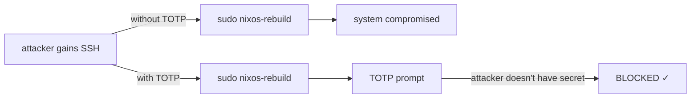
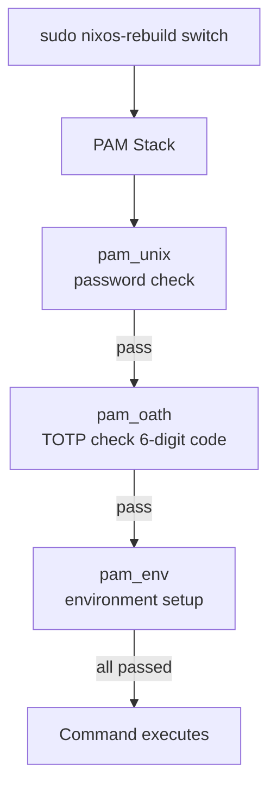

---
sidebar:
  order: 8
title: TOTP Sudo 防护
---

# TOTP Sudo 防护

本章配置 sudo 的 TOTP（基于时间的一次性密码）认证，确保 `nixos-rebuild switch` 等关键操作需要来自身份验证器应用的 6 位验证码 —— 即使攻击者获得了 Shell 访问权限也无法绕过。

## 为什么对 Sudo 使用 TOTP



TOTP 密钥存储在你的手机（或硬件令牌）上，而非服务器上。即使服务器被入侵，攻击者也无法生成有效的验证码。

## 组件

| 组件 | 职责 |
|---|---|
| `pam_oath` | 验证 TOTP 验证码的 PAM 模块 |
| `oath-toolkit` | 用于生成密钥和测试验证码的命令行工具 |
| `oathtool` | 命令行 TOTP 验证码生成器（用于测试） |
| 身份验证器应用 | Google Authenticator、Authy 或任何 TOTP 应用 |

## PAM 认证流程



## NixOS 配置

### 安装和配置 pam_oath

```nix title="modules/totp-sudo.nix"
{ config, pkgs, lib, ... }:
{
  # Install oath-toolkit
  environment.systemPackages = with pkgs; [
    oath-toolkit   # oathtool CLI
    libpam_oath    # PAM module (provided by oath-toolkit)
    qrencode       # Generate QR codes for enrolling devices
  ];

  # Configure PAM for sudo to require TOTP
  security.pam.services.sudo = {
    text = lib.mkForce ''
      # Account management
      account required pam_unix.so

      # Authentication: password + TOTP
      auth required pam_unix.so
      auth required ${pkgs.oath-toolkit}/lib/security/pam_oath.so usersfile=/etc/users.oath window=3 digits=6

      # Session
      session required pam_unix.so
      session required pam_env.so
    '';
  };

  # Ensure the TOTP users file exists with correct permissions
  systemd.tmpfiles.rules = [
    "f /etc/users.oath 0600 root root -"
  ];
}
```

:::warning window=3
`window=3` 参数允许前后偏差最多 3 个时间步长（90 秒）的验证码。这是为了容忍服务器与身份验证器应用之间的时钟偏差。不要设置过大 —— 会削弱安全性。
:::

### TOTP 密钥注册

为每个需要 sudo 权限的用户生成 TOTP 密钥：

```bash
# Generate a random secret (base32 encoded)
head -c 20 /dev/urandom | base32 | tr -d '=' | head -c 32
# Example output: JBSWY3DPEHPK3PXP4ZTLMRQK6BZDG5A

# Store it. Format: HOTP/T TYPE USER - SECRET
# For TOTP with 6 digits and 30-second step:
echo "HOTP/T30/6 admin - JBSWY3DPEHPK3PXP4ZTLMRQK6BZDG5A" | sudo tee -a /etc/users.oath
echo "HOTP/T30/6 openclaw - KFWU4SDPN7PAQ3RPXVTZMRWK8CZDH7B" | sudo tee -a /etc/users.oath

# Set restrictive permissions
sudo chmod 600 /etc/users.oath
sudo chown root:root /etc/users.oath
```

### 为身份验证器应用生成二维码

```bash
# Generate a QR code for the admin user
qrencode -t ansiutf8 \
  "otpauth://totp/nixos-server:admin?secret=JBSWY3DPEHPK3PXP4ZTLMRQK6BZDG5A&issuer=nixos-server&digits=6&period=30"
```

终端中会显示一个二维码，用身份验证器应用（Google Authenticator、Authy、1Password 等）扫描即可。

:::tip 生成恢复码
注册完成后，生成一组紧急一次性验证码并离线存储（打印出来或存入密码管理器）：

```bash
# Generate 10 emergency codes from the same secret
for i in $(seq 0 9); do
  oathtool --totp --base32 JBSWY3DPEHPK3PXP4ZTLMRQK6BZDG5A -N "+${i}min"
done > ~/totp-emergency-codes.txt
```

这些验证码作为 TOTP 是有时效性的，因此更好的做法是安全地备份**密钥本身**（`JBSWY3DPEHPK3PXP4ZTLMRQK6BZDG5A`）。有了密钥，随时可以在任何身份验证器应用中重新注册。
:::

### 测试 TOTP 认证

```bash
# Generate a test code using oathtool
oathtool --totp --base32 JBSWY3DPEHPK3PXP4ZTLMRQK6BZDG5A
# Output: 123456

# Test sudo — it should ask for password + TOTP
sudo echo "TOTP works!"
# Password: (your password)
# One-time password (OATH): (6-digit code from authenticator)
```

## 用户文件格式

`/etc/users.oath` 文件格式如下：

```
# TYPE         USER    PIN  SECRET
HOTP/T30/6     admin   -    JBSWY3DPEHPK3PXP4ZTLMRQK6BZDG5A
HOTP/T30/6     openclaw -   KFWU4SDPN7PAQ3RPXVTZMRWK8CZDH7B
```

| 字段 | 含义 |
|---|---|
| `HOTP/T30/6` | TOTP 模式，30 秒周期，6 位数字 |
| `admin` | Unix 用户名 |
| `-` | 无附加 PIN（仅使用 TOTP 验证码） |
| `JBSWY3...` | Base32 编码的密钥 |

## OpenClaw TOTP 集成

OpenClaw 需要一种机制来向人类操作员请求 TOTP 验证码，以便对门控操作进行认证。通常通过通知渠道实现：

```nix title="modules/openclaw-totp-bridge.nix"
{ config, pkgs, ... }:
let
  totpBridge = pkgs.writeShellScriptBin "openclaw-totp-bridge" ''
    set -euo pipefail

    ACTION="$1"
    PROPOSAL_ID="$2"

    echo "=== TOTP Authorization Required ==="
    echo "Action:   $ACTION"
    echo "Proposal: $PROPOSAL_ID"
    echo ""

    # Send notification to operator (via webhook, email, etc.)
    ${pkgs.curl}/bin/curl -s -X POST \
      "''${OPENCLAW_NOTIFY_URL}" \
      -H "Content-Type: application/json" \
      -d "{
        \"text\": \"🔐 TOTP required for: $ACTION\nProposal: $PROPOSAL_ID\nReply with 6-digit code to approve.\"
      }" || true

    # Wait for operator to provide TOTP code
    # This reads from OpenClaw's approval channel
    echo "Waiting for TOTP code from operator..."
    read -r -t 300 TOTP_CODE < /var/lib/openclaw/totp-response-pipe

    if [ -z "$TOTP_CODE" ]; then
      echo "Timeout: no TOTP code received within 5 minutes"
      exit 1
    fi

    # Validate the TOTP code
    EXPECTED=$(${pkgs.oath-toolkit}/bin/oathtool --totp --base32 \
      "$(grep openclaw /etc/users.oath | awk '{print $4}')")

    if [ "$TOTP_CODE" = "$EXPECTED" ]; then
      echo "TOTP validated successfully"
      exit 0
    else
      echo "Invalid TOTP code"
      exit 1
    fi
  '';
in
{
  environment.systemPackages = [ totpBridge ];

  services.openclaw.settings.authentication = {
    totpBridgeCommand = "${totpBridge}/bin/openclaw-totp-bridge";
    approvalTimeout = "5m";
  };
}
```

## 选择性 TOTP 强制

你可能只想对特定命令启用 TOTP，而非所有 sudo 操作。可以使用 PAM 条件：

```nix title="Alternative: TOTP only for specific commands"
{ config, pkgs, lib, ... }:
let
  # Wrapper that enforces TOTP before running a command
  totpGuard = pkgs.writeShellScriptBin "totp-guard" ''
    set -euo pipefail

    COMMAND="$*"

    echo "This operation requires TOTP authentication."
    echo "Command: $COMMAND"
    echo ""

    # Read TOTP code
    read -r -s -p "TOTP code: " TOTP_CODE
    echo ""

    # Validate against the current user's secret
    USER=$(whoami)
    SECRET=$(sudo grep "^HOTP.*$USER" /etc/users.oath | awk '{print $4}')

    EXPECTED=$(${pkgs.oath-toolkit}/bin/oathtool --totp --base32 "$SECRET")

    if [ "$TOTP_CODE" != "$EXPECTED" ]; then
      echo "Invalid TOTP code. Operation denied."
      logger -t totp-guard "DENIED: $USER attempted $COMMAND with invalid TOTP"
      exit 1
    fi

    logger -t totp-guard "APPROVED: $USER executed $COMMAND with valid TOTP"
    exec $COMMAND
  '';
in
{
  environment.systemPackages = [ totpGuard ];

  # Create aliases for protected commands
  environment.shellAliases = {
    "nixos-rebuild" = "totp-guard nixos-rebuild";
  };
}
```

## 时钟同步

TOTP 依赖服务器与身份验证器之间的时钟同步。确保已配置 NTP：

```nix
# In configuration.nix
services.timesyncd.enable = true;
networking.timeServers = [
  "0.nixos.pool.ntp.org"
  "1.nixos.pool.ntp.org"
  "2.nixos.pool.ntp.org"
  "3.nixos.pool.ntp.org"
];
```

```bash
# Verify time sync
timedatectl status
# Should show: System clock synchronized: yes
```

:::danger 时钟偏差会导致 TOTP 失效
如果服务器时钟与 UTC 的偏差超过 90 秒，TOTP 验证码将被拒绝。务必保持 NTP 启用并监控时钟同步。PAM 中的 `window=3` 设置提供 90 秒的容差。
:::

## 备份与恢复

### 备份 TOTP 密钥

```bash
# Encrypt and backup the users.oath file
sudo gpg --symmetric --cipher-algo AES256 -o /root/users.oath.gpg /etc/users.oath

# Store the GPG-encrypted backup offline (USB, password manager, etc.)
```

### 丢失 TOTP 设备

如果丢失了身份验证器设备：

1. **启动到救援模式**（通过 VPS 提供商的控制台）
2. **挂载文件系统**：`mount /dev/sda2 /mnt -o subvol=@root`
3. **编辑或移除 TOTP 要求**：`vim /mnt/etc/users.oath`
4. **重启并重新注册**新设备

:::tip 始终保留备份
保留备份码或注册第二台设备。如果在服务器要求 TOTP 的情况下丢失了唯一的 TOTP 设备，你将需要控制台访问权限才能恢复。
:::

## 下一步

关键操作现已受到 TOTP 保护。接下来，我们将设计[数据库快照策略](./database-snapshot-strategy)，确保有状态服务的一致性备份。
