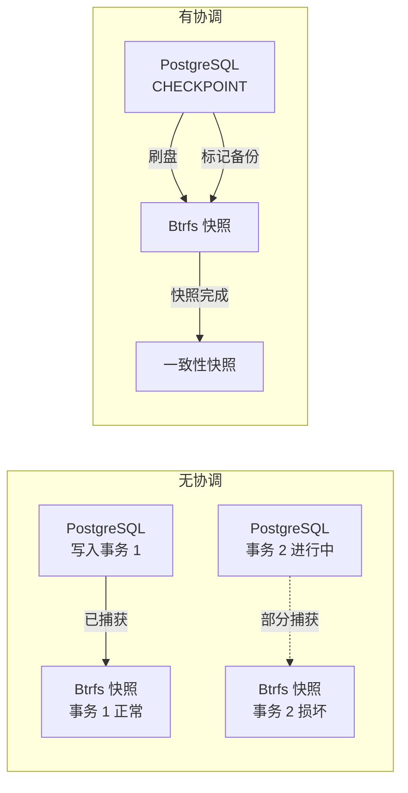
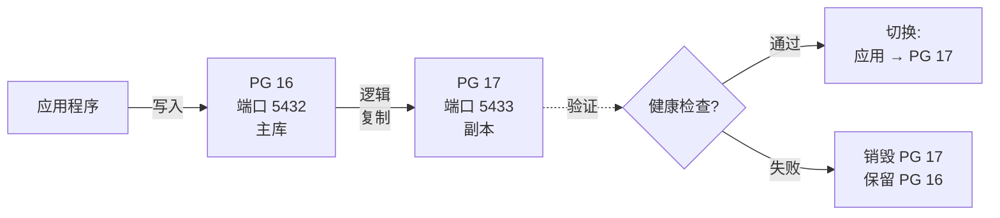

---
sidebar:
  order: 9
title: 数据库快照策略
---

# 数据库快照策略

数据库需要特殊的快照处理方式。对运行中的数据库直接做文件系统快照，可能会捕获到不一致的状态 -- 写到一半的事务、脏缓冲区、不完整的 WAL 条目。本章介绍在 Btrfs 上创建一致性数据库快照的策略。

## 一致性问题



## 策略概览

| 数据库 | 快照方法 |
|---|---|
| PostgreSQL | `CHECKPOINT` + `pg_backup_start()` + Btrfs 快照 + `pg_backup_stop()` |
| SQLite | `PRAGMA wal_checkpoint(TRUNCATE)` + Btrfs 快照 |
| Redis | `BGSAVE` + 等待完成 + Btrfs 快照 |
| MySQL/MariaDB | `FLUSH TABLES WITH READ LOCK` + Btrfs 快照 + `UNLOCK TABLES` |

## PostgreSQL 一致性快照

### NixOS PostgreSQL 配置

```nix title="modules/postgresql.nix"
{ config, pkgs, ... }:
{
  services.postgresql = {
    enable = true;
    package = pkgs.postgresql_16;

    # 将数据存储在 @db 子卷上
    dataDir = "/var/lib/db/postgresql";

    settings = {
      # WAL configuration for reliable backup
      wal_level = "replica";
      archive_mode = "on";
      archive_command = "cp %p /var/lib/db/wal-archive/%f";

      # Checkpoint settings
      checkpoint_timeout = "15min";
      max_wal_size = "1GB";
    };
  };

  # Ensure WAL archive directory exists
  systemd.tmpfiles.rules = [
    "d /var/lib/db/wal-archive 0700 postgres postgres -"
  ];
}
```

### 一致性快照脚本

```nix title="modules/db-snapshot.nix"
{ config, pkgs, ... }:
let
  dbSnapshot = pkgs.writeShellScriptBin "db-snapshot" ''
    set -euo pipefail

    TIMESTAMP=$(date +%Y%m%d-%H%M%S)
    SNAP_NAME="@db-$TIMESTAMP"
    SNAP_PATH="/.snapshots/$SNAP_NAME"

    echo "=== Database Consistent Snapshot ==="
    echo "Timestamp: $TIMESTAMP"
    echo "Target:    $SNAP_PATH"
    echo ""

    # Step 1: Force a checkpoint (flush dirty buffers to disk)
    echo "[1/5] Forcing PostgreSQL checkpoint..."
    sudo -u postgres psql -c "CHECKPOINT;"

    # Step 2: Start backup mode (PostgreSQL notes the WAL position)
    echo "[2/5] Starting backup mode..."
    BACKUP_LABEL=$(sudo -u postgres psql -t -c \
      "SELECT pg_backup_start('btrfs-snapshot-$TIMESTAMP', false);")
    echo "       Backup LSN: $BACKUP_LABEL"

    # Step 3: Take the Btrfs snapshot
    echo "[3/5] Creating Btrfs snapshot..."
    sudo btrfs subvolume snapshot -r /var/lib/db "$SNAP_PATH"

    # Step 4: Stop backup mode
    echo "[4/5] Stopping backup mode..."
    sudo -u postgres psql -c "SELECT pg_backup_stop(false);" > /dev/null

    # Step 5: Verify
    echo "[5/5] Verifying snapshot..."
    sudo btrfs subvolume show "$SNAP_PATH"

    echo ""
    echo "Snapshot created: $SNAP_PATH"
    echo "To restore: sudo btrfs subvolume snapshot $SNAP_PATH /var/lib/db"
  '';

  dbRestore = pkgs.writeShellScriptBin "db-restore" ''
    set -euo pipefail

    SNAP_PATH="''${1:?Usage: db-restore <snapshot-path>}"

    if [ ! -d "$SNAP_PATH" ]; then
      echo "Error: Snapshot not found: $SNAP_PATH"
      exit 1
    fi

    echo "=== Database Restore ==="
    echo "Source: $SNAP_PATH"
    echo ""
    echo "WARNING: This will stop PostgreSQL and replace the database."
    read -r -p "Continue? [y/N] " confirm
    if [ "$confirm" != "y" ]; then
      echo "Aborted."
      exit 0
    fi

    # Step 1: Stop PostgreSQL
    echo "[1/4] Stopping PostgreSQL..."
    sudo systemctl stop postgresql

    # Step 2: Move current data aside
    echo "[2/4] Moving current data aside..."
    TIMESTAMP=$(date +%Y%m%d-%H%M%S)
    sudo mv /var/lib/db /var/lib/db-old-$TIMESTAMP

    # Step 3: Restore from snapshot (create read-write copy)
    echo "[3/4] Restoring from snapshot..."
    sudo btrfs subvolume snapshot "$SNAP_PATH" /var/lib/db

    # Step 4: Start PostgreSQL
    echo "[4/4] Starting PostgreSQL..."
    sudo systemctl start postgresql

    # Verify
    echo ""
    echo "Restore complete. Verifying..."
    sudo -u postgres psql -c "SELECT version();"
    echo "Old data saved to: /var/lib/db-old-$TIMESTAMP"
  '';
in
{
  environment.systemPackages = [ dbSnapshot dbRestore ];
}
```

## 自动化数据库快照

定期调度一致性快照：

```nix title="modules/db-snapshot-timer.nix"
{ config, pkgs, ... }:
{
  # Take a consistent DB snapshot every 6 hours
  systemd.services.db-snapshot = {
    description = "Consistent database Btrfs snapshot";
    serviceConfig = {
      Type = "oneshot";
      # Uses the db-snapshot script from modules/db-snapshot.nix above
      ExecStart = "/run/current-system/sw/bin/db-snapshot";
    };
  };

  systemd.timers.db-snapshot = {
    wantedBy = [ "timers.target" ];
    timerConfig = {
      OnCalendar = "*-*-* 00,06,12,18:00:00";  # Every 6 hours
      Persistent = true;
      RandomizedDelaySec = "5m";
    };
  };
}
```

## SQLite 快照策略

SQLite 更简单 -- 执行 WAL checkpoint 后即可做快照：

```bash
#!/usr/bin/env bash
set -euo pipefail

DB_PATH="${1:?Usage: sqlite-snapshot <db-path>}"
TIMESTAMP=$(date +%Y%m%d-%H%M%S)

# Checkpoint the WAL (flush all WAL pages to the main database file)
sqlite3 "$DB_PATH" "PRAGMA wal_checkpoint(TRUNCATE);"

# Now the database file is self-contained — snapshot is safe
sudo btrfs subvolume snapshot -r /var/lib/db "/.snapshots/@db-sqlite-$TIMESTAMP"

echo "SQLite snapshot created: /.snapshots/@db-sqlite-$TIMESTAMP"
```

## Redis 快照策略

```bash
#!/usr/bin/env bash
set -euo pipefail

TIMESTAMP=$(date +%Y%m%d-%H%M%S)

# Record current save timestamp
BEFORE=$(redis-cli LASTSAVE)

# Trigger background save
redis-cli BGSAVE

# Wait for save to complete (LASTSAVE changes when done)
while [ "$(redis-cli LASTSAVE)" = "$BEFORE" ]; do
  sleep 1
done

# Snapshot the data directory
sudo btrfs subvolume snapshot -r /var/lib/db "/.snapshots/@db-redis-$TIMESTAMP"

echo "Redis snapshot created: /.snapshots/@db-redis-$TIMESTAMP"
```

## 数据库快照保留策略

由于数据变动频繁，数据库快照比系统快照占用更多空间。建议配置积极的清理策略：

```
时间线:
  ├── 最近 48 小时:  每小时快照  (48 个快照)
  ├── 最近 2 周:     每日快照    (14 个快照)
  ├── 最近 2 个月:   每周快照    (8 个快照)
  └── 最近 6 个月:   每月快照    (6 个快照)

总保留: ~76 个快照
预估空间: 数据库大小的 2-5 倍（取决于数据变动量）
```

## 监控

```bash
# Check database snapshot sizes
sudo btrfs filesystem du -s /.snapshots/@db-*

# Check exclusive space (would be freed if deleted)
sudo btrfs qgroup show -reF / | grep "db"

# Alert if database snapshots exceed threshold
DB_SNAP_SIZE=$(sudo du -sb /.snapshots/@db-* 2>/dev/null | awk '{sum+=$1} END {print sum}')
DB_SNAP_GB=$((DB_SNAP_SIZE / 1073741824))
if [ "$DB_SNAP_GB" -gt 50 ]; then
  echo "WARNING: Database snapshots consuming ${DB_SNAP_GB}GB"
fi
```

## OpenClaw 集成

OpenClaw 可以在监控过程中管理数据库快照：

```json
{
  "proposal_id": "prop-20240115-db-001",
  "issue": "Database snapshot age exceeds 12 hours",
  "proposed_actions": [
    {
      "tier": 1,
      "action": "database-snapshot",
      "command": "db-snapshot",
      "impact": "Creates consistent snapshot of PostgreSQL",
      "risk": "low"
    }
  ]
}
```

## 零停机数据库升级

:::danger 仅快照回滚会丢失数据
Btrfs 快照捕获的是时间点状态。如果数据库升级在**新数据写入后**失败，回滚到升级前的快照会**丢弃快照之后的所有写入**。对于有持续流量的生产数据库，这是不可接受的。
:::

### 问题所在

```
t0: 创建 Btrfs 快照
t1: PostgreSQL 16→17 升级开始
t2: 新的订单、支付、用户注册持续写入    ← 实时流量
t3: 升级失败 — PG 17 无法启动
t4: 回滚到 t0 快照 → t1–t3 之间的数据丢失
```

仅快照回滚在以下场景是安全的：
- 升级期间数据库处于离线状态（计划维护窗口）
- 快照和回滚之间没有写入发生（只读副本）
- 数据丢失是可接受的（开发/测试环境）

对于要求零停机的生产环境，请使用以下策略。

### 策略一：逻辑复制（推荐）

同时运行新旧版本。所有写入实时复制。零数据丢失，零停机。



#### NixOS 配置

```nix title="modules/pg-upgrade-replication.nix"
{ config, pkgs, ... }:
{
  # 旧 PostgreSQL 实例（当前生产环境）
  services.postgresql = {
    enable = true;
    package = pkgs.postgresql_16;
    dataDir = "/var/lib/db/postgresql";
    port = 5432;
    settings = {
      wal_level = "logical";       # 逻辑复制必需
      max_replication_slots = 4;
      max_wal_senders = 4;
    };
  };

  # 新 PostgreSQL 实例（升级目标）
  # 准备好升级时启用此服务
  systemd.services.postgresql-new = {
    description = "PostgreSQL 17 (upgrade target)";
    after = [ "network.target" ];
    serviceConfig = {
      User = "postgres";
      ExecStart = "${pkgs.postgresql_17}/bin/postgres -D /var/lib/db/postgresql-new -p 5433";
      ExecStartPre = pkgs.writeShellScript "pg17-init" ''
        if [ ! -f /var/lib/db/postgresql-new/PG_VERSION ]; then
          ${pkgs.postgresql_17}/bin/initdb -D /var/lib/db/postgresql-new
          echo "port = 5433" >> /var/lib/db/postgresql-new/postgresql.conf
          echo "wal_level = logical" >> /var/lib/db/postgresql-new/postgresql.conf
        fi
      '';
    };
  };
}
```

#### 升级步骤

```bash
#!/usr/bin/env bash
set -euo pipefail

echo "=== 零停机 PostgreSQL 升级 ==="

# 步骤 1: 创建安全快照（双重保险）
echo "[1/7] 创建 Btrfs 安全快照..."
db-snapshot

# 步骤 2: 启动新的 PostgreSQL 实例
echo "[2/7] 启动 PostgreSQL 17..."
sudo systemctl start postgresql-new
sleep 5

# 步骤 3: 将 schema 复制到 PG 17
echo "[3/7] 复制 schema 到 PG 17..."
sudo -u postgres pg_dump -p 5432 --schema-only | \
  sudo -u postgres psql -p 5433

# 步骤 4: 设置逻辑复制
echo "[4/7] 设置逻辑复制..."
sudo -u postgres psql -p 5432 -c \
  "CREATE PUBLICATION upgrade_pub FOR ALL TABLES;"

sudo -u postgres psql -p 5433 -c \
  "CREATE SUBSCRIPTION upgrade_sub
   CONNECTION 'host=/run/postgresql port=5432 dbname=postgres'
   PUBLICATION upgrade_pub;"

# 步骤 5: 等待初始同步完成
echo "[5/7] 等待初始数据同步..."
while true; do
  STATE=$(sudo -u postgres psql -p 5433 -t -c \
    "SELECT srsubstate FROM pg_subscription_rel LIMIT 1;" | tr -d ' ')
  [ "$STATE" = "r" ] && break  # 'r' = ready（已同步）
  echo "  同步中... (状态: $STATE)"
  sleep 5
done
echo "  初始同步完成。"

# 步骤 6: 验证数据一致性
echo "[6/7] 验证行数..."
OLD_COUNT=$(sudo -u postgres psql -p 5432 -t -c \
  "SELECT sum(n_live_tup) FROM pg_stat_user_tables;")
NEW_COUNT=$(sudo -u postgres psql -p 5433 -t -c \
  "SELECT sum(n_live_tup) FROM pg_stat_user_tables;")
echo "  PG 16 行数: $OLD_COUNT"
echo "  PG 17 行数: $NEW_COUNT"

# 步骤 7: 切换（更新应用连接）
echo "[7/7] 准备切换。"
echo ""
echo "完成升级："
echo "  1. 更新应用连接到端口 5433"
echo "  2. 验证应用健康状态"
echo "  3. 删除订阅: psql -p 5433 -c 'DROP SUBSCRIPTION upgrade_sub;'"
echo "  4. 删除发布: psql -p 5432 -c 'DROP PUBLICATION upgrade_pub;'"
echo "  5. 停止旧实例: systemctl stop postgresql"
echo ""
echo "中止升级："
echo "  1. 停止新实例: systemctl stop postgresql-new"
echo "  2. 旧的 PG 16 未受影响 — 无数据丢失"
```

### 策略二：WAL 重放回滚

如果必须使用快照回滚，持续归档 WAL，这样可以在恢复的快照之上**重放写入**。这能恢复快照和故障之间写入的数据。

```
t0: 创建快照（WAL 归档活跃）
t3: 升级失败
t4: 回滚到 t0 快照
t5: 重放 t0 → t3 的 WAL   ← 恢复快照后的写入
t6: 数据库恢复到 t3 状态，所有数据完整
```

#### NixOS 配置

WAL 归档已在[上面的 PostgreSQL 配置](#nixos-postgresql-配置)中配置。关键设置：

```nix
settings = {
  wal_level = "replica";
  archive_mode = "on";
  archive_command = "cp %p /var/lib/db/wal-archive/%f";
};
```

#### 带 WAL 重放的恢复

```bash title="db-restore-with-wal"
#!/usr/bin/env bash
set -euo pipefail

SNAP_PATH="${1:?用法: db-restore-with-wal <snapshot-path>}"

echo "=== 带 WAL 重放的数据库恢复 ==="

# 步骤 1: 停止 PostgreSQL
echo "[1/5] 停止 PostgreSQL..."
sudo systemctl stop postgresql

# 步骤 2: 保留 WAL 归档，移动当前数据
echo "[2/5] 保留 WAL 归档并移动数据..."
TIMESTAMP=$(date +%Y%m%d-%H%M%S)
sudo cp -a /var/lib/db/wal-archive /tmp/wal-archive-$TIMESTAMP
sudo mv /var/lib/db /var/lib/db-old-$TIMESTAMP

# 步骤 3: 从快照恢复
echo "[3/5] 从快照恢复..."
sudo btrfs subvolume snapshot "$SNAP_PATH" /var/lib/db

# 步骤 4: 配置 WAL 重放（时间点恢复 PITR）
echo "[4/5] 配置 PITR..."
sudo cp -a /tmp/wal-archive-$TIMESTAMP /var/lib/db/wal-archive

# 创建恢复信号文件
sudo touch /var/lib/db/postgresql/recovery.signal
cat <<EOF | sudo tee /var/lib/db/postgresql/postgresql.auto.conf > /dev/null
restore_command = 'cp /var/lib/db/wal-archive/%f %p'
recovery_target = 'immediate'
recovery_target_action = 'promote'
EOF
sudo chown postgres:postgres /var/lib/db/postgresql/recovery.signal
sudo chown postgres:postgres /var/lib/db/postgresql/postgresql.auto.conf

# 步骤 5: 启动 PostgreSQL（将自动重放 WAL）
echo "[5/5] 启动 PostgreSQL 并重放 WAL..."
sudo systemctl start postgresql

echo ""
echo "PostgreSQL 正在重放 WAL 文件以恢复快照后的数据。"
echo "监控进度: sudo journalctl -u postgresql -f"
echo "旧数据已保存到: /var/lib/db-old-$TIMESTAMP"
```

### 策略三：只读副本提升

升级副本而非主库。在升级验证完成之前，主库不受任何影响。

```
1. 主库（PG 16）正常服务流量
2. 创建主库的流复制副本
3. 提升副本，在副本上升级到 PG 17
4. 在副本上验证 PG 17 健康状态
5. 如果通过 → 将应用切换到副本（现在是新主库）
6. 如果失败 → 销毁副本，主库未受影响
```

:::caution 复制延迟
流复制存在较小的延迟（通常低于 1 秒）。在切换瞬间，可能会丢失最多该延迟窗口内的写入。对于大多数应用这是可接受的；对于金融交易，请使用逻辑复制（策略一）。
:::

### 策略选择指南

| 场景 | 策略 | 数据丢失 | 停机时间 | 复杂度 |
|---|---|---|---|---|
| 仅配置变更（无数据风险） | 快照回滚 | 无 | 无 | 低 |
| 小版本升级（16.1→16.2） | WAL 重放 | 无 | 秒级 | 中 |
| 大版本升级（16→17） | 逻辑复制 | 无 | 无 | 高 |
| 紧急回滚 | 只读副本 | 亚秒级 | 秒级 | 中 |
| 开发/测试环境 | 快照回滚 | 可接受 | 无 | 低 |

### OpenClaw 升级编排

OpenClaw 根据升级类型选择合适的策略：

```json
{
  "proposal_id": "prop-20240315-dbupgrade-001",
  "issue": "PostgreSQL 16 → 17 upgrade available",
  "analysis": {
    "upgrade_type": "major_version",
    "traffic_level": "active",
    "data_loss_tolerance": "none"
  },
  "proposed_actions": [
    {
      "tier": 3,
      "action": "pg-major-upgrade",
      "strategy": "logical_replication",
      "steps": [
        "创建 Btrfs 安全快照",
        "在端口 5433 初始化 PG 17 实例",
        "设置 PG 16 → PG 17 逻辑复制",
        "等待初始同步 + 验证行数",
        "切换应用连接",
        "24 小时稳定期后拆除 PG 16"
      ],
      "rollback": "停止 PG 17，应用保持在 PG 16",
      "impact": "零停机，零数据丢失",
      "risk": "high",
      "requires_totp": true
    }
  ]
}
```

:::tip 测试你的恢复流程
没有经过测试的备份不算备份。定期安排恢复测试：

```bash
# 恢复到临时位置并验证
sudo btrfs subvolume snapshot /.snapshots/@db-20240115-120000 /tmp/db-test
sudo -u postgres pg_isready -h /tmp/db-test
sudo btrfs subvolume delete /tmp/db-test
```
:::

## 下一步

数据库快照已配置为一致性模式，零停机升级策略确保版本变更期间不会丢失数据。接下来，我们将在[灾难恢复计划](./disaster-recovery)中将所有内容整合，覆盖每种故障场景。
