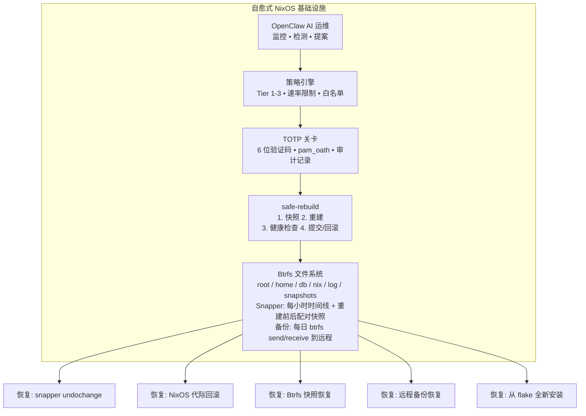

---
sidebar:
  order: 11
title: AI 安全与回滚
---

# AI 安全与回滚

本章定义了安全运行 AI 管理基础设施的操作规程。涵盖安全护栏、回滚工作流、故障预算，以及在享受 AI 自动化优势的同时保持人类控制权的核心原则。

## 安全模型


## AI 安全护栏

### 1. 操作白名单

OpenClaw 只能执行策略中明确列出的操作。未列入白名单的操作一律拒绝：

```nix
# Only these actions are allowed — everything else is blocked
services.openclaw.settings.policy.autonomous.allowedActions = [
  "restart-failed-service"
  "rotate-logs"
  "clean-temp-files"
  "collect-metrics"
  "check-certificates"
];
```

:::tip 默认拒绝
策略引擎采用默认拒绝模型。如果某个操作不在白名单中，OpenClaw 无法执行它 -- 即使 LLM 推荐了该操作。这是一项根本性的安全特性。
:::

### 2. 速率限制

防止自动化失控：

```nix
services.openclaw.settings.policy.safety = {
  maxActionsPerHour = 5;          # Total actions across all tiers
  maxChangesPerDay = 20;          # Total state-changing operations
  maxRestartsPerServicePerHour = 3; # Per-service restart limit
  cooldownAfterFailure = "15m";   # Pause after any failed action
};
```

### 3. 爆炸半径控制

每个操作都有明确的作用范围。OpenClaw 不能将多个操作合并为单一操作执行：

```
允许:
  - 重启 nginx（单一服务，明确范围）
  - 更新一个软件包（定向变更）
  - 添加一条防火墙规则（特定修改）

不允许:
  - 同时重启所有服务
  - 执行任意 shell 命令
  - 在一次操作中修改多个配置文件
  - 未经逐一审批就链式执行操作
```

### 4. 回滚预算

定义在 OpenClaw 被自动暂停之前允许的回滚次数：

```nix
services.openclaw.settings.policy.safety = {
  # If OpenClaw triggers 3 rollbacks in 24 hours, suspend autonomous actions
  maxRollbacksPerDay = 3;
  suspendOnRollbackBudgetExceeded = true;

  # Require human review to resume
  resumeRequiresTotp = true;
};
```

## 回滚工作流

每个 AI 发起的变更都遵循以下流程：

```
步骤 1: 提议
  OpenClaw 生成变更提案
  ├── Nix 配置差异
  ├── 影响评估
  ├── 风险分类
  └── 回滚方案

步骤 2: 审批（Tier 2 或 Tier 3 时）
  ├── Tier 2: 通知 + 倒计时
  └── Tier 3: 需要 TOTP 验证码

步骤 3: 快照
  创建 Btrfs 快照:
  ├── snapper -c root create --type pre
  ├── snapper -c db create --type pre  (如影响数据库)
  └── 快照 ID 记录在提案中

步骤 4: 应用
  safe-rebuild switch（或定向操作）
  ├── NixOS 构建新配置
  ├── 激活新系统配置
  └── 记录退出码

步骤 5: 验证
  运行健康检查:
  ├── 所有 systemd 服务是否正常？
  ├── 网络连通性是否正常？
  ├── 应用端点是否响应？
  ├── 数据库是否接受连接？
  └── 自定义健康检查是否通过？

步骤 6a: 提交（如果健康）
  ├── 创建后快照 (snapper --type post)
  ├── 更新审计日志 (status: success)
  └── 标记提案为已完成

步骤 6b: 回滚（如果异常）
  ├── snapper -c root undochange $PRE_SNAP..0
  ├── snapper -c db undochange $DB_SNAP..0  (如影响数据库)
  ├── 重启服务
  ├── 重新运行健康检查确认恢复
  ├── 更新审计日志 (status: rolled-back)
  └── 向运维人员发送告警
```

### 回滚实现

```nix title="modules/auto-rollback.nix"
{ config, pkgs, ... }:
let
  autoRollback = pkgs.writeShellScriptBin "auto-rollback" ''
    set -euo pipefail

    PRE_SNAP_NUM="''${1:?Usage: auto-rollback <pre-snapshot-number>}"
    HEALTH_TIMEOUT="''${2:-120}"

    echo "=== Post-Change Health Check ==="
    echo "Pre-snapshot: #$PRE_SNAP_NUM"
    echo "Timeout: ''${HEALTH_TIMEOUT}s"
    echo ""

    HEALTHY=true

    # Check 1: Failed systemd services
    FAILED=$(systemctl --failed --no-legend | wc -l)
    if [ "$FAILED" -gt 0 ]; then
      echo "FAIL: $FAILED failed systemd units"
      systemctl --failed --no-legend
      HEALTHY=false
    else
      echo "PASS: No failed systemd units"
    fi

    # Check 2: SSH is still accessible
    if systemctl is-active --quiet sshd; then
      echo "PASS: SSH daemon running"
    else
      echo "FAIL: SSH daemon not running"
      HEALTHY=false
    fi

    # Check 3: Network connectivity
    if ping -c 1 -W 5 1.1.1.1 > /dev/null 2>&1; then
      echo "PASS: Network connectivity OK"
    else
      echo "FAIL: No network connectivity"
      HEALTHY=false
    fi

    # Check 4: Disk space
    DISK_USAGE=$(df / | awk 'NR==2 {print $5}' | tr -d '%')
    if [ "$DISK_USAGE" -lt 95 ]; then
      echo "PASS: Disk usage at ''${DISK_USAGE}%"
    else
      echo "FAIL: Disk usage critical at ''${DISK_USAGE}%"
      HEALTHY=false
    fi

    # Check 5: PostgreSQL (if enabled)
    if systemctl is-enabled --quiet postgresql 2>/dev/null; then
      if sudo -u postgres psql -c "SELECT 1;" > /dev/null 2>&1; then
        echo "PASS: PostgreSQL responding"
      else
        echo "FAIL: PostgreSQL not responding"
        HEALTHY=false
      fi
    fi

    echo ""

    if [ "$HEALTHY" = true ]; then
      echo "All health checks passed. Change committed."
      exit 0
    else
      echo "╔══════════════════════════════════════════╗"
      echo "║  HEALTH CHECK FAILED — ROLLING BACK     ║"
      echo "╚══════════════════════════════════════════╝"
      echo ""
      echo "Rolling back to snapshot #$PRE_SNAP_NUM..."

      sudo snapper -c root undochange "''${PRE_SNAP_NUM}..0"

      echo "Rollback complete. Restarting services..."
      sudo systemctl daemon-reload

      echo "Verifying rollback..."
      sleep 5
      NEW_FAILED=$(systemctl --failed --no-legend | wc -l)
      if [ "$NEW_FAILED" -gt 0 ]; then
        echo "WARNING: Still have $NEW_FAILED failed units after rollback"
        echo "Manual intervention required"
        exit 2
      fi

      echo "Rollback verified. System is healthy."
      exit 1
    fi
  '';
in
{
  environment.systemPackages = [ autoRollback ];
}
```

## 运维规程

### 每日运维

```
晨检（5 分钟）:
  1. 查看 OpenClaw 审计日志中的隔夜操作
     $ sudo tail -50 /var/log/openclaw/audit.jsonl | jq -r '.timestamp + " " + .action + " " + .status'

  2. 审查待处理的 Tier 2 提案
     $ sudo openclaw pending-proposals

  3. 验证快照健康状态
     $ sudo snapper -c root list | tail -10
     $ sudo snapper -c db list | tail -10

  4. 检查磁盘使用情况
     $ sudo btrfs filesystem usage /
```

### 每周运维

```
周检（30 分钟）:
  1. 审查完整审计日志，寻找模式
     - 是否有某些操作反复失败？
     - OpenClaw 的变更频率是否过高/过低？
     - LLM 是否有可疑的提案？

  2. 测试快照恢复（非破坏性）
     $ sudo btrfs subvolume snapshot /.snapshots/root/latest /tmp/restore-test
     $ ls /tmp/restore-test/etc/nixos/
     $ sudo btrfs subvolume delete /tmp/restore-test

  3. 验证远程备份是否为最新
     $ ssh backup-server "ls -la /backups/$(hostname)/ | tail -5"

  4. 更新 NixOS flake（先在测试环境中验证）
     $ nix flake update
     $ nixos-rebuild dry-build
```

### 每月运维

```
月检（2 小时）:
  1. 完整灾难恢复演练
     - 从备份恢复到测试服务器
     - 验证所有服务正常启动
     - 测试 TOTP 认证
     - 记录发现的问题

  2. 审查并更新 OpenClaw 策略
     - 层级分类是否仍然正确？
     - 是否有新操作需要加入白名单？
     - 速率限制是否合适？

  3. 轮换密钥
     - OpenClaw API key
     - 备份 SSH 密钥
     - 审查 TOTP 注册情况

  4. 审查并归档旧快照
     $ sudo snapper -c root cleanup number
     $ sudo snapper -c db cleanup number
```

## 反模式

以下做法会让你陷入麻烦：

### 1. 给 OpenClaw 赋予 root 权限

```
不要这样做:
  users.users.openclaw.extraGroups = [ "wheel" ];
  # 或者
  security.sudo.extraRules = [{
    users = [ "openclaw" ];
    commands = [{ command = "ALL"; options = [ "NOPASSWD" ]; }];
  }];
```

这会绕过所有安全层。OpenClaw 必须通过 TOTP 保护的 sudo 执行破坏性操作。

### 2. 为节省空间而禁用快照

```
不要这样做:
  services.snapper.configs.root.TIMELINE_CREATE = false;
```

没有快照就无法回滚。如果磁盘空间不足，减少保留数量 -- 不要禁用快照。

### 3. 不加验证地信任 AI 输出

```
不要这样做:
  不审查 Nix 差异就接受 OpenClaw 的每个提案。

正确做法:
  在提供 TOTP 验证码之前审查每个 Tier 3 提案。
  TOTP 关卡是你审查的机会，而不只是一个减速带。
```

### 4. 跳过健康检查

```
不要这样做:
  应用变更后不进行健康验证。
  自动回滚系统只有在健康检查全面的情况下才能正常工作。

正确做法:
  在默认检查之外添加应用特定的健康检查。
  如果你的应用有 /health 端点，请将其加入检查。
```

## 运维指标

跟踪以下指标以评估 AI 管理基础设施的健康状况：

| 指标 | 目标值 | 告警阈值 |
|---|---|---|
| 成功变更 / 总变更数 | > 95% | < 90% |
| 每周回滚次数 | < 2 | > 3 |
| 平均问题发现时间 | < 5 分钟 | > 15 分钟 |
| 平均恢复时间 | < 10 分钟 | > 30 分钟 |
| 快照空间占用 | < 磁盘的 30% | > 50% |
| OpenClaw 操作频率 | 5-15 次/天 | > 30 次/天 或 0 次/天 |
| TOTP 审批响应时间 | < 15 分钟 | > 1 小时 |

## 完整系统总览



## 结语

这套架构为 AI 辅助基础设施管理提供了实用的框架。核心洞察是：**AI 不需要完美才能有用** -- 它只需要在一个「犯错代价低廉」的系统中运行。

以下组合：
- **NixOS**（声明式、可复现的系统状态）
- **Btrfs 快照**（即时、空间高效的回滚）
- **TOTP 关卡**（关键操作中的人类在环）
- **策略引擎**（有边界的 AI 自主权）

创造了一个环境：AI 可以实验和学习，而人类保持最终控制权。当 AI 犯错时，一条命令即可恢复。当 AI 做出正确决策时，系统无需人工干预即可改进。

从保守开始 -- 将 OpenClaw 限制在 Tier 1 操作。随着信心的积累，逐步扩大其自主权。安全层的存在就是为了让你能快速行动而无需担忧。

有疑问？请查看[常见问题](./faq)了解关于这套架构的常见问题解答。
